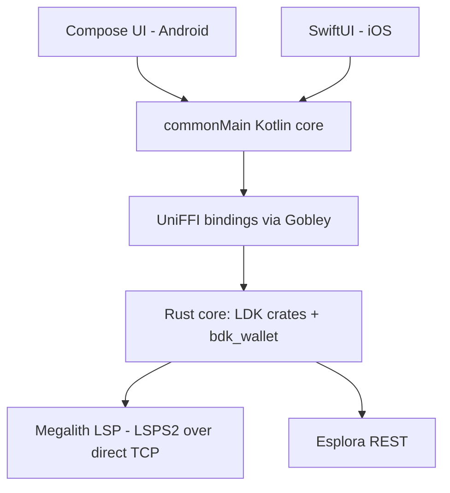
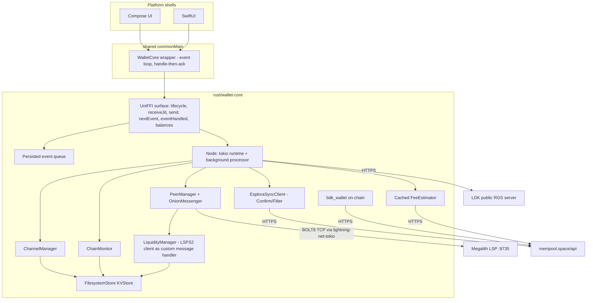
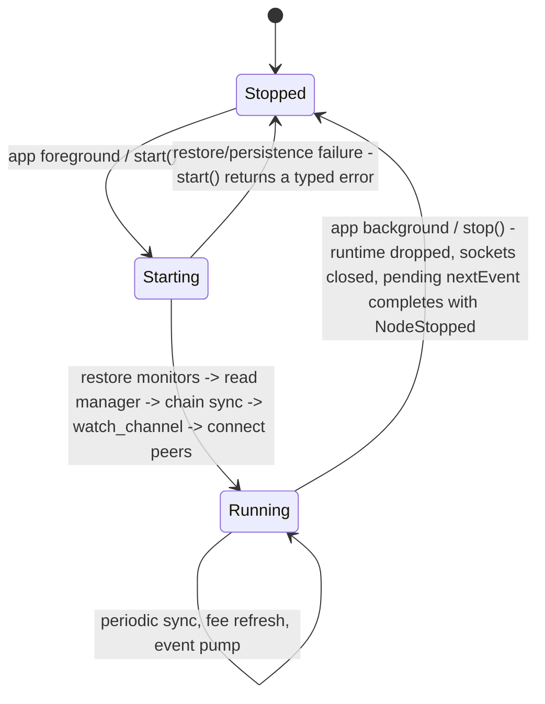

# KMP Native Payment Spike - Plan

## Goal Capsule

- **Objective:** Prove Zinqq's Lightning stack runs natively by building a Kotlin Multiplatform spike app — a shared core on the LDK crates — that receives and sends a real mainnet payment through a Megalith LSPS2 JIT channel on both Android and iOS.
- **Product authority:** This plan owns the spike only. The Zinqq PWA remains the production client and is unaffected. Store distribution, background receive, and PWA feature parity are not active scope.
- **Execution profile:** Greenfield scaffold in this repository. Work units in dependency order U1 → U8; U1 (walking skeleton) must pass before any Lightning code. Automated gates in the Verification Contract; final acceptance (U8) is a manual mainnet payment on both platforms with small amounts (< $10 equivalent).
- **Stop conditions:** Stop and surface rather than guess if (a) Gobley cannot produce a working iOS or Android binary in U1 after applying the documented escape hatch check, (b) Megalith stops answering `lsps2.get_info` (resolved 2026-07-26: it answers tokenless at the PWA's LSP identity), or (c) any step would import or derive from the existing Zinqq wallet seed (forbidden by R5).
- **Open blockers:** None. The canonical product record also lives in the Zinqq web repo at `docs/plans/2026-07-25-001-feat-kmp-native-payment-spike-plan.md`.

---

## Product Contract

### Summary

A minimal native KMP app with a Rust core built directly on the LDK crates (not ldk-node), exposed through UniFFI/Gobley into shared `commonMain` Kotlin, with thin native Compose and SwiftUI shells. Success is one mainnet payment received via a Megalith JIT channel and one sent, driven by the same shared core on both platforms.

### Problem Frame

Zinqq runs LDK as WASM inside a browser, which imposes structural constraints: peer connections require a WebSocket-to-TCP proxy, persistence rides on IndexedDB, and background execution is unavailable — the known weak spot for offline receive. Separately, the maintainer wants working knowledge of Kotlin Multiplatform with a Rust core, the architecture pattern serious mobile wallets converge on. The primary driver is that exploration; the PWA's constraints are the backdrop, not an emergency. Both clients will be maintained.

### Key Decisions

- **Build on the LDK crates directly, not ldk-node** (session-settled: user-directed — chosen over ldk-node: excluded by the user at intake).
- **Own Rust core exposed via UniFFI/Gobley, over the official per-platform bindings or lightning-kmp** (session-settled: user-directed — chosen over expect/actual across ldk-java/ldk-swift, which writes the Lightning logic twice, and over ACINQ's lightning-kmp, which abandons LDK and the Megalith LSPS2 flow). The plumbing is assembled from first-party LDK crates rather than rebuilt: `lightning-liquidity` (client-side LSPS2), `lightning-transaction-sync` (Esplora), `lightning-background-processor`, `lightning-net-tokio` (direct TCP), and `bdk_wallet` for on-chain.
- **Shared core, native UIs** (session-settled: user-directed — chosen over Compose Multiplatform everywhere: Lightning logic lives in `commonMain`; each platform keeps an idiomatic thin shell).
- **Both platforms from day one** (session-settled: user-directed — chosen over Android-first: the spike only proves the KMP thesis if the same shared code pays on Android and iOS).
- **Fresh dedicated wallet** (session-settled: user-approved — chosen over reusing the Zinqq seed: two live LDK nodes on one node identity diverge on channel state, and the stale instance risks force-closes or penalty transactions).
- **New dedicated repository** (session-settled: user-approved — chosen over a module in the Zinqq repo: the Gradle/cargo/Xcode toolchain shares nothing with the Vite build, and a spike needs churn freedom outside production history).
- **Event-queue API across the FFI boundary, not callbacks** (session-settled: user-directed — chosen over UniFFI callback interfaces: threading constraints). The proven shape (ldk-node's own) is an event queue the Kotlin side awaits.



### Requirements

**Proof of stack**

- R1. A shared `commonMain` core, backed by a Rust core built on the LDK crates, runs a Lightning node on both Android and iOS.
- R2. The app receives a real mainnet payment through a Megalith LSPS2 JIT channel (`lsps2.get_info` / `lsps2.buy` flow).
- R3. The app sends a real mainnet Lightning payment from the JIT channel's balance.
- R4. Both platform apps drive payments through the same shared core; no Lightning logic lives in platform source sets.

**Wallet and safety**

- R5. The spike uses a fresh seed and node identity; the existing Zinqq wallet seed is never imported.
- R6. Persistence is local-only; the PWA's remote VSS backup of channel state is not replicated.
- R7. Peer connections are direct TCP; the WebSocket proxy is not part of the native stack.

**UX floor**

- R8. UI is minimal: display a receive invoice/QR, accept a BOLT11 to pay, and show balance and payment outcomes. Rough is acceptable.

### Key Flows

- F1. JIT receive
  - **Trigger:** User requests an amount to receive.
  - **Steps:** Core fetches opening params from Megalith via LSPS2; a wrapped invoice is displayed; the payer pays; the JIT channel opens with fees deducted from the incoming amount.
  - **Outcome:** Balance reflects the received amount minus the LSP fee. **Covers R1, R2.**
- F2. Send
  - **Trigger:** User pastes a BOLT11 invoice.
  - **Steps:** Core pays over the existing channel; result surfaces as an event.
  - **Outcome:** Payment success or failure is visible in the UI. **Covers R3.**

### Acceptance Examples

- AE1. **Covers R2, R4.** Given a fresh wallet with no channels on an Android device, when a generated invoice is paid externally, then a JIT channel opens and the balance shows the amount minus Megalith's fee — and the identical scenario passes on iOS with no platform-specific Lightning code changed.
- AE2. **Covers R5.** Given the spike app's first launch, when the wallet initializes, then it generates a new seed; there is no import path for an existing mnemonic.

### Scope Boundaries

**Deferred for later**

- Store distribution, signing, and release process.
- Background/offline receive and push notifications (aligns with the existing LSPS5 async-payments strategy when it lands).
- Remote channel-state backup (VSS parity with the PWA).
- Feature parity with the PWA: payment history, recovery/sweep flows, on-chain fallback, JIT floor UX refinements.

**Outside this work's identity**

- Code sharing with the web PWA — Gobley has no WASM target; the two clients share protocol behavior and infrastructure, never code.
- Replacing the PWA — this is a second client exploration, not a migration.

**Deferred to Follow-Up Work**

- `MonitorUpdatingPersister` (delta-based monitor persistence) — the spike uses full-monitor writes; the two formats are not backward-compatible, so switching later is a migration.
- A real payment-history store — the spike keeps an in-memory/simple persisted list only.
- On-chain send/sweep UX beyond durable `Event::SpendableOutputs` handling.
- Platform-keystore seed protection (Keychain / EncryptedSharedPreferences) — the spike keeps the seed as a file in the app-private data directory (KTD-11).

### Dependencies / Assumptions

- Gobley is 0.x; generated-binding stability between versions is not guaranteed. Mitigation: pin the version, keep the exposed Rust API small. Escape hatch: the same crate emits plain Kotlin + Swift bindings via upstream UniFFI, sacrificing shared bindings but preserving the Rust core.
- **Proven 2026-07-26:** `lightning-liquidity`'s LSPS2 client interoperates with Megalith. A live run completed `get_info` -> cheapest-offer selection -> `buy` -> wrapped mainnet invoice (`lnbc60u...`, intercept SCID `16173016x1761102x16056`, CLTV delta 144) and emitted `InvoiceReady`. Only the external payment itself remains for U8.
- Assumption: cargo cross-compilation to iOS via Gobley's Gradle plugin works as documented; this is the expected first-friction point and is proven with a walking skeleton (U1) before any Lightning code.
- Megalith remains the LSP (existing relationship and config carry over conceptually).

### Outstanding Questions

All three questions the requirements phase deferred to planning are resolved in the Planning Contract: Esplora access (KTD-5: the Zinqq PWA's own proxy, configurable), exact crate versions and the UniFFI surface (KTD-1, U3), and repository/scaffold layout (this repo; see Output Structure). Two execution-time unknowns remain, one of them now answered by a live run:

Both are now **answered by live mainnet runs on 2026-07-26**; no token is required.

- Whether Megalith requires an access token on `lsps2.get_info`. **No — `token: null` is accepted.** The apparent rejection during the first live run was a wrong LSP identity on our side: the node id and host had been taken from public explorer listings (`038a9e56...e889bf` at `64.23.162.51`), which completes a BOLT8 handshake and even answers Ping/Pong but never replies to `lsps2.get_info` because it is not the LSPS2 service. The Zinqq PWA's own working configuration (`VITE_LSP_NODE_ID` / `VITE_LSP_HOST`) names `034066e2...1453b0` at `64.23.159.177:9735`; with that identity, `get_info` answers in ~3s and the PWA likewise sends no token. Explorer listings are not authoritative for the LSPS2 endpoint — the PWA config is.
- Megalith's live fee menu, payment-size bounds, and trust-model flag. **Observed live:** two offers, both `proportional = 14000` ppm (1.4%) with `min_lifetime = 13140` and `max_client_to_self_delay = 512`; the cheaper offer is `min_fee_msat = 2_500_000` with `min_payment_size_msat = 2_501_000` valid ~5h, the dearer `min_fee_msat = 3_125_000` with `min_payment_size_msat = 3_126_000` valid ~27h. Both cap at `max_payment_size_msat = 16_000_000_000`. `lsps2.buy` returns `lsp_cltv_expiry_delta = 144` and **`client_trusts_lsp: true`** — meaning the client releases the preimage before seeing the funding transaction, so the spike is exposed to the LSP not broadcasting it. Acceptable at spike amounts, but it makes the received amount the trust ceiling and is worth stating before amounts grow (see Risks).

Consequence for the acceptance run (U8): the opening fee is a 2,500 sat floor, not a percentage at these sizes, so a receive must exceed 2,501 sats and only amounts well above it leave a sensible remainder. The README protocol uses 6,000 sats (fee 2,500, keep 3,500).

### Sources / Research

- Reference implementations in the Zinqq web repo (protocol knowledge transfers; code does not): `src/ldk/lsps2/client.ts` (LSPS2 get_info/buy over custom messages), `src/ldk/sync/esplora-client.ts`, `proxy/src/index.ts` (the proxy the native stack sheds), `src/ldk/storage/persist-cm.ts` (VSS dual-write the spike explicitly skips). A condensed extraction with file:line pointers is at `docs/research/zinq-grounding-dossier.md` in this repo.
- Zinqq web repo `docs/solutions/integration-issues/ldk-lsps2-client-not-in-wasm-bindings.md` — why the TS LSPS2 client was hand-written; the Rust core gets this from `lightning-liquidity` instead.
- External: [lightning-liquidity](https://github.com/lightningdevkit/rust-lightning/tree/main/lightning-liquidity), [Gobley](https://gobley.dev/), [Bitkey's cross-platform architecture](https://engineering.block.xyz/blog/how-bitkey-uses-cross-platform-development) and [open-source repo](https://github.com/proto-at-block/bitkey) — the same KMP + Rust core + native UIs shape, inspectable prior art (and reachable internally at Block).
- Planning-time research (2026-07-25): [ldk-node](https://github.com/lightningdevkit/ldk-node) `src/builder.rs`, `src/event.rs`, `src/liquidity.rs`, `src/payment/bolt11.rs`, `src/runtime.rs` — the canonical from-crates assembly this plan mirrors; [bLIP-52 / LSPS2 spec](https://github.com/lightning/blips/blob/master/blip-0052.md); [rust-lightning CHANGELOG](https://github.com/lightningdevkit/rust-lightning/blob/main/CHANGELOG.md) (0.2.0 breaking changes); [Gobley Gradle plugin docs](https://gobley.dev/docs/gradle-plugins/cargo/); [Megalith LSPS2 docs](https://docs.megalithic.me/lightning-services/lsps2-get-a-just-in-time-channel-for-mobile-clients/); [Android 16 KB page sizes](https://developer.android.com/guide/practices/page-sizes); [UniFFI async docs](https://mozilla.github.io/uniffi-rs/latest/futures.html).

---

## Planning Contract

**Product Contract preservation:** unchanged — no R/F/AE edits. The Outstanding Questions section was rewritten in place to record planning-time resolutions.

### Key Technical Decisions

- KTD-1. **Pin the ldk-node 0.7.0-parity dependency set.** `lightning 0.2.4`, `lightning-liquidity 0.2.3`, `lightning-transaction-sync 0.2.1` (feature `esplora-async-https`), `lightning-background-processor 0.2.3`, `lightning-net-tokio 0.2.0`, `lightning-persister 0.2.3`, `lightning-invoice 0.34.1`, `bdk_wallet 2.4.0`, `bdk_esplora 0.22.x`, `bitcoin 0.32.x`, `esplora-client 0.12.x`, `tokio 1.x`, `uniffi 0.29.4`. Rationale: mirroring ldk-node's pins is the cheapest way to a compiling workspace with a coherent `bitcoin`-crate graph; `bdk_wallet 2.4.0` is chosen over 3.1.0 for that parity. The `lightning 0.3.0-beta` line is out of scope. Instantiates the Product Contract's LDK-crates decision (session-settled: user-directed — chosen over ldk-node: excluded by the user at intake).
- KTD-2. **Gobley 0.3.7 exactly, proc-macro UniFFI, library-mode generation.** Plugins `dev.gobley.cargo` + `dev.gobley.uniffi` + `org.jetbrains.kotlin.plugin.atomicfu`; `uniffi::setup_scaffolding!()` + `#[uniffi::export]` (no UDL); `crate-type = ["cdylib", "staticlib"]` so Gobley packages JNI libs for Android and statically links into the Kotlin/Native framework for iOS — no hand-built XCFramework pipeline. Rationale: 0.3.6 changed JNA mapping and 0.3.7 fixed a loading regression, so the pin is exact; proc-macro style is what Gobley's own tutorial uses. Instantiates the Product Contract's UniFFI/Gobley decision (session-settled: user-directed — see Key Decisions).
- KTD-3. **The Rust core owns a multi-threaded tokio runtime** (2 worker threads), created at `Node::start`, dropped at `Node::stop`; the background processor runs via `process_events_async` with `mobile_interruptable_platform = true` and the `LiquidityManager` passed in. Rationale: ldk-node's proven shape; sidesteps the upstream UniFFI bug where `async_runtime = "tokio"` is ignored on trait-object async methods (mozilla/uniffi-rs#2576).
- KTD-4. **Persistence: `FilesystemStore` (`KVStoreSync`) with full-monitor writes, using LDK's persist key constants,** in app-private storage on both platforms. `ChannelMonitor` writes are durable-before-`Completed`; the manager may lag but monitors never do. Rationale: the sync store is the simplest safe shape; mixing sync and async monitor persistence panics in LDK 0.2; delta persistence is deferred (see Scope Boundaries).
- KTD-5. **Esplora default is the Zinqq PWA's own proxy `https://zinqq.app/api/esplora`, held in config with `https://blockstream.info/api` and `https://mempool.space/api` as fallbacks.** Rationale: keyless, esplora-compatible, actively maintained; Blockstream's open endpoint is de-prioritized behind their keyed Explorer API. Retry frequency is capped so background sync can't storm the endpoint. Resolves the Esplora question the requirements phase deferred. The proxy fronts Blockstream Enterprise staging and keeps credentials server-side, so the spike shares the production client's chain infrastructure without embedding a key (maintainer-authorized 2026-07-25). Measured during the first device run: the proxy answers in ~0.2-0.7s, while public mempool.space throttled a single request to 75s under this repo's own test volume and stalled every sync pass.
- KTD-6. **Rapid Gossip Sync instead of `P2PGossipSync`,** from LDK's public RGS server. Rationale: the spike must send a routed payment; full P2P gossip on mobile is slow and battery-hostile, and RGS is what ldk-node ships for mobile.
- KTD-7. **Fixed-amount JIT invoices (MPP + fixed-invoice mode)** for the acceptance flow. Rationale: the zero-amount variant forbids MPP and fails with payers that split; fixed-amount is the robust path with arbitrary payers (bLIP-52).
- KTD-8. **Persisted event queue with handle-then-ack semantics** — a public `Event` enum mapped from LDK/liquidity events, queued in the core, serialized to the KVStore on every push and ack; Kotlin consumes via an awaitable `nextEvent` and acks via `eventHandled`; the same event repeats until acked, so handlers are idempotent. `stop()` completes pending `nextEvent` awaits with a terminal `NodeStopped` event (runtime-independent notification), and `NodeStarted` is emitted before chain sync completes — the stop-while-awaiting contract lives in the core, not the shells. Instantiates the Product Contract's event-queue decision (session-settled: user-directed — chosen over UniFFI callback interfaces: threading constraints).
- KTD-9. **The 0-conf JIT config cluster is set from day one:** `manually_accept_inbound_channels = true`, `accept_inbound_channel_from_trusted_peer_0conf` when the counterparty is Megalith, underpaying-HTLC acceptance for the skimmed opening fee, and `min_final_cltv_expiry_delta` at least +2 on JIT invoices — copied from ldk-node `src/liquidity.rs`. Rationale: these three bits are the likeliest silent-failure cluster in a from-crates LSPS2 client; missing any one rejects the JIT open or the payment.
- KTD-10. **Foreground-only node lifecycle.** The node stops/parks when the app backgrounds and reconnects + resyncs on foreground; peer reconnect logic lives in the Rust core, not the UI. Rationale: there is no legitimate background mode for a TCP Lightning node on iOS, and background receive is explicitly out of scope.
- KTD-11. **Seed at rest: a file in the node's app-private data directory, not the platform keystore.** The BIP39 seed sits beside the channel monitors — the monitors directory is already the fund-loss surface (losing it strands channel funds), so a keystore-protected seed next to unprotected monitors buys nothing for a spike holding < $10. Keychain/EncryptedSharedPreferences integration is deferred (see Scope Boundaries). Chosen over platform keystores: equal effective risk here, meaningfully less platform-specific code.

### Assumptions

Recorded here because pipeline mode resolved them without a user checkpoint; each has a defined fallback rather than a blocking dependency.

- Megalith accepts `lsps2.get_info` with `token: None`. Fallback: request access via megalithic.me/contact — initiated during U1 (longest external lead time). Megalith's mainnet LSPS2 is self-described as short of production-ready; failures are expected and mapped to visible events.
- Megalith's node identity is `038a9e56512ec98da2b5789761f7af8f280baf98a09282360cd6ff1381b5e889bf` at `64.23.162.51:9735` per current gossip; re-verify at implementation time and keep pubkey/address in config.
- Public Esplora volume from a two-device spike stays far below rate limits (with capped retries per KTD-5).
- The PWA's production infrastructure is available to the spike (maintainer, 2026-07-25): the credentialed Esplora endpoint is a config swap (KTD-5), and VSS is available but stays unused here — R6 keeps spike persistence local-only; VSS parity remains in Deferred for later.
- No signet/regtest dress rehearsal: no LSPS2 LSP is confirmed available off-mainnet, so acceptance goes straight to mainnet with small amounts. The automated test floor (Verification Contract) covers what tests can cover without a network.
- Device deployment uses ordinary dev-signed builds; no TestFlight or store account requirements apply to the spike.
- Android toolchain: NDK r28+ (16 KB page alignment default), ABIs `arm64-v8a` + `x86_64`; Kotlin version pinned to whatever the Gobley 0.3.7 examples use, verified in U1.

### High-Level Technical Design

Component topology — what the Rust core assembles and what talks to what:



JIT receive sequence (F1) — the flow U4 implements:

```mermaid
sequenceDiagram
  participant UI as Shell UI
  participant Core as Rust core
  participant LSP as Megalith
  participant Payer
  UI->>Core: receiveJit(amount)
  Core->>LSP: lsps2.get_info (token: None)
  LSP-->>Core: opening_fee_params menu
  Core->>Core: pick cheapest valid params; reject if fee >= amount
  Core->>LSP: lsps2.buy(params, amount)
  LSP-->>Core: intercept_scid + cltv_expiry_delta
  Core->>Core: create_inbound_payment; build invoice with LSP route hint (zero hint fees, +2 CLTV)
  Core-->>UI: InvoiceReady(bolt11, valid_until)
  Payer->>LSP: pays invoice
  LSP->>Core: open 0-conf channel (OpenChannelRequest -> accept_0conf)
  LSP->>Core: forward HTLC minus opening fee
  Core->>Core: PaymentClaimable -> claim_funds(preimage)
  Core-->>UI: PaymentReceived(amount - skimmed fee)
```

Node lifecycle (KTD-10):



The restore-before-sync-before-watch ordering inside `Starting` is load-bearing: syncing after `watch_channel`, or reading the manager before the monitors, panics or silently desyncs. Failure semantics: restore/persistence errors fail `start()` hard with a typed error; an unreachable Esplora on a fresh node (zero channel monitors) is tolerated as a degraded start — `NodeStarted` then `SyncFailed` are emitted and sync retries on the next foreground.

### Output Structure

Expected scaffold (adjustable if implementation finds a better layout; per-unit Files stay authoritative):

```text
zinqq-kmp/
├── settings.gradle.kts
├── build.gradle.kts
├── gradle/libs.versions.toml
├── rust/
│   ├── Cargo.toml              # wallet-core crate: LDK + bdk_wallet + uniffi
│   ├── src/
│   │   ├── lib.rs              # setup_scaffolding + exports
│   │   ├── builder.rs          # node assembly (fresh + restore paths)
│   │   ├── node.rs             # lifecycle, tokio runtime, background processor
│   │   ├── events.rs           # public Event enum + persisted queue
│   │   ├── liquidity.rs        # LSPS2 client flow (U4)
│   │   ├── invoice.rs          # JIT invoice construction (U4)
│   │   ├── payment.rs          # BOLT11 send (U5)
│   │   ├── chain.rs            # esplora sync, broadcaster
│   │   ├── fees.rs             # cached FeeEstimator
│   │   ├── wallet.rs           # bdk_wallet integration
│   │   └── config.rs           # network, esplora URL, LSP identity
│   └── tests/restart.rs        # restart-safety integration test
├── shared/
│   ├── build.gradle.kts        # Gobley plugins applied here
│   └── src/
│       ├── commonMain/kotlin/zinqq/spike/WalletCore.kt
│       └── jvmTest/kotlin/zinqq/spike/BindingsSmokeTest.kt
├── androidApp/
└── iosApp/
```

---

## Implementation Units

### U1. Walking skeleton: KMP scaffold with Gobley toolchain proof

- **Goal:** The full toolchain works end-to-end before any Lightning code: a trivial Rust function (plus one async function on a core-owned tokio runtime) crosses UniFFI into `commonMain` and runs on an Android emulator/device and the iOS simulator.
- **Requirements:** Foundation for R1; validates the Product Contract's cross-compilation assumption. Cites KTD-2, KTD-3.
- **Dependencies:** None.
- **Files:** `settings.gradle.kts`, `build.gradle.kts`, `gradle/libs.versions.toml`, `rust/Cargo.toml`, `rust/src/lib.rs`, `shared/build.gradle.kts`, `shared/src/commonMain/kotlin/zinqq/spike/WalletCore.kt`, `shared/src/jvmTest/kotlin/zinqq/spike/BindingsSmokeTest.kt`, `androidApp/` and `iosApp/` app skeletons.
- **Approach:** Gobley 0.3.7 per KTD-2; NDK r28+; Android ABIs `arm64-v8a` + `x86_64`; iOS targets `iosArm64` + `iosSimulatorArm64`. Declare the full KTD-1 pin set in `rust/Cargo.toml` and route the trivial exported function through at least one LDK/secp256k1 call, so both platform builds compile and link the real dependency graph (secp256k1's C build, the rustls/HTTP stack, static-link size) — a skeleton that only exports a trivial function can green-light a toolchain that fails at U2. Include the async export early — it exercises the JNA direct-mapping and Kotlin/Native suspend paths where Gobley regressions live. Release profile for size (`opt-level = "z"`, `lto = true`, `panic = "abort"`, `strip = true`) configured now, not later. Also during this unit: send the Megalith access request (see Assumptions).
- **Execution note:** Smoke-first — the origin document requires proving cross-compilation with a walking skeleton before any Lightning code. If Gobley cannot produce working binaries, evaluate the documented escape hatch (upstream UniFFI plain Kotlin + Swift bindings) before writing any Lightning code, and surface the trade-off.
- **Test scenarios:**
  - Happy path: JVM test calls the exported sync function and asserts the returned value; same for the async function (suspend).
  - Platform proof: Android app and iOS simulator app each display the Rust-provided string at launch.
  - Packaging edge: `.so` LOAD segments are 16 KB-aligned (`llvm-readelf -l`).
- **Verification:** `./gradlew :shared:jvmTest`, `./gradlew :androidApp:assembleDebug`, and an Xcode simulator build all pass; both apps launch and show the Rust string.

### U2. Rust core: node assembly, persistence, and chain sync

- **Goal:** `wallet-core` boots a mainnet LDK node from a fresh seed, syncs to chain tip, and restarts safely from disk.
- **Requirements:** R1, R5, R6, R7. Cites KTD-1, KTD-3, KTD-4, KTD-5, KTD-6, KTD-11, and the Product Contract's fresh-wallet decision (session-settled: user-approved).
- **Dependencies:** U1.
- **Files:** `rust/src/builder.rs`, `rust/src/node.rs`, `rust/src/chain.rs`, `rust/src/fees.rs`, `rust/src/wallet.rs`, `rust/src/config.rs`, `rust/tests/restart.rs`.
- **Approach:** Mirror ldk-node's wiring order (`src/builder.rs`): KeysManager (fresh BIP39 seed, no import path) → ChainMonitor → ChannelManager with first-class fresh and restore paths → OnionMessenger → PeerManager. `FilesystemStore` per KTD-4; restore sequence: read monitors → `ChannelManagerReadArgs` → deserialize manager → Esplora `Confirm` sync on both → `watch_channel` each monitor. `EsploraSyncClient` (async-https) doubles as the ChainMonitor's `Filter`; `bdk_wallet` syncs separately via `bdk_esplora` sharing the `esplora-client 0.12.x` stack. Cached `FeeEstimator` answers every `ConfirmationTarget` variant from the Esplora fee-estimates endpoint, floored at 253 sat/kw, refreshed by a background task — never hardcoded. Broadcaster tolerates already-known/confirmed errors. RGS per KTD-6. Handle `Event::SpendableOutputs` durably (OutputSweeper) so a channel close never strands funds. Note LDK 0.2 semantics: no `Persister` trait, no `Event::PendingHTLCsForwardable` (the background processor forwards HTLCs itself) — pre-2025 sample code is a trap.
- **Execution note:** This unit is the fund-safety core; sequence it fully before any LSPS2 work. The restart path is written first-class, not retrofitted.
- **Test scenarios:**
  - Restart safety: build node in a temp dir → create persisted state → drop → rebuild → monitors and manager reload, sync path runs, `watch_channel` succeeds.
  - KVStore round-trip: monitor/manager/graph/scorer keys write and read back under LDK's persist key constants.
  - Fee floor: estimator returns ≥ 253 sat/kw for every `ConfirmationTarget` variant when the endpoint returns low/empty data.
  - Fresh seed (covers AE2 core): first init generates a new mnemonic; the API exposes no mnemonic-import entry point.
  - Error path: broadcaster treats "already in mempool" as success, not fatal.
  - Startup failure paths: start with an unreachable Esplora on a fresh (zero-monitor) node succeeds degraded and emits `SyncFailed`; start with unreadable/corrupt monitor data fails with a typed error rather than proceeding.
- **Verification:** `cargo test` green in `rust/`; a dev harness (Rust test or JVM smoke) boots the node against mainnet Esplora and reaches chain tip.

### U3. Event queue and UniFFI API surface

- **Goal:** The complete (small) FFI surface exists in `commonMain`: node lifecycle, `receiveJit`, `send`, `nextEvent`/`eventHandled`, balances — with the persisted handle-then-ack event queue underneath.
- **Requirements:** R1, R4. Cites KTD-8 (session-settled event-queue decision).
- **Dependencies:** U2.
- **Files:** `rust/src/events.rs`, `rust/src/lib.rs` (exports), `shared/src/commonMain/kotlin/zinqq/spike/WalletCore.kt`, `shared/src/jvmTest/kotlin/zinqq/spike/BindingsSmokeTest.kt`.
- **Approach:** Public `Event` enum (node started/stopped, sync failed, invoice ready, payment received/claimed, payment sent/failed, channel pending/ready, LSPS2 failures) mapped from LDK and liquidity events, mirroring ldk-node `src/event.rs`: queue serialized to the KVStore on every push and ack; `nextEvent` exported as a UniFFI async fn awaiting the queue (Kotlin `suspend`, consumed from a `Dispatchers.IO` loop); `eventHandled` pops and re-persists. Lifecycle contract: `stop()` completes any pending `nextEvent` with a terminal `NodeStopped` event via a runtime-independent notification (not runtime-bound IO); the Kotlin loop treats it as loop exit and restarts after `start()` on foreground. `NodeStarted` is emitted before chain sync completes, so the queue is observable with no network. `receiveJit`/`send` are wired fully in U4/U5. Keep the exported surface to those six operations — Gobley risk shrinks with API size.
- **Test scenarios:**
  - Happy path: pushed event is returned by `nextEvent`; `eventHandled` advances the queue.
  - Idempotency edge: without an ack, the same event is returned again after core restart (queue reloads from disk).
  - Persistence round-trip: queue with 3 events survives drop/rebuild in order.
  - Integration: JVM bindings smoke test starts the node with a stub/unreachable Esplora URL, pulls the `NodeStarted` event through `nextEvent`, acks it — proving the FFI threading path.
  - Lifecycle edge: `stop()` while a `nextEvent` await is outstanding completes promptly with `NodeStopped` rather than hanging.
- **Verification:** `cargo test` and `./gradlew :shared:jvmTest` green.

### U4. LSPS2 JIT receive flow

- **Goal:** `receiveJit(amount)` produces a Megalith-wrapped invoice and an externally-paid invoice results in an open JIT channel and claimed balance.
- **Requirements:** R2, F1, AE1. Cites KTD-7, KTD-9 and the Product Contract's LDK-crates decision.
- **Dependencies:** U2, U3.
- **Files:** `rust/src/liquidity.rs`, `rust/src/invoice.rs`, `rust/src/config.rs` (LSP identity), plus `rust/src/builder.rs` and `rust/src/node.rs` (wiring the LiquidityManager into the PeerManager/background processor and setting the KTD-9 0-conf UserConfig flags); tests as `#[cfg(test)]` modules in `rust/src/liquidity.rs` and `rust/src/invoice.rs`. Re-run U2's restart-safety test after the config lands.
- **Approach:** `LiquidityManager` (client-only `LSPS2ClientConfig`) plugged in as PeerManager's custom message handler — without this LSPS2 silently does nothing — and passed to `process_events_async`. Flow per the HTD sequence diagram: `request_opening_params(megalith_pubkey, token: None)` → `OpeningParametersReady` → choose cheapest valid params and reject client-side when `opening_fee >= amount` (LSP error 202 pre-empted) → `select_opening_params` → `InvoiceParametersReady` → `create_inbound_payment` + `InvoiceBuilder` with the LSP route hint (intercept SCID, zero hint fees, event's `cltv_expiry_delta`, `min_final_cltv_expiry_delta` +2). Fixed-amount mode per KTD-7. Invoices are generated on demand at request time and `valid_until` expiry is surfaced in the event (LSP guarantees only ≥10 min). `GetInfoFailed`/`BuyRequestFailed` and LSPS error codes 201/202/203 map to distinct failure events. Claim on `PaymentClaimable` via `claim_funds`; `PaymentClaimed` (with `counterparty_skimmed_fee_msat`) is the durable success signal. Copy the 0-conf acceptance and underpaying-HTLC configuration verbatim from ldk-node `src/liquidity.rs` (KTD-9).
- **Test scenarios:**
  - Covers AE1 (assembly half): with a mocked buy response, the built invoice's route hint carries the intercept SCID, Megalith's pubkey, zero fees, and CLTV ≥ event value +2; amount and expiry match.
  - Fee floor edge: `receiveJit` with amount ≤ menu `min_fee_msat` fails fast with a clear event, before any `buy`.
  - Params expiry edge: expired `valid_until` in the menu is skipped; all-expired menu surfaces a failure event.
  - Error paths: `GetInfoFailed` / `BuyRequestFailed` / codes 201/202/203 each map to the right event.
  - Idempotency: replayed `PaymentClaimable` after an unacked claim does not double-claim or panic.
- **Verification:** `cargo test` green. Additionally, an `#[ignore]`d live smoke test performs one real `lsps2.get_info` against Megalith and logs the fee menu — run it as soon as U2's node boots (it needs no invoice, channel, or UI), and before U5–U7 begin, so a Megalith interop surprise reworks one unit instead of five. The full mainnet proof is U8.

### U5. Send payment flow

- **Goal:** `send(bolt11)` pays an invoice from the JIT channel's balance, idempotently across restarts.
- **Requirements:** R3, F2.
- **Dependencies:** U3 (surface); channel balance at runtime comes from U4.
- **Files:** `rust/src/payment.rs`; tests as a `#[cfg(test)]` module in `rust/src/payment.rs`.
- **Approach:** Parse and validate the BOLT11, pay with a stable `PaymentId` derived from the payment hash so a restart never double-pays; routing via RGS-fed `NetworkGraph` + `ProbabilisticScorer`/`DefaultRouter`; `PaymentSuccessful`/`PaymentFailed` surface through the event queue.
- **Test scenarios:**
  - Happy path: valid invoice yields a send attempt with the derived `PaymentId`.
  - Idempotency edge: second `send` of the same invoice reuses the `PaymentId` and is rejected as duplicate rather than double-paid.
  - Error paths: malformed invoice, expired invoice, and amountless invoice without an amount argument each fail with distinct errors; route-not-found maps to `PaymentFailed`.
- **Verification:** `cargo test` green. The live mainnet proof is U8.

### U6. Android Compose shell

- **Goal:** A minimal Compose app drives the shared core: balance, receive (amount → QR with expiry countdown), send (paste BOLT11), payment outcomes.
- **Requirements:** R8; R4 (no Lightning logic in Android source sets). Cites the shared-core/native-UI decision (session-settled: user-directed) and KTD-10.
- **Dependencies:** U3; full flows exercise U4/U5.
- **Files:** `androidApp/src/main/kotlin/...` (MainActivity, single wallet screen, ViewModel binding the shared event loop), `androidApp/build.gradle.kts`.
- **Approach:** One screen is enough (R8: rough is acceptable). The ViewModel owns the handle-then-ack event loop from `WalletCore` and reduces events into UI state; QR rendered from the BOLT11 string. Lifecycle per KTD-10: start the node on foreground, stop on background. Backup exclusion (R6): set `android:allowBackup="false"` plus `dataExtractionRules` opting the node data directory out of cloud backup and device transfer — otherwise Android Auto Backup silently copies the seed and channel monitors to Google servers, and a restored stale monitor set is the force-close/penalty hazard the fresh-wallet decision exists to avoid.
- **Test scenarios:**
  - Event-to-state reduction: `InvoiceReady` shows QR + expiry; `PaymentReceived` updates balance; `PaymentFailed` shows the failure — as plain ViewModel unit tests. UI chrome itself is manually verified in U8.
- **Verification:** `./gradlew :androidApp:assembleDebug` plus the unit tests green; app runs on a device and displays a generated invoice QR.

### U7. iOS SwiftUI shell

- **Goal:** The equivalent minimal SwiftUI app on the shared framework — same capabilities as U6, no Lightning logic in Swift.
- **Requirements:** R8, R4, and the both-platforms decision (session-settled: user-directed). Cites KTD-10.
- **Dependencies:** U3; full flows exercise U4/U5.
- **Files:** `iosApp/iosApp.xcodeproj`, `iosApp/iosApp/` (App entry, wallet view, observable model binding the shared event loop).
- **Approach:** Mirror U6's shape in SwiftUI: observable model runs the event loop from the shared framework's suspend API (Swift async), one wallet screen, QR from the invoice string. Foreground-only lifecycle; set `isIdleTimerDisabled` while an invoice is displayed so the screen can't sleep mid-payment. Backup exclusion (R6): set `isExcludedFromBackup = true` (URL resource values) on the node data directory at startup so iCloud/device backups never copy the seed or channel monitors. iOS drops sockets on suspend — reconnect on foreground is the core's job (KTD-10), the shell only signals lifecycle.
- **Test scenarios:** Test expectation: none — the shell mirrors U6's tested reduction pattern over the same shared core; behavior is proven by the U8 acceptance run on device (AE1's "identical scenario on iOS").
- **Verification:** Xcode build succeeds for simulator and device; app runs and displays a generated invoice QR.

### U8. Mainnet acceptance run

- **Goal:** The spike's success criterion, executed and recorded: one real mainnet receive through a Megalith JIT channel and one send, on both platforms, from the same shared core.
- **Requirements:** R2, R3, AE1, AE2; exercises F1, F2 end to end.
- **Dependencies:** U4, U5, U6, U7.
- **Files:** `README.md` (run instructions + results record with screenshots/payment hashes).
- **Approach:** On Android, fresh install (AE2: observe new seed, confirm no import path) → request an invoice for an amount comfortably above Megalith's live `min_fee_msat` (read from the get_info menu) → pay from an external wallet → JIT channel opens → balance shows amount minus skimmed fee → send a small payment out to an external invoice. Repeat identically on iOS with zero platform Lightning-code changes (AE1). The payer must be a separate device — paying from another app on the same phone backgrounds the spike and stops the node (KTD-10) — and the spike app stays foregrounded from invoice display until `PaymentReceived`. Keep amounts < $10 equivalent. Record outcomes, fees observed, and any Megalith quirks in the README.
- **Test scenarios:** Test expectation: none — this unit *is* the manual acceptance protocol for AE1/AE2; the automated floor lives in U2–U6.
- **Verification:** AE1 passes on both platforms; AE2 confirmed; results recorded in the README.

---

## Verification Contract

Exact Gradle task names are fixed once U1 lands the scaffold; the gates below are the contract.

| Gate | Command | Proves | Units |
|---|---|---|---|
| Rust unit + integration tests | `cargo test` (in `rust/`) | node assembly, restart safety, event queue, invoice building, send idempotency | U2–U5 |
| Bindings smoke test | `./gradlew :shared:jvmTest` | FFI surface loads, async/suspend path, event pull-ack across the boundary | U1, U3 |
| Android build | `./gradlew :androidApp:assembleDebug` | Gobley cargo integration, JNI packaging | U1, U6 |
| Android page alignment | `llvm-readelf -l` on packaged `.so` (16 KB LOAD alignment) | Android 15+ compatibility | U1 |
| iOS build | `xcodebuild` simulator + device build of `iosApp` | Kotlin/Native + static Rust linking | U1, U7 |
| ViewModel state tests | Android unit test task | event-to-UI-state reduction | U6 |
| Mainnet acceptance | manual protocol in U8 | AE1, AE2 — the spike's definition of success | U8 |

---

## Definition of Done

- R1–R8 satisfied; AE1 verified on both Android and iOS and AE2 verified at first launch, with results recorded in `README.md`.
- All automated gates in the Verification Contract pass.
- R4 spot-check: no Lightning logic (LDK types, LSPS2 flow, invoice handling) appears in `androidApp/` or `iosApp/` source sets.
- Config surface (Esplora URL, LSP pubkey/address, RGS URL) lives in `rust/src/config.rs`, not hardcoded at call sites.
- Seed and channel-monitor files are excluded from OS backup on both platforms (R6): `allowBackup="false"` + `dataExtractionRules` on Android, `isExcludedFromBackup` on iOS.
- Abandoned experiments and dead-end code from the spike's exploration are removed from the tree.
- `README.md` carries build/run instructions for both platforms.

---

## Risks & Dependencies

| Risk | Mitigation |
|---|---|
| Gobley 0.x churn or iOS linking failures (LLVM mismatch, JNA direct-mapping regressions) | Exact 0.3.7 pin; U1 walking skeleton proves the whole toolchain before Lightning work; documented escape hatch to upstream UniFFI per-platform bindings |
| Megalith LSPS2 not production-ready | Proven live 2026-07-26: `get_info` + `buy` + wrapped-invoice assembly all succeed tokenless against `034066e2...1453b0`. All LSPS2 failures surface as distinct events; acceptance amounts stay small |
| `client_trusts_lsp: true` — the client releases the preimage before seeing the funding tx, so a non-broadcasting LSP keeps the payment | Inherent to Megalith's advertised mode; the received amount is the trust ceiling. Bounded by the < $10 acceptance cap; revisit before any larger amount |
| LSP identity drift — explorer listings name a different node than the LSPS2 service | Identity is sourced from the PWA's own config and pinned in `rust/src/config.rs` with a comment recording why the explorer value is wrong |
| Fund loss via monitor-persistence bugs | KTD-4 monitor-first durable writes; restart-safety test is a named gate; amounts < $10 |
| Public Esplora rate limiting / outage | Capped retry with backoff; config-swappable URL (KTD-5) |
| `lightning 0.3.0-beta` ecosystem churn mid-spike | Hard 0.2.x pins (KTD-1); no beta upgrades during the spike |
| Payer wallets that split payments (MPP) against JIT invoices | Fixed-amount invoice mode (KTD-7), which permits LSP-side MPP aggregation |
| iOS sockets dropped on suspend mid-flow | Foreground-only lifecycle with core-owned reconnect (KTD-10); `isIdleTimerDisabled` during invoice display |
