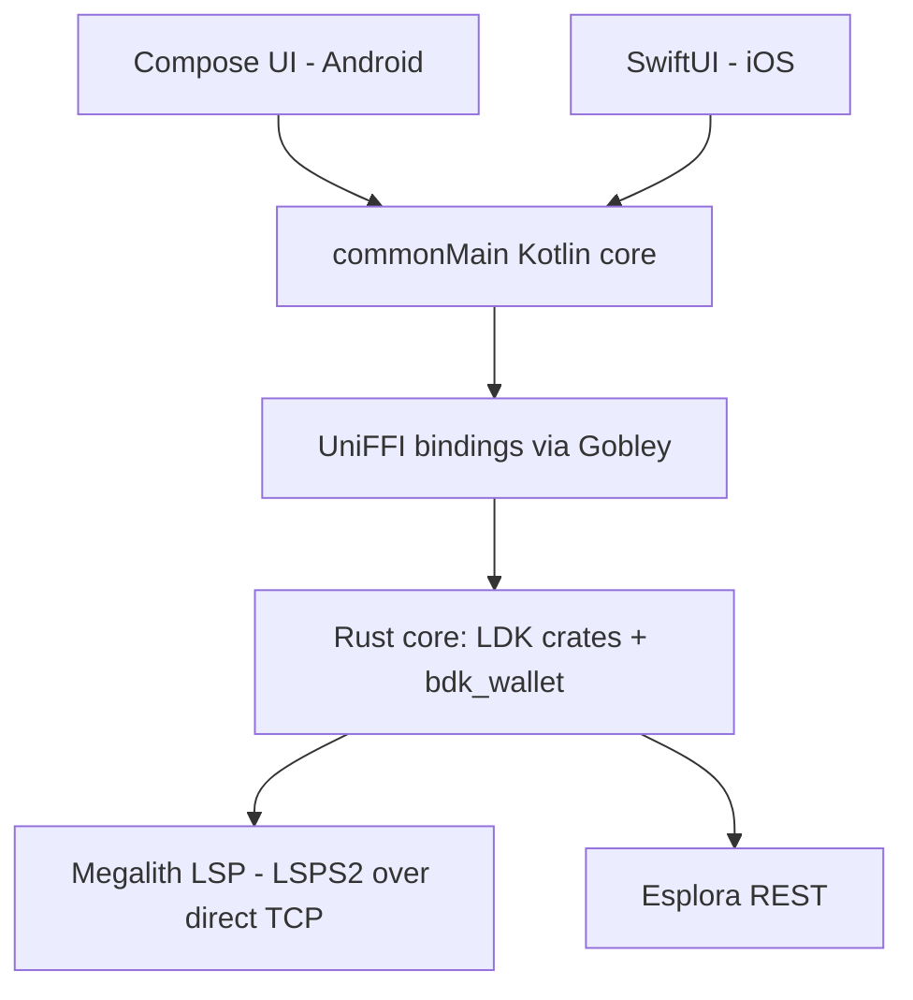

# KMP Native Payment Spike - Plan

## Goal Capsule

- **Objective:** Prove Zinqq's Lightning stack runs natively by building a Kotlin Multiplatform spike app — a shared core on the LDK crates — that receives and sends a real mainnet payment through a Megalith LSPS2 JIT channel on both Android and iOS.
- **Product authority:** This plan owns the spike only. The Zinqq PWA remains the production client and is unaffected. Store distribution, background receive, and PWA feature parity are not active scope.
- **Open blockers:** None. This repository is the implementation home; the canonical product record also lives in the Zinqq web repo at `docs/plans/2026-07-25-001-feat-kmp-native-payment-spike-plan.md`.

---

## Product Contract

### Summary

A minimal native KMP app with a Rust core built directly on the LDK crates (not ldk-node), exposed through UniFFI/Gobley into shared `commonMain` Kotlin, with thin native Compose and SwiftUI shells. Success is one mainnet payment received via a Megalith JIT channel and one sent, driven by the same shared core on both platforms.

### Problem Frame

Zinqq runs LDK as WASM inside a browser, which imposes structural constraints: peer connections require a WebSocket-to-TCP proxy, persistence rides on IndexedDB, and background execution is unavailable — the known weak spot for offline receive. Separately, the maintainer wants working knowledge of Kotlin Multiplatform with a Rust core, the architecture pattern serious mobile wallets converge on. The primary driver is that exploration; the PWA's constraints are the backdrop, not an emergency. Both clients will be maintained.

### Key Decisions

- **Build on the LDK crates directly, not ldk-node** (session-settled: user-directed — chosen over ldk-node: excluded by the user at intake).
- **Own Rust core exposed via UniFFI/Gobley, over the official per-platform bindings or lightning-kmp** (session-settled: user-directed — chosen over expect/actual across ldk-java/ldk-swift, which writes the Lightning logic twice, and over ACINQ's lightning-kmp, which abandons LDK and the Megalith LSPS2 flow). The plumbing is assembled from first-party LDK crates rather than rebuilt: `lightning-liquidity` (client-side LSPS2), `lightning-transaction-sync` (Esplora), `lightning-background-processor`, `lightning-net-tokio` (direct TCP), and `bdk_wallet` for on-chain.
- **Shared core, native UIs** (session-settled: user-directed — chosen over Compose Multiplatform everywhere: Lightning logic lives in `commonMain`; each platform keeps an idiomatic thin shell).
- **Both platforms from day one** (session-settled: user-directed — chosen over Android-first: the spike only proves the KMP thesis if the same shared code pays on Android and iOS).
- **Fresh dedicated wallet** (session-settled: user-approved — chosen over reusing the Zinqq seed: two live LDK nodes on one node identity diverge on channel state, and the stale instance risks force-closes or penalty transactions).
- **New dedicated repository** (session-settled: user-approved — chosen over a module in the Zinqq repo: the Gradle/cargo/Xcode toolchain shares nothing with the Vite build, and a spike needs churn freedom outside production history).
- **Event-queue API across the FFI boundary, not callbacks.** UniFFI callback interfaces carry threading constraints; the proven shape (ldk-node's own) is an event queue the Kotlin side awaits.

### Requirements

**Proof of stack**

- R1. A shared `commonMain` core, backed by a Rust core built on the LDK crates, runs a Lightning node on both Android and iOS.
- R2. The app receives a real mainnet payment through a Megalith LSPS2 JIT channel (`lsps2.get_info` / `lsps2.buy` flow).
- R3. The app sends a real mainnet Lightning payment from the JIT channel's balance.
- R4. Both platform apps drive payments through the same shared core; no Lightning logic lives in platform source sets.

**Wallet and safety**

- R5. The spike uses a fresh seed and node identity; the existing Zinqq wallet seed is never imported.
- R6. Persistence is local-only; the PWA's remote VSS backup of channel state is not replicated.
- R7. Peer connections are direct TCP; the WebSocket proxy is not part of the native stack.

**UX floor**

- R8. UI is minimal: display a receive invoice/QR, accept a BOLT11 to pay, and show balance and payment outcomes. Rough is acceptable.

### Key Flows

- F1. JIT receive
  - **Trigger:** User requests an amount to receive.
  - **Steps:** Core fetches opening params from Megalith via LSPS2; a wrapped invoice is displayed; the payer pays; the JIT channel opens with fees deducted from the incoming amount.
  - **Outcome:** Balance reflects the received amount minus the LSP fee. **Covers R1, R2.**
- F2. Send
  - **Trigger:** User pastes a BOLT11 invoice.
  - **Steps:** Core pays over the existing channel; result surfaces as an event.
  - **Outcome:** Payment success or failure is visible in the UI. **Covers R3.**

### Acceptance Examples

- AE1. **Covers R2, R4.** Given a fresh wallet with no channels on an Android device, when a generated invoice is paid externally, then a JIT channel opens and the balance shows the amount minus Megalith's fee — and the identical scenario passes on iOS with no platform-specific Lightning code changed.
- AE2. **Covers R5.** Given the spike app's first launch, when the wallet initializes, then it generates a new seed; there is no import path for an existing mnemonic.

### Scope Boundaries

**Deferred for later**

- Store distribution, signing, and release process.
- Background/offline receive and push notifications (aligns with the existing LSPS5 async-payments strategy when it lands).
- Remote channel-state backup (VSS parity with the PWA).
- Feature parity with the PWA: payment history, recovery/sweep flows, on-chain fallback, JIT floor UX refinements.

**Outside this work's identity**

- Code sharing with the web PWA — Gobley has no WASM target; the two clients share protocol behavior and infrastructure, never code.
- Replacing the PWA — this is a second client exploration, not a migration.

### Dependencies / Assumptions

- Gobley is 0.x; generated-binding stability between versions is not guaranteed. Mitigation: pin the version, keep the exposed Rust API small. Escape hatch: the same crate emits plain Kotlin + Swift bindings via upstream UniFFI, sacrificing shared bindings but preserving the Rust core.
- Assumption: `lightning-liquidity`'s spec-compliant LSPS2 client interoperates with Megalith. High confidence (Megalith documents standard LSPS2) but unproven until the spike's first `get_info`.
- Assumption: cargo cross-compilation to iOS (XCFramework) via Gobley's Gradle plugin works as documented; this is the expected first-friction point and should be proven with a walking skeleton before any Lightning code.
- Megalith remains the LSP (existing relationship and config carry over conceptually).

### Outstanding Questions

**Deferred to Planning**

- Esplora access for the native app: the PWA reaches Esplora through a proxy on Blockstream Enterprise staging credentials; the spike needs its own endpoint decision (public endpoint vs credentialed).
- Exact crate versions and the minimal UniFFI API surface.
- New repository name and scaffold layout.

### Sources / Research

- Reference implementations in the Zinqq web repo (protocol knowledge transfers; code does not): `src/ldk/lsps2/client.ts` (LSPS2 get_info/buy over custom messages), `src/ldk/sync/esplora-client.ts`, `proxy/src/index.ts` (the proxy the native stack sheds), `src/ldk/storage/persist-cm.ts` (VSS dual-write the spike explicitly skips). A condensed extraction with file:line pointers is at `docs/research/zinq-grounding-dossier.md` in this repo.
- Zinqq web repo `docs/solutions/integration-issues/ldk-lsps2-client-not-in-wasm-bindings.md` — why the TS LSPS2 client was hand-written; the Rust core gets this from `lightning-liquidity` instead.
- External: [lightning-liquidity](https://github.com/lightningdevkit/rust-lightning/tree/main/lightning-liquidity), [Gobley](https://gobley.dev/), [Bitkey's cross-platform architecture](https://engineering.block.xyz/blog/how-bitkey-uses-cross-platform-development) and [open-source repo](https://github.com/proto-at-block/bitkey) — the same KMP + Rust core + native UIs shape, inspectable prior art (and reachable internally at Block).
