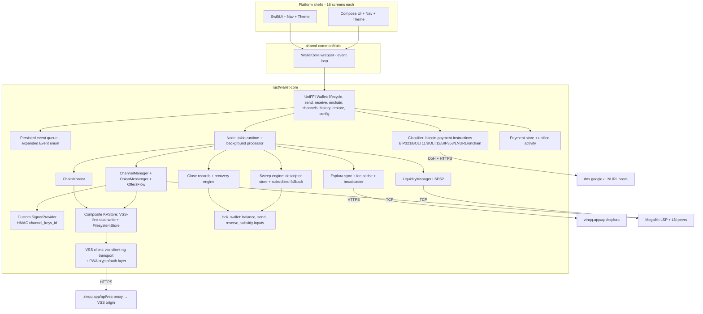
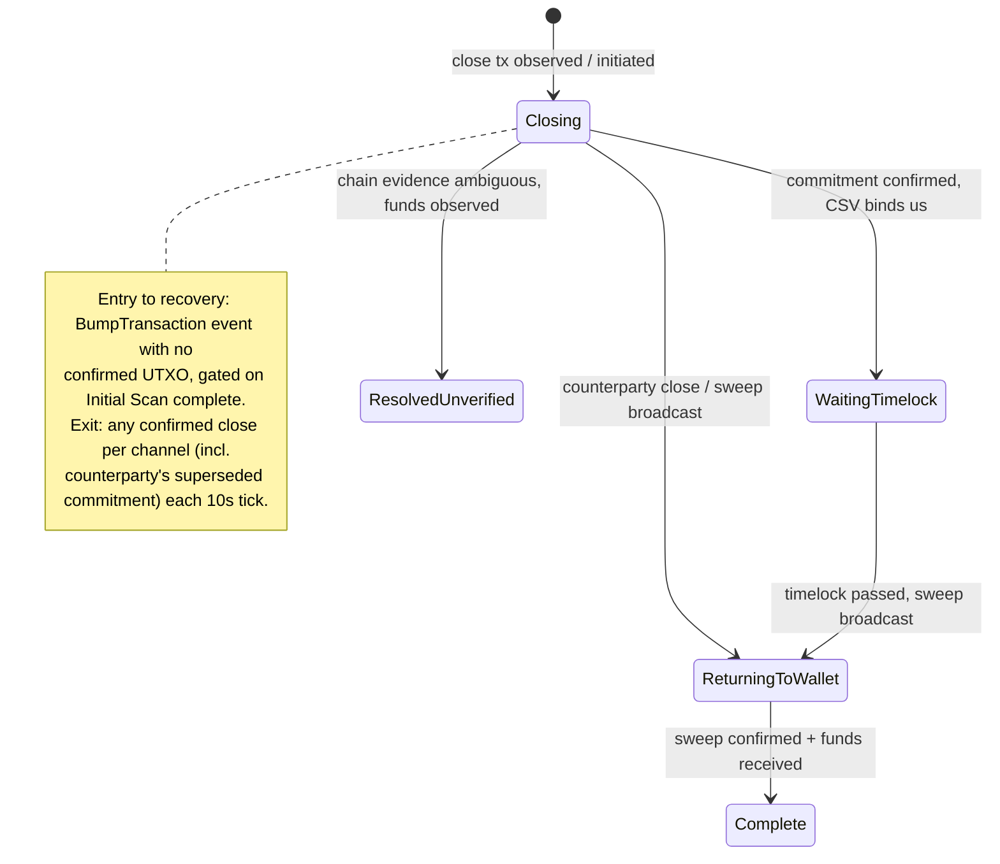
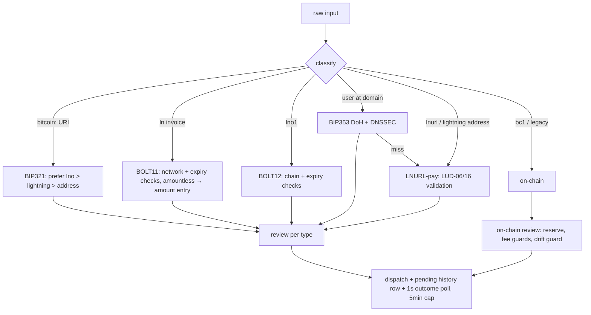

# Zinqq PWA Feature Parity - Plan

## Goal Capsule

- **Objective:** Grow zinqq-kmp from the proven payment spike into the full Zinqq native client: complete feature parity with the Zinqq PWA — the same screens and UX, every shipped capability, and the same architecture, including VSS encrypted cloud backup, the zinqq.app Esplora proxy, the Megalith LSPS2 LSP, and RGS gossip.
- **Product authority:** The parity target is the PWA's code as shipped in the sibling `zinq` repo on 2026-07-26 — not its README (which overstates VSS coverage) and not its roadmap (BIP353 receive and LSPS5 are unshipped and excluded).
- **Execution profile:** Rust-core units first (U1–U12, dependency-ordered), then Android UI (U13–U17) and iOS UI (U18–U22) waves that can start per-cluster as their core APIs land, then cross-client acceptance (U23). Automated gates in the Verification Contract; final acceptance includes restoring a PWA-created wallet on native from the seed alone.
- **Stop conditions:** Stop and surface rather than guess if (a) the PWA-compatible VSS wire format cannot be reproduced against the live VSS endpoint (U2's live check), (b) any step would run two live LDK nodes concurrently on one seed — except U23's two-client collision drill, which does so deliberately on a throwaway wallet to prove the fence — or (c) a change would weaken a fund-safety invariant (monitor durability before `Completed`, anchor reserve, restore rollback).
- **Open blockers:** None.

---

## Product Contract

### Summary

Implement every user-facing capability of the Zinqq PWA in the native KMP app: unified send (BIP321, BOLT11, BOLT12, BIP353, LNURL-pay, on-chain), unified receive (BIP321 QR, BOLT12 offer pager, LSPS2 JIT with live floor and fee review), QR scanning, persisted payment history with a unified activity feed, channel and peer management, force-close recovery with close records and CPFP, on-chain send with a 10,000-sat anchor reserve, sweep with subsidized fallback, seed backup/restore, and VSS encrypted cloud backup — wire-compatible with the PWA so one seed restores on either client. The UI replicates the PWA's 16 screens, navigation, design tokens, three appearance modes, and typography in Compose and SwiftUI.

### Problem Frame

The spike proved the KMP + Rust-core architecture pays on mainnet, but it is a single-screen demo: no history, no backup, no restore, no on-chain send, no channel management, and a raw-entropy seed with deliberately no import path. The PWA is the full product. The maintainer wants the native client brought to full parity so both clients offer the same product on the same infrastructure, with the seed and cloud backup portable between them.

### Key Decisions

- **Parity is to code-as-shipped.** README/code discrepancies resolve in favor of code: network graph, scorer, payment history, BOLT12 offer, and BDK changeset stay local-only; the VSS blob set is exactly `channel_manager`, per-monitor keys + `_monitor_keys` manifest, `_known_peers`, `force_close_recovery`, `close_records`.
- **Same client architecture as the spike** — Rust core on the LDK crates exposed via UniFFI/Gobley into shared `commonMain`, thin native Compose/SwiftUI shells, persisted handle-then-ack event queue (session-settled: user-directed — chosen over ldk-node, per-platform bindings, and Compose-multiplatform-everywhere; see `docs/plans/2026-07-25-001-feat-kmp-native-payment-spike-plan.md` Key Decisions, which this plan inherits wholesale).
- **Full VSS wire-format compatibility with the PWA**, including cross-client restore-from-seed: a wallet created and backed up by the PWA restores on native, and vice versa. Simultaneous use of one seed by two live clients stays forbidden; VSS versioned writes act as the fence.
- **Mnemonic-based key hierarchy replaces the spike's raw `keys_seed`.** This deliberately reverses the spike's fresh-seed/no-import rule (its AE2): backup reveal and restore-from-seed are now product features. Existing spike installs are disposable; no seed-format migration is built.
- **Both platforms reach parity** — every unit pair (Android/iOS) implements the same screen set against the same core APIs (inherits the spike's both-platforms decision, session-settled: user-directed).

### Requirements

**Wallet and keys**

- R1. A BIP39 12-word mnemonic is auto-created on first launch (no onboarding screens), stored in app-private storage with OS-backup exclusion; Backup reveals it with a 60-second auto-hide and hide-on-background; Restore replaces the current wallet from 12 entered words after a destructive confirm.
- R2. The key hierarchy is byte-identical to the PWA's: LDK seed at `m/535'/0'`, VSS encryption key at `m/535'/1'`, VSS signing key at `m/535'/2'`, BIP84 descriptors from `m/84'/0'/0'`, VSS store id `hex(SHA-256(ldkSeed))`, and the PWA's `channel_keys_id` HMAC scheme. The same mnemonic yields the same node ID on native and PWA.

**VSS backup and restore**

- R3. Fund-critical state is dual-written VSS-first with the PWA's exact wire format (HMAC-SHA256 key obfuscation, ChaCha20-Poly1305 `[nonce(12)][ciphertext+tag]` blobs without AAD, signature auth header) and the PWA's per-key write semantics (monitors/CM VSS-first with `InProgress` until durable; close records and recovery state local-first with best-effort VSS and field-wise merge on conflict).
- R4. Restore from seed alone on a fresh install rebuilds the wallet from VSS — including a wallet created by the PWA: monitor manifest → chunked downloads → validate-by-deserialization → ordered local writes, with rollback on partial failure. A fresh start with existing remote state silently recovers it; a local-only wallet migrates its state to VSS on first run.

**Send**

- R5. One send input classifies BIP321 URIs (preferring `lno` > `lightning` > address), BOLT11 (including amountless with amount entry), BOLT12 offers, BIP353 names (DNSSEC-verified over DoH), LNURL-pay (LUD-06/16 with callback-domain binding and invoice validation), and on-chain addresses — each routed to the PWA's review/result screens with its failure-message taxonomy, and every failure screen carrying "Your funds are safe."

**Receive**

- R6. Receive produces the PWA's unified uppercase BIP321 QR (address + BOLT11), a BOLT12 offer pager page when an offer exists and a channel is usable, and the JIT flow: live floor from one amountless `lsps2.get_info` per visit (static fallback 3,000 sats), quote freshness ≥ 30 s, fee review showing the setup fee, invoice expiry clamped to quote validity minus 30 s (minimum 60 s, else re-quote), and below-minimum states.

**On-chain, sweep, and recovery**

- R7. On-chain send with the anchor reserve: 10,000 sats withheld while any channel is open; exact-amount and send-max (drain when no channels, reserve-preserving otherwise); fee guards (6-block target, ≥ 2 sat/vB, `MAX_FEE_SATS` 50,000 → "try again later", dust floors); the review-to-broadcast drift guard.
- R8. Sweep pipeline: spendable outputs are tracked and swept by a single core-owned engine with per-channel attribution; wallet-owned `StaticOutput` descriptors excluded before persist; near-dust rescue via a subsidized sweep (LDK floor-fee PSBT + BDK wallet inputs as fee subsidy, net-positive-gated, reserve-aware); pending-sweep state surfaced with shortfall/add-funds UX.
- R9. Force-close recovery parity: close records (statuses Closing / Waiting timelock / Returning to wallet / Complete / Resolved-unverified) persisted locally and merged field-wise into VSS; recovery state machine gated on Initial Scan completion, deposit calculation (fee-rate × 140 vB × 1.5, 5,000-sat steps, 25,000 fallback), chain-truth exit reconciliation (any confirmed close counts, including the counterparty's), and CPFP fee-bumping of anchor closes.

**Channels and peers**

- R10. Peer and channel management: connect (`pubkey@host:port`), persist known peers, forget (blocked with open channels), open channel (20,000–16,777,215 sats with fee estimate and review), cooperative and force close with informational close estimates and in-flight-payment warnings.

**History and activity**

- R11. A persisted payment store (hash/id, direction, amount msat, status, fee, created-at, failure reason) written at dispatch and updated from LDK events; a unified activity feed merging Lightning rows (failed hidden), on-chain transactions (close-absorbed txids skipped), and one row per close record; transaction and channel-close detail screens with mempool.space links.

**UI and platform**

- R12. UI parity: the PWA's 16 routes with the same information architecture, design tokens and their three appearance modes (hybrid/dark/light, persisted), Inter + Space Grotesk typography, field/room screen split, one hot-moment accent per screen, BIP177 `₿` sat formatting (floor for display, ceil for fees), 44 px touch targets, and per-screen behaviors — implemented natively in Compose and SwiftUI, deviating only where the platform requires (system back handling, permission dialogs, share sheets).
- R13. Camera QR scanning on both platforms feeding the send classifier with the raw scanned string; invalid scans toast "Not a valid payment code"; camera-error taxonomy preserved.
- R14. Shells contain no Lightning or business logic: classification, validation, fee math, merging, and protocol work live in the Rust core behind the FFI; shells reduce events/state to UI and forward intents.

**Infrastructure**

- R15. Same infrastructure as the PWA: Esplora default `https://zinqq.app/api/esplora`, VSS default `https://zinqq.app/api/vss-proxy`, Megalith LSP identity from the PWA's config, RGS `https://rapidsync.lightningdevkit.org/snapshot`, mainnet-only with a genesis-hash check at startup; all endpoints overridable via config.

### Key Flows

- F1. Unified send
  - **Trigger:** User pastes/scans/types into the single send input.
  - **Steps:** Core classifies; async resolution for BIP353/LNURL (5 s budgets, LNURL fallback for BIP353 misses); amount entry when needed (bounds from LNURL min/max or dust floor); review screen per type; dispatch (LN with retry ×3, on-chain with drift guard); 1 s outcome polling with 5-minute timeout and cancel-as-abandon.
  - **Outcome:** Success or taxonomy-mapped failure screen; history row written at dispatch and settled by events. **Covers R5, R7, R11.**
- F2. JIT receive
  - **Trigger:** Amount request exceeding inbound capacity (or any request with no usable channel).
  - **Steps:** Quote (`get_info`, cheapest valid params, freshness gate) → fee review → buy → invoice built with intercept SCID hint, expiry clamped to quote validity → QR displayed with countdown → payment detected via history store.
  - **Outcome:** Balance reflects amount minus skimmed fee. **Covers R6.**
- F3. Restore from seed
  - **Trigger:** User completes the 12-word grid and confirms the destructive replace.
  - **Steps:** Derive keys → probe VSS (`listKeyVersions`; empty = "No backup found") → download CM, manifest, monitors, peers → stop node and flush writers → clear local state → ordered writes (mnemonic, seed, CM before monitors, monitors, peers) → restart.
  - **Outcome:** Wallet identity and channel state match the backed-up wallet; progress steps surfaced. **Covers R1, R4.**
- F4. Force-close lifecycle
  - **Trigger:** A channel closes unilaterally.
  - **Steps:** Close record created and reconciled against chain truth each sync; `BumpTransaction` events CPFP anchor closes (with recovery deposit flow when no confirmed UTXO exists, gated on Initial Scan); spendable outputs tracked and swept, subsidized if near-dust; statuses progress to Complete.
  - **Outcome:** Funds return to the on-chain wallet; activity shows the close with live status. **Covers R8, R9.**

### Acceptance Examples

- AE1. **Covers R2.** Given the same 12-word mnemonic, when the native app and the PWA each initialize, then both report the identical node ID.
- AE2. **Covers R3, R4.** Given a wallet created, funded, and backed up by the PWA, when its mnemonic is restored on a fresh native install, then balances and channel state match and the node starts cleanly (single-client discipline observed: the PWA instance is stopped first).
- AE3. **Covers R4.** Given a native wallet with VSS backup, when the app is deleted and reinstalled and the seed restored, then monitors, manager, and known peers rebuild from VSS with no manual input.
- AE4. **Covers R6.** Given a fresh wallet with no channels, when the user requests an amount below the live JIT floor, then the numpad blocks with "Minimum ₿X" and no `buy` is issued.
- AE5. **Covers R5.** Given a BIP321 URI containing `lno`, `lightning`, and an address, when classified, then the BOLT12 offer is preferred, with BOLT11 and on-chain as ordered fallbacks.
- AE6. **Covers R7.** Given one open channel and a send-max request, when the transaction is built, then exactly 10,000 sats remain as an explicit reserve output and the review-to-broadcast drift guard rejects any amount change.

### Scope Boundaries

**Deferred for later**

- BIP353 receive (claimable `user@zinqq.app` address) and LSPS5 offline receive — unshipped PWA roadmap.
- Store distribution, signing, release process; push notifications; background receive.
- Platform-keystore seed protection (Keychain / EncryptedSharedPreferences) — parity keeps the PWA's posture (plaintext-at-rest in app-private storage with OS-backup exclusion); keystore hardening is a follow-up.
- Fiat/currency display (the PWA has none).

**Outside this work's identity**

- Code sharing with the web PWA — the clients share protocol, formats, and infrastructure, never code.
- Replacing the PWA — both clients remain maintained.
- PWA-only machinery: service worker/update banner, install prompts, WS→TCP proxy (native uses direct TCP), multi-tab Web Locks/takeover logic (native has the process-scoped data-dir lock), LNURL CORS shim (native hits endpoints directly).

**Deferred to Follow-Up Work**

- `MonitorUpdatingPersister` delta persistence — full-monitor writes are required for PWA blob-format parity anyway.
- LSP failover machinery (the PWA's fallback slot is built but disabled; Megalith is sole LSP).
- Settings "How It Works" / "Get Help" content (inert no-ops in the PWA; replicate as inert rows).
- In-app error-log ring buffer UI (core keeps a capped log; no screen exposes it in the PWA).

### Dependencies / Assumptions

- The PWA's public endpoints (`zinqq.app/api/esplora`, `zinqq.app/api/vss-proxy`) are reachable from native HTTP clients (maintainer-authorized for the spike 2026-07-25; re-verified live in U2/U3). Fallback: direct VSS origin URL via config.
- `vss-client-ng 0.4.1` transport interoperates with the PWA's VSS server (both speak the standard LDK VSS protobuf protocol); its built-in crypto/obfuscation layers are NOT used (KTD-2).
- `bitcoin-payment-instructions 0.7` (with `http` feature) compiles and runs on Android/iOS targets; its DoH resolution (dns.google) substitutes for the PWA's cloudflare-dns.com endpoint with identical DNSSEC (`AD`) requirements. If the crate proves unusable on a mobile target, the fallback covers all four of its roles: hand-rolled BIP353/LNURL resolution with `dnssec-prover` + `reqwest` following the PWA's flow, classification via the PWA's preserved dispatch order and regexes (KTD-6), and BOLT12 parsing via the already-pinned `lightning` crate's offer parser.
- The VSS origin is trusted for freshness and integrity of fund-critical blobs: encryption gives confidentiality only, versioning is server-maintained, and a server serving a stale-but-valid monitor set at restore is a stale-commitment/penalty hazard. This matches the PWA's posture and is accepted, not mitigated, in this plan.
- Existing spike installs are disposable; the mnemonic hierarchy ships without a `keys_seed` migration.
- Serialization interop: LDK WASM 0.2.4-0 and `lightning 0.2.4` produce identical `ChannelMonitor`/`ChannelManager` bytes (bindings wrap the same compiled crate); cross-client restore relies on this.
- Megalith remains the LSP; identity and quote behavior as proven live 2026-07-26 in the spike.

---

## Planning Contract

**Product Contract preservation:** new plan (bootstrap source); no upstream artifact edited.

### Key Technical Decisions

- KTD-1. **Dependency additions on top of the spike's pin set:** `vss-client-ng = 0.4.1` (transport, protobuf types, retry policies only — ldk-node 0.7 parity pin), `bitcoin-payment-instructions = 0.7` (features `std`, `http`) for classification/BOLT12-parse/BIP353/LNURL, `bip39 = 2.x` for mnemonics, `hmac`/`sha2`/`chacha20poly1305` (or `lightning`'s vendored crypto where exposed) for the VSS scheme. No `lnurl-rs` (its `lightning-invoice 0.32` pin conflicts). Existing lightning/bdk pins unchanged.
- KTD-2. **Replicate the PWA's VSS crypto exactly; do not use `StorableBuilder`/`KeyObfuscator`.** Wire key = `hex(HMAC-SHA256(vss_encryption_key, plaintext_key))`; value = `[random nonce (12)][ChaCha20-Poly1305 ciphertext+tag]` with empty AAD; auth header `authorization = hex(compressed pubkey) + hex(compact sig) + unix-seconds`, signing `SHA-256(salt64 ‖ pubkey ‖ timestamp-ASCII)` with the PWA's 64-byte salt constant; store id `hex(SHA-256(ldkSeed))`. The crate's Storable envelope is incompatible with PWA blobs; format compatibility is the whole point. Verified with test vectors exported from the PWA implementation.
- KTD-3. **Full-monitor writes stay (no delta persistence); VSS-first dual-write with split monitor/CM semantics.**
  - *Monitors:* a custom `Persist` implementation returns `ChannelMonitorUpdateStatus::InProgress`, runs the VSS-then-local write on a background chain (per-channel serialized), and calls `channel_monitor_updated` per update id only after both writes are durable. This is the third arm of a real fork, chosen deliberately: a sync-blocking KVStore over VSS would stall the background processor for the length of any outage, and LDK's built-in async path (`ChainMonitor::new_async_beta`) is hard-wired to delta persistence (`MonitorUpdatingPersisterAsync`), which breaks PWA full-blob format parity. Consequence: `builder.rs` swaps the ChainMonitor persister from the raw KVStore to this composite `Persist`, and `node.rs` revisits the background-processor entry point accordingly.
  - *Channel manager:* PWA semantics (`persist-cm.ts`) — a bounded write attempt; failure sets a dirty/retry flag consumed by the next timer tick. `InProgress` is a monitor-only concept; CM persistence never gates the event loop.
  - *Transient failures* (network/5xx) retry with indefinite exponential backoff (500 ms → 60 s) and a degraded-mode event after 10 s.
  - *Version conflicts (409) on fund-critical keys are content-compared, never blindly retried:* refetch remote bytes and compare on decrypted plaintexts (or equivalently the exact previously-sent ciphertext buffer, which retries must reuse rather than re-encrypt — KTD-2's random nonces make independent encryptions of identical plaintext byte-divergent); identical → short-circuit success; divergent → **fence immediately** — persist a durable fenced flag (survives restart), halt the node with a typed error, and issue zero further puts. Un-fencing is user-owned: a fenced screen offers "this wallet is active elsewhere — restore from backup (wipe + U4 flow) or quit." This is a deliberate hardening over the PWA's refetch-and-overwrite retry, not parity drift.
  - *Version-cache seeding at startup is mandatory* when local state exists — seed failure is a typed startup error (a lost cache would otherwise false-trip the fence on the first write). Version-0 puts to fund-critical keys are permitted only after `listKeyVersions` returned empty in the current session; silent-recovery failure against a non-empty namespace is a fatal startup error, never a fall-through to fresh-wallet writes.
  - *Manifest gating is normative:* for `persist_new_channel`, the `_monitor_keys` manifest put (merge-on-conflict, same backoff) must succeed before `channel_monitor_updated` — LDK will not broadcast funding until then, so a stuck manifest write stalls channel open instead of orphaning a monitor. Updates to existing monitors need no manifest gate.
  - *Source of truth on restart:* local storage is what the node loads; remote may lead local at a crash seam, which is benign because `Completed`/`channel_monitor_updated` was never signalled for the in-flight write and LDK re-persists. Close records and recovery state are local-first with best-effort VSS and the PWA's exact `mergeCloseRecords` semantics on 409. If a local-only CM fast path is ever added (the PWA has one on `visibilitychange`), it must be a recorded exception.
- KTD-4. **Key hierarchy and signer parity.** BIP39 (English, 128-bit) → BIP32: LDK seed = private key at `m/535'/0'`; VSS encryption key `m/535'/1'`; VSS signing key `m/535'/2'`; BDK BIP84 `wpkh(.../84'/0'/0'/{0,1}/*)`. `KeysManager` constructed with `v2_remote_key_derivation = false` — not merely parity: `true` forbids downgrade below LDK 0.2 and changes counterparty-close script pubkeys, breaking byte-compat with the PWA's WASM signer. Custom `SignerProvider` wrapping `KeysManager`: `generate_channel_keys_id = HMAC-SHA256(channelKeyHmacKey, [inbound u8][user_channel_id lo64 BE][hi64 BE])` where `channelKeyHmacKey = HMAC-SHA256(ldkSeed, "zinq/channel_keys_id/v1")`; `get_destination_script` = BDK external address at index `BE(first 4 bytes of channel_keys_id) mod 10_000` via peek + `reveal_addresses_to` (determinism is scoped to destination scripts only — `get_shutdown_scriptpubkey` uses `next_unused_address`, non-deterministic by design, matching the PWA); BDK initialized eagerly (no network) before any LDK deserialization; monitors deserialized with the custom provider.
- KTD-5. **One expanded `Wallet` FFI object; all business logic in Rust.** The UniFFI surface grows to cover send/receive/on-chain/channels/history/restore/settings queries, and the `Event` enum grows to carry payment hashes/ids, channel and sweep and recovery state changes, and restore progress. Shells keep the established `reduce()` pattern; commonMain stays a thin wrapper (inherits the spike's event-queue decision, session-settled: user-directed — chosen over UniFFI callback interfaces: threading constraints). The object's concurrency contract is explicit: long-running or network-touching operations (`restore`, `classify`, sends, quote fetches) are async; queries are cheap and non-blocking and never inherit persistence backoff; each method declares its valid call states across stopped / running / fenced / restoring (e.g., `restore` only from stopped; queries readable while fenced so the fenced screen can render). The `Event` enum evolves in lockstep with the shells (in-repo rebuild, not a compatibility surface); reducers still log-and-ignore unrecognized variants defensively.
- KTD-6. **Payment classification in Rust via `bitcoin-payment-instructions`, adjusted to PWA semantics:** BIP321 preference `lno` > `lightning` > address; network checks against mainnet; expiry checks at classify time; LNURL LUD-06/16 with callback-domain binding, metadata `description_hash` verification, and amount-match enforcement; BIP353 requires DNSSEC verification with LNURL fallback on miss. Classification returns a typed enum the shells render verbatim.
- KTD-7. **Unified activity computed in core.** `list_activity()` merges the payment store (failed rows hidden), BDK transactions (net amounts; txids absorbed by close records skipped), and one row per close record with the PWA's ordering and status-derivation rules. Shells never merge.
- KTD-8. **Sweep = a ported PWA descriptor-store pipeline with single ownership; the spike's `OutputSweeper` wiring is replaced.** `OutputSweeper` was rejected after API review: it exposes no untrack/release, its regenerate-and-rebroadcast cycle would race a parallel subsidized transaction over the same outpoints, and it emits no per-tx attribution — which close-record status derivation (U10) requires. Instead the core owns a KVStore-persisted spendable-outputs store (PWA `sweep.ts` shape): wallet-owned `StaticOutput` descriptors filtered before persist (including post-recovery re-derivation by `channel_keys_id`), dedup by descriptor+outpoint, all-or-nothing `spend_spendable_outputs` batches, and a subsidized fallback for near-dust batches — `create_spendable_outputs_psbt` at the 250 sat/kW floor plus BDK foreign-UTXO inputs as fee subsidy (net-positive gate, ≤ 20 inputs, reserve-aware, 546-sat dust gate, RBF sequence), dual-signed (LDK signs its inputs with `trust_witness_utxo: true`, BDK its own; no PSBT byte-surgery — native BDK has real foreign-UTXO support) and verified against chain before descriptors are dropped. Sweep txs carry per-channel attribution feeding close records. Pending-sweep state (lower-bound sats, shortfall, `needsOnchainFunds`) exposed as events + query.
- KTD-9. **Fee and broadcast parity.** Fee-estimator floors/targets aligned to the PWA table — notably `UrgentOnChainSweep` at a 3-block target (the 1-block default overpaid 30× in a real incident) — with 60 s cache TTL and clamp ceiling 500,000 sat/kW; broadcaster maps "already known"/`-25`/`-27` responses to success sentinels; pending broadcasts persisted with startup drain and 48 h TTL; funding txs persisted before `funding_transaction_generated`.
- KTD-10. **`UserConfig` parity cluster:** `manually_accept_inbound_channels`, `negotiate_scid_privacy`, `negotiate_anchors_zero_fee_htlc_tx`, `max_inbound_htlc_value_in_flight_percent_of_channel = 100`, `trust_own_funding_0conf`, `force_announced_channel_preference = false`, `accept_underpaying_htlcs`, plus per-channel `ChannelConfigOverrides` on 0-conf accepts from the trusted-LSP set (kept as a set + predicate, never a single hardcoded pubkey).
- KTD-11. **UI parity via per-platform token systems generated from one spec.** The PWA's role tokens (field/room, hot, dark-surface family, danger/warning/success, qr-tile), three appearance modes with persisted selection and pre-render application, bundled Inter + Space Grotesk (OFL), BIP177 `₿` formatting (floor display / ceil fees), the z-ladder, 44 px targets, and the 64/56 px bars are encoded once per platform (Compose theme object; SwiftUI theme environment). Navigation is declarative destination-based like the PWA (`backTo`, not history pops), with system back mapped to the same destinations.
- KTD-12. **Infrastructure defaults identical to the PWA:** Esplora `https://zinqq.app/api/esplora` (fallbacks `blockstream.info`, `mempool.space`), VSS `https://zinqq.app/api/vss-proxy` (the pass-through adds no trust; direct origin configurable), Megalith `034066e2…1453b0@64.23.159.177:9735`, RGS snapshot URL, explorer links `https://mempool.space`. Mainnet-only with an Esplora genesis-hash check at startup; network-dependent constants live in one network-keyed module (mainnet-audit learning).

### Assumptions

Recorded because pipeline mode resolved them without a user checkpoint; each has a fallback rather than a blocking dependency.

- "Exact same UI" is implemented as visual and behavioral parity in native toolkits — same routes, layouts, tokens, copy, and state machines — with platform-mandated deviations only (system back, permission prompts, share sheet). Pixel-for-pixel web rendering is not attempted.
- Parity covers the PWA's shipped behavior including its inert surfaces (Settings rows that do nothing render as inert) and excludes its known-gap TODOs (no claim-time underpayment bound, ignored `client_trusts_lsp`, no LNURL capacity check) — replicated as-is, not fixed silently; fixes are follow-ups.
- The unified send/receive copy, error strings, and status labels are carried verbatim from the PWA (they encode months of UX convergence).
- iOS gains an XCTest target for model/reducer tests (the spike had none); heavier UI verification stays manual per platform.
- The spike's foreground-only node lifecycle (spike KTD-10) continues to govern; nothing in parity scope requires background execution.
- The VSS proxy path `zinqq.app/api/vss-proxy/{endpoint}` maps to `{VSS_ORIGIN}/vss/{endpoint}`; if the proxy rejects non-browser clients, the direct origin URL is supplied via config (maintainer owns the value).

### System-Wide Impact: one VSS namespace, multiple clients

Cross-client restore makes native the second (or third, counting multi-device PWA use) writer into one VSS namespace — the store id derives from the seed, so every client of a wallet shares it. The contract:

- **Detection:** a divergent-content 409 on a fund-critical key means another client wrote; the writer fences itself (durable flag, node halt, zero further puts — KTD-3).
- **User-facing recovery:** the fenced client shows "This wallet is active on another device" with two exits — take over here (wipe + restore-from-VSS, the U4 flow, which adopts the remote state as truth) or quit and keep using the other client. The take-over path presents a blocking confirmation that the other client has been closed before the wipe begins (AE2's "the PWA instance is stopped first" discipline, enforced at the moment the user needs it), and it warns that after genuine concurrent use channel state may be forked beyond safe automatic recovery — cooperatively closing channels from the still-active client first is the safe exit. No automatic un-fence; restart does not clear the flag.
- **Non-goal:** no VSS-level active-client lease or heartbeat is built. Fencing is collision-detection, not prevention; the acceptance protocol and README carry the single-active-client discipline.
- **Namespace isolation:** a reinstall that auto-generates a new mnemonic derives a new store id and cannot touch the old backup (old funds are orphaned until restored by seed, never corrupted).

### High-Level Technical Design

Component topology after parity (additions to the spike in bold):



VSS dual-write and restore (the fund-safety core of this plan):

```mermaid
sequenceDiagram
  participant LDK
  participant KV as Composite KVStore
  participant VSS as VSS endpoint
  participant FS as FilesystemStore
  Note over LDK,FS: Monitor persist (KTD-3)
  LDK->>KV: persist_new_channel / update (returns InProgress)
  KV->>VSS: putObjects(obfuscated key, encrypted blob, version n)
  alt transient error
    VSS-->>KV: 5xx/timeout
    KV->>VSS: retry, backoff 500ms→60s (indefinite, degraded event at 10s)
  else version conflict
    VSS-->>KV: 409 CONFLICT
    KV->>VSS: refetch remote bytes and compare
    Note over KV: identical → short-circuit success<br/>divergent → persist fenced flag, halt node,<br/>zero further puts (un-fence = wipe + restore)
  end
  VSS-->>KV: ok (version n+1 cached)
  KV->>VSS: update _monitor_keys manifest (gates new-channel completion)
  KV->>FS: local write
  KV->>LDK: channel_monitor_updated (per update id)
  Note over LDK,FS: Restore from seed (F3)
  KV->>VSS: listKeyVersions (empty → "No backup found")
  KV->>VSS: get channel_manager, _monitor_keys, monitors (chunks of 10, 120s budget), _known_peers
  KV->>KV: validate each blob by deserialization; rollback all on failure
  KV->>FS: stop node, flush writers, clear, ordered writes (CM before monitors), restart
```

Close-record / recovery lifecycle (F4):



Send classification and dispatch (F1):



### Output Structure

Expected additions (per-unit Files stay authoritative):

```text
rust/src/
├── keys.rs              # mnemonic, m/535' hierarchy, channel_keys_id HMAC (U1)
├── signer.rs            # custom SignerProvider (U1)
├── vss/
│   ├── mod.rs           # VssStore: composite KVStore glue (U3)
│   ├── client.rs        # transport via vss-client-ng (U2)
│   ├── crypto.rs        # PWA obfuscation + ChaCha20-Poly1305 (U2)
│   └── auth.rs          # signature header provider (U2)
├── restore.rs           # restore-from-seed + silent recovery + migration (U4)
├── history.rs           # payment store + unified activity (U5)
├── send.rs              # classification + dispatch + outcome tracking (U6)
├── receive.rs           # BIP321 URI, offers, JIT floor/quote (U7; JIT from liquidity/)
├── onchain_send.rs      # tx build, reserve, sendMax, drift guard (U8)
├── channels.rs          # peers/channels management API (U9)
├── close_records.rs     # store + status derivation + reconcile (U10)
├── recovery.rs          # recovery state machine + deposit calc (U10)
├── bump.rs              # BumpTransaction/CPFP handling (U11)
└── sweep.rs             # tracking, exclusion, subsidized fallback (U11)
androidApp/src/main/kotlin/zinqq/app/
├── theme/  nav/  components/   # U13
└── screens/ (home, activity, send, scan, receive, settings, ...)  # U14–U17
iosApp/iosApp/
├── Theme/  Navigation/  Components/   # U18
└── Screens/                            # U19–U22
```

---

## Implementation Units

Unit Index:

| U-ID | Title | Key files | Depends on |
|---|---|---|---|
| U1 | Mnemonic key hierarchy & signer parity | `rust/src/keys.rs`, `rust/src/signer.rs`, `rust/src/builder.rs` | — |
| U2 | VSS wire client (PWA-compatible) | `rust/src/vss/{client,crypto,auth}.rs` | U1 |
| U3 | VSS dual-write persistence & migration | `rust/src/vss/mod.rs`, `rust/src/builder.rs` | U2 |
| U4 | Restore-from-seed & silent recovery | `rust/src/restore.rs`, `rust/src/api.rs` | U3 |
| U5 | Payment store & event surface expansion | `rust/src/history.rs`, `rust/src/events.rs`, `rust/src/api.rs` | — |
| U6 | Unified send engine | `rust/src/send.rs`, `rust/src/payment.rs` | U5, U8 |
| U7 | Receive engine | `rust/src/receive.rs`, `rust/src/liquidity/` | U5 |
| U8 | On-chain send & reserve | `rust/src/onchain_send.rs`, `rust/src/wallet.rs` | U5 |
| U9 | Channels & peers API | `rust/src/channels.rs`, `rust/src/node.rs` | U5 |
| U10 | Close records & recovery engine | `rust/src/close_records.rs`, `rust/src/recovery.rs` | U3, U8 |
| U11 | CPFP & subsidized sweep | `rust/src/bump.rs`, `rust/src/sweep.rs` | U8, U10 |
| U12 | Config, UserConfig & fee parity | `rust/src/config.rs`, `rust/src/fees.rs`, `rust/src/chain.rs` | — |
| U13 | Android design system & shell | `androidApp/.../theme/`, `nav/`, `components/` | — |
| U14 | Android wallet & activity screens | `androidApp/.../screens/` | U5, U10, U13 |
| U15 | Android send & scan | `androidApp/.../screens/send/`, `scan/` | U6, U8, U13 |
| U16 | Android receive | `androidApp/.../screens/receive/` | U7, U13 |
| U17 | Android settings suite | `androidApp/.../screens/settings/` | U4, U9, U13 |
| U18 | iOS design system & shell | `iosApp/iosApp/Theme/`, `Navigation/` | — |
| U19 | iOS wallet & activity screens | `iosApp/iosApp/Screens/` | U5, U10, U18 |
| U20 | iOS send & scan | `iosApp/iosApp/Screens/Send/`, `Scan/` | U6, U8, U18 |
| U21 | iOS receive | `iosApp/iosApp/Screens/Receive/` | U7, U18 |
| U22 | iOS settings suite | `iosApp/iosApp/Screens/Settings/` | U4, U9, U18 |
| U23 | Cross-client acceptance & docs | `README.md` | all |

### U1. Mnemonic key hierarchy & signer parity

- **Goal:** The wallet derives every key from a BIP39 mnemonic exactly as the PWA does, and channel signing/destination derivation is cross-client compatible.
- **Requirements:** R1 (storage half), R2. Cites KTD-4.
- **Dependencies:** None.
- **Files:** `rust/src/keys.rs`, `rust/src/signer.rs`, `rust/src/builder.rs`, `rust/src/wallet.rs`, `rust/tests/restart.rs` (update), remove the no-seed-input compile guard.
- **Approach:** New `keys.rs`: mnemonic generate/load (write-once file `mnemonic` in the data dir, replacing `keys_seed`), BIP32 derivations per KTD-4, zeroize after use. Auto-generation checks the restore-in-progress marker first (U4) — a mnemonic is never generated while a restore is incomplete. `signer.rs`: `SignerProvider` wrapper delegating to `KeysManager` but overriding `generate_channel_keys_id` (HMAC scheme) and `get_destination_script` (BDK-derived deterministic index); `get_shutdown_scriptpubkey` stays `next_unused_address` per KTD-4. Builder ordering enforced: BDK wallet initialized from descriptors before any monitor/manager deserialization; monitors read with the custom provider. `KeysManager` uses `v2_remote_key_derivation = false`. Export a small `derive_debug_info()` (node id) for AE1 verification.
- **Patterns to follow:** PWA `zinq/src/wallet/keys.ts`, `zinq/src/ldk/traits/bdk-signer-provider.ts`; spike `builder.rs` restore ordering.
- **Test scenarios:**
  - Covers AE1 (vector half): fixed test mnemonic → expected node id, LDK seed, VSS keys, store id, BIP84 descriptors — vectors exported from the PWA implementation.
  - channel_keys_id vector: known ldkSeed + user_channel_id (inbound and outbound) → exact HMAC output and destination index.
  - Write-once: second `generate` call refuses to overwrite an existing mnemonic; corrupt mnemonic file fails start with a typed error.
  - Deterministic destinations: same channel_keys_id yields the same BDK address across a wallet rebuild (restore path).
- **Verification:** `cargo test` green including new vector tests; restart-safety suite still passes with the mnemonic-based seed.

### U2. VSS wire client (PWA-compatible)

- **Goal:** A Rust VSS client whose bytes on the wire are indistinguishable from the PWA's: same endpoints, obfuscation, encryption, auth, and versioning.
- **Requirements:** R3 (wire format), R15. Cites KTD-1, KTD-2.
- **Dependencies:** U1 (keys).
- **Files:** `rust/src/vss/client.rs`, `rust/src/vss/crypto.rs`, `rust/src/vss/auth.rs`, `rust/Cargo.toml`.
- **Approach:** `vss-client-ng 0.4.1` for transport/proto/retry with a custom `VssHeaderProvider` implementing the PWA's signature auth; `crypto.rs` implements key obfuscation and blob encryption per KTD-2. Store id from U1. 15 s request timeout, list pagination cap. Encryption sits above the transport (encrypt/obfuscate before put, reverse after get).
- **Execution note:** Start with cross-implementation test vectors (key obfuscation, blob round-trip, auth preimage/signature) generated from the PWA's TS code, then wire transport. An `#[ignore]`d live test does a put/get/list round-trip against `https://zinqq.app/api/vss-proxy` with a throwaway store id — run it before U3 begins (stop condition (a) lives here). Also falsify the serialization-interop assumption here, not at U23: export one real `ChannelManager` and one `ChannelMonitor` blob from a PWA dev wallet, decrypt with this unit's crypto layer, and deserialize with U1's custom SignerProvider in a cargo test — U3 does not start until this passes.
- **Test scenarios:**
  - Vector parity: obfuscated key, encrypted blob (fixed nonce injected for the test), and auth header for fixed inputs match PWA-exported vectors byte-for-byte.
  - Round-trip: encrypt→decrypt identity; decrypt rejects blobs shorter than nonce+tag; tampered ciphertext fails auth.
  - Versioning: put at stale version surfaces conflict as a typed error; 404/NO_SUCH_KEY → None.
  - Error taxonomy: HTTP failure vs VSS ErrorResponse codes map to distinct errors.
  - Serialization interop: PWA-exported `ChannelManager` and `ChannelMonitor` blob fixtures decrypt and deserialize with the U1 signer provider (gates U3).
- **Verification:** `cargo test` green; live round-trip test passes against the real endpoint.

### U3. VSS dual-write persistence & migration

- **Goal:** Fund-critical persistence is dual-written VSS-first per PWA semantics; a local-only wallet migrates to VSS; version caches seed correctly.
- **Requirements:** R3. Cites KTD-3.
- **Dependencies:** U2.
- **Files:** `rust/src/vss/mod.rs` (composite store), `rust/src/builder.rs`, `rust/src/node.rs`, `rust/src/events.rs` (degraded/backup events).
- **Approach:** Per KTD-3's split semantics: a custom `Persist` for monitors (background VSS-then-local chains, `InProgress`, per-update `channel_monitor_updated`, manifest put gating `persist_new_channel` completion) wired into the ChainMonitor in `builder.rs`; CM persistence as bounded-attempt + dirty/retry flag on the node's timer tick; `_monitor_keys` manifest (regex-validated keys, dedup, merge-on-conflict, backfill for pre-manifest stores); `_known_peers` whole-map LWW writes; graph/scorer/events/changeset stay local-only. Conflict policy: content-compare on 409, fence-on-divergence with a durable fenced flag (KTD-3). Local storage is authoritative for node start; remote-leading-local at a crash seam converges by re-persist. Startup: if local store empty → silent recovery (U4 path), and a recovery failure against a non-empty namespace is a fatal startup error — never fall through to fresh-wallet writes; if local data and VSS empty → batch migration put; else mandatory version-cache seeding (seed failure = typed startup error). Version-0 puts to fund-critical keys only after `listKeyVersions` returned empty this session. Degraded-backup and fenced states surface as events.
- **Test scenarios:**
  - Monitor persist gates channel ops: `Completed`/`channel_monitor_updated` never signalled while the VSS put is failing; resumes after recovery (mock transport).
  - Manifest gates new channels: crash injected between the monitor put and the manifest put → `channel_monitor_updated` never fired for `persist_new_channel`; funding not broadcast.
  - Fence: divergent-content 409 on a monitor key halts with the fenced error and zero puts issued after detection; identical-content 409 short-circuits to success; fenced flag survives restart.
  - Fresh-over-backup guard: empty local + non-empty VSS + recovery download failure → node refuses to start; no VSS write issued; remote CM bytes unchanged.
  - Version seeding: seed failure at startup with existing local state → typed startup error (no writes at guessed versions).
  - Crash seam: crash injected between the remote put and the local write → restart re-persists and converges; no fence trip, no data loss.
  - Migration: local monitors + empty VSS → one batch put (CM + monitors + manifest + peers), versions seeded to 1; migration failure is non-fatal.
  - CM dirty-flag: failed CM write retries on the next tick without blocking the event loop.
- **Verification:** `cargo test` green; restart suite green with the composite store; live smoke: fresh wallet dual-writes and `listKeyVersions` shows the expected obfuscated key count.

### U4. Restore-from-seed & silent recovery

- **Goal:** `restore(mnemonic)` rebuilds a wallet from VSS (fresh installs recover silently), with validation, ordered writes, rollback, and progress events.
- **Requirements:** R1 (restore half), R4. Cites KTD-3.
- **Dependencies:** U3.
- **Files:** `rust/src/restore.rs`, `rust/src/api.rs`, `rust/src/events.rs`.
- **Approach:** Core restore engine per F3: probe (`listKeyVersions` empty → typed `NoBackupFound`), manifest reconciliation (obfuscated keys are deterministic HMACs, so compute the obfuscated form of every expected key — manifest entries plus the fixed set — and set-diff against `listKeyVersions`; any unexplained remote key aborts with "backup inconsistent" before anything is written), chunked monitor downloads (10 parallel, 120 s overall budget), validate every blob by deserialization before any local write, stop-node-and-flush-writers before clearing (the PWA's background-persist race, and this repo's process-scoped ownership, both demand it). The write phase is two-phase: a durable `restore_in_progress` marker is written before clearing and removed only after all writes are durable; startup with the marker present treats local LDK state as void — no node boot, no mnemonic auto-generation (U1) — and resumes silent recovery from VSS (idempotent). Ordered writes (mnemonic, CM before monitors, monitors, peers), restart. An independent startup integrity check hard-halts with a typed error when the CM references a channel with no local monitor (the missing mirror of the PWA's monitors-without-CM halt). Progress steps surfaced as `RestoreProgress` events matching the PWA's step copy. FFI: `Wallet.restore(mnemonic)` valid only from the stopped state; `reveal_mnemonic()` for Backup.
- **Test scenarios:**
  - Covers AE3 (offline half): seeded mock VSS → full restore; node restarts with the restored identity.
  - Rollback: corrupt monitor blob in the set → no partial local writes remain, typed error, original wallet intact.
  - Crash-prefix matrix: process killed after the marker write, after clear, after mnemonic, after CM, mid-monitors → every restart resumes recovery; the node never boots against a partial set; no fresh mnemonic is generated.
  - Manifest reconciliation: a remote monitor key absent from the manifest → restore aborts with "backup inconsistent"; nothing written locally.
  - No backup: empty listKeyVersions → `NoBackupFound`, local state untouched.
  - Ordering: CM written before monitors (write log assertion); restore refused while the node is running.
  - Integrity check: CM referencing a channel with no local monitor → hard halt, not a silent start.
  - Stale-manager defense: CM that fails deserialization with zero monitors → discarded, fresh manager (not a crash).
- **Verification:** `cargo test` green; manual: fresh emulator restore from a native-created backup completes with progress UI (full cross-client proof lands in U23).

### U5. Payment store & event surface expansion

- **Goal:** Payments persist across restarts; the FFI event/query surface carries everything the 16 screens need.
- **Requirements:** R11 (store half), R14. Cites KTD-5, KTD-7.
- **Dependencies:** None (parallel with U2–U4).
- **Files:** `rust/src/history.rs`, `rust/src/events.rs`, `rust/src/api.rs`, `rust/src/node.rs`.
- **Approach:** `PersistedPayment` rows (KTD-7 shape, KVStore-persisted JSON map) written pending-at-dispatch and settled from `PaymentSent`/`PaymentFailed`/`PaymentClaimed` — the settle write is durable before the causing event is acked (persist-then-ack, never the reverse; replay + idempotency covers the crash-between window). A startup reconcile diffs pending rows against `ChannelManager::list_recent_payments`: a pending row with no LDK counterpart past a small grace is marked failed with an "interrupted" reason (no permanent phantom in-flight rows). `list_activity()` merging per KTD-7 — U5 defines the close-record row type and a read interface (shape per the PWA's `close-records/close-record.ts`, which U10 treats as normative) and tests the merge arm against fixtures; U10 later implements the real store behind that interface, keeping the two tracks parallel; expanded `Event` enum (payment events carry hash/id/amount/fee/failure-reason; add channel lifecycle, sync, backup-degraded, fenced, sweep, recovery, restore-progress variants); queries: `list_activity`, `payment_detail`, `balances` (split confirmed/pending/spendable/lightning), `node_id`. Event-queue mechanics unchanged (handle-then-ack).
- **Test scenarios:**
  - Dispatch→settle: pending row settles exactly once under replayed `PaymentClaimed` (idempotency); settle persist ordered before ack (crash between them replays and settles once).
  - Startup reconcile: a pending row with no matching LDK payment is failed as "interrupted"; a pending row with a live LDK payment is left pending.
  - Persistence: rows survive node restart; bigint-as-string serialization round-trips.
  - Merge rules: failed LN rows hidden; close-absorbed txids skipped; close records appear once with stable timestamps; descending order.
  - Amountless-outbound rows and BOLT12 (random payment id) rows keyed correctly.
- **Verification:** `cargo test` and `./gradlew :shared:jvmTest` green (FFI smoke pulls an expanded event through the queue).

### U6. Unified send engine

- **Goal:** `classify(input)` + typed dispatch cover all six input families with PWA validation and failure taxonomy.
- **Requirements:** R5. Cites KTD-1, KTD-6.
- **Dependencies:** U5; U8 for on-chain dispatch.
- **Files:** `rust/src/send.rs`, `rust/src/payment.rs` (amount override, BOLT12 pay), `rust/src/api.rs`.
- **Approach:** Classification per KTD-6 (crate-backed, PWA dispatch order and regexes preserved; 2,000-char cap; 5 s resolution budgets; BIP353→LNURL fallback). BOLT11 gains amount-override for amountless invoices; BOLT12 `pay_for_offer` with 32-byte random payment id, payer note, LSP pre-connect for onion transport; retries ×3; outcome polling surfaces through payment-store settlement rather than a poll loop in shells. Failure strings carried verbatim (`describePaymentFailure` set). LNURL resolution returns min/max sats and skips amount entry when equal.
- **Test scenarios:**
  - Covers AE5: BIP321 preference matrix (lno+lightning+address permutations).
  - Classification matrix ported from the PWA's `payment-input.test.ts` (valid/invalid per family, network mismatch, expired invoice/offer, uppercase QR forms, `lightning:` strip).
  - LNURL: callback-domain binding rejected on mismatch; metadata `description_hash` mismatch rejected; amount out of bounds rejected; min==max skips amount entry (flag in result).
  - BIP353: DNSSEC-unverified (`AD=false` equivalent) rejected; miss falls back to LNURL; 5 s budget enforced.
  - Amount override: amountless BOLT11 + amount pays; override on amounted invoice rejected.
  - Failure mapping: each LDK failure reason → exact PWA string.
- **Verification:** `cargo test` green; live: an LNURL-pay resolution against a real lightning address returns a payable invoice (`#[ignore]`d).

### U7. Receive engine

- **Goal:** Receive covers standard invoices, the unified BIP321 URI, the BOLT12 offer lifecycle, and the JIT quote/floor data the review UI needs.
- **Requirements:** R6. Cites KTD-10.
- **Dependencies:** U5.
- **Files:** `rust/src/receive.rs`, `rust/src/liquidity/mod.rs`, `rust/src/api.rs`.
- **Approach:** Standard invoice via `create_inbound_payment` (3600 s, description `Zinqq Wallet`, amountless allowed); `build_bip321_uri` (uppercase, BTC 8dp amount only when > 0, `lightning=` param); capacity decision `needs_jit`; JIT floor: one amountless `get_info` per receive session with `compute_min_receive_sats` and static 3,000-sat fallback; quote objects expose fee, validity, and freshness so the shell can render review/below-minimum/expired states; invoice expiry clamp per R6 (re-quote signal when headroom < 60 s); BOLT12 offer: `create_offer_builder` with 3/6/12/24/48 s retry backoff (graph-dependent), persisted under a stable key, exposed with usable-channel gating. Invoice-paid detection via the payment store.
- **Test scenarios:**
  - Covers AE4: below-floor amounts refused before any `buy`.
  - URI: uppercase, amount formatting (8dp trim), no amount param at 0; lightning param present exactly when an invoice exists.
  - Clamp: quote `valid_until` − 30 s bounds expiry; < 60 s headroom → re-quote signal; expiry surfaces in the event.
  - Offer: creation retries until graph-ready (mocked), persisted offer stable across restart; no offer exposed with zero usable channels.
  - Floor: menu → per-entry `max(minPaymentSize, minFee+1)` → min across menu, ceil to sats; empty/expired menu → static floor.
- **Verification:** `cargo test` green; live JIT smoke (existing `#[ignore]`d tests) still passes with clamped expiry.

### U8. On-chain send & reserve

- **Goal:** On-chain sends respect the anchor reserve, fee guards, and the drift guard; the wallet exposes receive addresses.
- **Requirements:** R7. Cites KTD-9.
- **Dependencies:** U5.
- **Files:** `rust/src/onchain_send.rs`, `rust/src/wallet.rs`, `rust/src/api.rs`.
- **Approach:** ldk-node's shape: build normally, post-check `spendable = trusted_spendable − reserve` (reserve = 10,000 sats iff ≥ 1 channel); send-max drains fully at zero channels, else adds an explicit reserve output to an internal address; fee target 6 blocks clamped ≥ 2 sat/vB; `MAX_FEE_SATS = 50_000` → "try again later"; dust floor from script; drift guard: script+amount captured at review, re-verified at broadcast, mismatch → typed error for the "Amounts were updated" re-render; broadcast pauses sync then triggers `sync_now`. `next_unused_address` for receive (changeset persisted after every reveal — the address-reveal learning).
- **Test scenarios:**
  - Covers AE6: send-max with one channel leaves exactly the reserve output; with zero channels drains fully.
  - Reserve arithmetic: amount+fee+reserve > spendable rejected; untrusted pending never counted.
  - Fee guards: fee > 50,000 → too-high error; sub-dust drain → "balance too low"; rate floor 2 sat/vB enforced.
  - Drift guard: changed amount between review and broadcast rejected; unchanged passes.
  - Address reveal persists the changeset (restart keeps the index).
- **Verification:** `cargo test` green.

### U9. Channels & peers API

- **Goal:** The Advanced/Peers/Open/Close screens have full core support.
- **Requirements:** R10. Cites KTD-10.
- **Dependencies:** U5.
- **Files:** `rust/src/channels.rs`, `rust/src/node.rs`, `rust/src/api.rs`.
- **Approach:** `parse_peer_address` (`pubkey@host:port`), `connect_peer` (persists known peer), `forget_peer` (refuses with open channels; auto-forget when the last channel with a peer closes), `list_peers` (connected/saved), `list_channels` (state, capacity, send/receive/reserve msat, usable), `open_channel` (bounds 20,000–16,777,215 sats, 8-byte random `user_channel_id`, fee estimate 6-block × 140 vB, funding tx persisted before `funding_transaction_generated`, `FundingTxBroadcastSafe`-driven broadcast, DiscardFunding cleanup via channel-id map), `close_channel` coop and `force_close_broadcasting_latest_txn`, `estimate_close` (nullable fields, informational only, never gates: coop weight 700 WU, sweep 140 vB, CPFP 200 vB).
- **Test scenarios:**
  - Address parsing matrix (valid, missing port, bad pubkey).
  - Open-channel bounds and fee estimate; funding persisted before the generated call (write-order assertion).
  - Forget refused with an open channel; auto-forget after last close.
  - estimate_close returns nulls on ambiguity, never errors the screen.
- **Verification:** `cargo test` green.

### U10. Close records & recovery engine

- **Goal:** Channel closes are tracked as records with derived statuses, recovery state machines run with initial-scan gating and chain-truth exits, both VSS-merged.
- **Requirements:** R9 (records + recovery halves), R3. Cites KTD-3.
- **Dependencies:** U3, U8.
- **Files:** `rust/src/close_records.rs`, `rust/src/recovery.rs`, `rust/src/node.rs`, `rust/src/events.rs`.
- **Approach:** Close-record store (map keyed by channel id, bigints as strings, local-first + VSS `close_records`); the PWA's `mergeCloseRecords` (`zinq/src/ldk/close-records/close-record.ts`) is normative the same way KTD-2's crypto is — an asymmetric, non-commutative per-field lattice (base-wins `??` fields, incoming-wins amount/height fields, non-`unknown` preference, `verified` precedence, `createdAt` min, `schemaVersion` max, per-txid union with subfield preference), with base = local and incoming = remote on 409, pinned by merge vectors exported from the PWA. Funding-txo map captured at `ChannelPending`; status derivation and per-tx roles per the PWA; reconcile each sync tick (budgeted queries, first-party Esplora only, funding-outspend re-check until confirmation, superseded-commitment handling, mempool-window exception, `resolved_unverified`). Recovery: entry on `BumpTransaction` with no confirmed UTXO gated on Initial Scan completion; deposit calc per R9; exit tick every 10 s (any confirmed close per channel); auto-recover sweep attempt ~60 s; `sweep_confirmed` banner state; VSS `force_close_recovery` seeding on init. Initial Scan flag set by BDK full-scan completion (skipped on failure). All handlers idempotent under event replay; no emptiness decision before Initial Scan.
- **Test scenarios:**
  - Replayed `BumpTransaction` after restore does not re-enter recovery when a confirmed UTXO exists (the false-positive incident).
  - Entry gating: no recovery state before Initial Scan completes, ever.
  - Exit: counterparty's confirmed commitment clears recovery (superseded commitment); own unconfirmed broadcast does not.
  - Merge vectors: PWA-exported (base, incoming) → merged fixtures covering each asymmetric rule, the direction convention (base = local), and a non-commutativity witness (merge(a,b) ≠ merge(b,a)).
  - Status derivation table: fixtures → expected status labels and per-tx roles.
  - Deposit calc: fee-rate cases → 5,000-step rounding, 25,000 fallback.
- **Verification:** `cargo test` green.

### U11. CPFP & subsidized sweep

- **Goal:** Anchor closes get fee-bumped safely and near-dust spendable outputs get rescued, with the three historic fund-burning bugs structurally prevented.
- **Requirements:** R8, R9 (CPFP half). Cites KTD-8, KTD-9.
- **Dependencies:** U8, U10.
- **Files:** `rust/src/bump.rs`, `rust/src/sweep.rs`, `rust/src/node.rs`, `rust/src/fees.rs`.
- **Approach:** `BumpTransactionEventHandler` wired with the BDK wallet source (`trust_witness_utxo: true` for LDK-produced PSBTs; P2WPKH satisfaction weight); Urgent target = 3 blocks (KTD-9); broadcaster idempotency sentinels. Sweep per KTD-8: replace the spike's `OutputSweeper` wiring with the core-owned descriptor store — pre-persist filter drops wallet-owned `StaticOutput`s (including re-derivation by `channel_keys_id` post-recovery); dedup by descriptor+outpoint; all-or-nothing `spend_spendable_outputs` batches with structural-vs-conditional failure classification; subsidized fallback with independent fee re-verification, session-scoped subsidy-outpoint reservation, `apply_unconfirmed_txs` visibility, sentinel-aware chain verification before descriptor deletion; per-channel sweep-tx attribution feeding close records (U10); retry cadence 60 s when shortfall-blocked else hourly; pending-sweep query + events (lower-bound semantics, shortfall, deep-link signal). A fee-sanity middleware refuses any broadcast whose effective rate exceeds 5× a fresh 3-block estimate (adopted from the incident review).
- **Test scenarios:**
  - CPFP PSBT with only `witness_utxo` signs (trust flag); default-signing rejection covered as a regression guard.
  - Broadcaster maps `-25`/`-27`/already-known to success sentinels; sentinel + shared-input tx verified on chain before descriptor deletion.
  - Urgent target uses 3-block estimates; fee-sanity middleware blocks a 30× overpay fixture.
  - Subsidy: net-positive gate (subsidy < LDK output sum); reserve untouched; ≤ 20 inputs; changeless variant; dust gate 546.
  - Structural vs conditional batch failures classified; poisoned member removed, batch retried.
- **Verification:** `cargo test` green; the force-close drill (documented steps) executed once on mainnet small amounts before U23 sign-off.

### U12. Config, UserConfig & fee parity

- **Goal:** Runtime config, channel config, and fee behavior match the PWA everywhere they differ from the spike today.
- **Requirements:** R15, R6 (config half). Cites KTD-9, KTD-10, KTD-12.
- **Dependencies:** None (early, parallel).
- **Files:** `rust/src/config.rs`, `rust/src/fees.rs`, `rust/src/chain.rs`, `rust/src/liquidity/mod.rs`, `rust/src/api.rs`.
- **Approach:** `WalletConfig` grows: vss_url (+ disable flag), explorer_url, lsp overrides, trusted-LSP set; genesis-hash network check at startup; fee-estimator floors/targets aligned to the PWA table; broadcaster gains persisted pending-broadcasts with startup drain and 48 h TTL; RGS `update_network_graph_no_std` timestamp handling verified; `UserConfig` parity cluster (KTD-10) with the JIT constants shared in one module; peer reconnect includes known peers (not just the LSP). Invoice descriptions unified to PWA strings.
- **Test scenarios:**
  - Genesis mismatch fails start with a typed error.
  - Fee table: every `ConfirmationTarget` → PWA floor/target values; cache TTL and failure backoff honored.
  - Pending broadcasts: persisted, drained at startup, expired after 48 h.
  - UserConfig snapshot test pinning the full parity cluster (a changed default breaks the build).
- **Verification:** `cargo test` green.

### U13. Android design system & navigation shell

- **Goal:** The Compose app has the PWA's design system and 16-route navigation skeleton.
- **Requirements:** R12 (foundation). Cites KTD-11.
- **Dependencies:** None (parallel with core).
- **Files:** `androidApp/src/main/kotlin/zinqq/app/theme/` (tokens, three themes, typography), `nav/` (routes, ScreenHeader with `backTo`, TabBar), `components/` (BalanceDisplay, Numpad + digit reducer, BottomSheet, QR view, result templates, banners), font assets, `androidApp/build.gradle.kts` (nav-compose, camera deps deferred to U15).
- **Approach:** First step: rename the package `zinqq.spike.android` → `zinqq.app` (Gradle `namespace`/`applicationId`, manifest, and moves of the existing `WalletHolder`/`WalletUiState`/`MainActivity` classes) — safe because spike installs are disposable. Then: token object with role names matching the PWA (`field`, `hot`, `darkSurface`, …) and three mode tables; theme selection persisted (DataStore) and applied before first frame; Inter + Space Grotesk bundled; `formatBtc` (BIP177) and msat floor/ceil helpers in commonMain (pure, shared with iOS via KMP); NavHost with the 16 destinations and destination-based back; TabBar visible on Home/Activity only; system back mapped to `backTo` targets. A shell-level blocking state renders the fenced screen ("This wallet is active on another device" → restore-take-over or quit; see System-Wide Impact) above all destinations. Reusable components mirror the PWA's (amount readout scaling at 5 digits, aria-equivalent content descriptions, 44 dp targets, z-order ladder).
- **Test scenarios:**
  - `formatBtc`/floor/ceil vectors (shared commonMain tests).
  - Numpad digit reducer: 8-digit cap, leading-zero collapse.
  - Theme persistence round-trip; mode tables resolve expected token values (snapshot).
- **Verification:** `./gradlew :androidApp:assembleDebug` + unit tests green; manual: all 16 destinations reachable with correct headers/tab bar in all three themes.

### U14. Android wallet & activity screens

- **Goal:** Home, Activity, TransactionDetail, ChannelCloseDetail, and RecoverFunds match the PWA.
- **Requirements:** R11 (UI half), R12, R9 (recovery UI). 
- **Dependencies:** U5, U10, U13.
- **Files:** `androidApp/.../screens/{home,activity,detail,recover}/`, expanded `WalletHolder`/reducers.
- **Approach:** Home: balance display (hide/show persisted, pending line), RecoveryBanner, PendingSweepBanner (failure-gated), Send/Request CTAs, error state. Activity: merged rows from `list_activity()` with badges, relative time, signed amounts. Details: rows/links per the PWA (mempool.space, mid-truncation, copy timings 1,500/2,000 ms). RecoverFunds: stuck balance/deposit card, `bitcoin:` QR, copy pill. Reducers extend the established `reduce()` pattern; every list/detail renders from core queries only.
- **Test scenarios:** Reducer tests per screen: event→state matrices (balance refresh triggers, banner gating incl. `lastAttemptFailed`-only sweep banner, badge derivation, relative-time buckets, hidden-balance dots). UI chrome manual.
- **Verification:** Unit tests + build green; manual walkthrough against the PWA side-by-side.

### U15. Android send & scan

- **Goal:** The full send state machine and camera scanning on Android.
- **Requirements:** R5 (UI), R7 (UI), R12, R13.
- **Dependencies:** U6, U8, U13.
- **Files:** `androidApp/.../screens/send/`, `screens/scan/`, camera deps (`camera-mlkit-vision`, `barcode-scanning`), manifest CAMERA permission.
- **Approach:** Six-step machine mirroring the PWA (input → resolving → amount → review-per-type → dispatch → result), driven by core classification results; scanned/pasted input handled identically (raw string, re-classified — never pass parsed objects between screens); LNURL min==max skips amount; on-chain review with drift-guard "Amounts were updated" banner; failure screens with taxonomy strings + "Your funds are safe."; outcome via events with 5-minute cap and cancel-as-abandon. Scan: CameraX `MlKitAnalyzer` QR-only, viewfinder frame, camera-error taxonomy, invalid-scan toast (3,000 ms). Camera permission states are committed (same contract as U20): initial request on entry; denied → inline rationale banner with retry; permanently denied → banner directing to OS Settings with a deep link.
- **Test scenarios:** Reducer matrices: step transitions per classification type; below-dust and out-of-bounds gating; review field derivation (fees, totals); drift-guard re-render; cancel semantics. Scanner logic behind an interface with a fake analyzer (valid → navigate w/ raw string; invalid → toast).
- **Verification:** Unit tests + build green; manual: scan a real BOLT11/BIP321/LNURL QR end-to-end.

### U16. Android receive

- **Goal:** Receive overlay parity: unified QR, offer pager, JIT flow.
- **Requirements:** R6 (UI), R12.
- **Dependencies:** U7, U13.
- **Files:** `androidApp/.../screens/receive/`.
- **Approach:** Full-screen overlay with snap pager (BIP321 page, offer page when eligible), captions, copy sheet (2,000 ms), system share; numpad amount entry mandatory when no usable channel; JIT: floor gating with `Minimum ₿X` alert, quote review (Amount / Setup fee / You'll receive), buy → QR with expiry countdown (suppressed mid-edit), expired → re-quote, received → success screen keyed off the payment store event.
- **Test scenarios:** Reducer matrices: needs-JIT decision table, floor gating, quote-expiry flip suppression while editing, re-quote on stale, pager eligibility (offer exists ∧ usable channel).
- **Verification:** Unit tests + build green; live: JIT invoice through the real UI (repeat of the spike's proven flow with the new screens).

### U17. Android settings suite

- **Goal:** Settings, Backup, Restore, Advanced, Balance, Peers, OpenChannel, CloseChannel parity.
- **Requirements:** R1 (UI), R4 (UI), R10 (UI), R12.
- **Dependencies:** U4, U9, U13.
- **Files:** `androidApp/.../screens/settings/` (8 screens).
- **Approach:** Settings rows (inert How-It-Works/Get-Help preserved), appearance radiogroup; Backup: warning bullets → reveal grid with 60 s countdown + hide-on-background (lifecycle observer), no screenshots (FLAG_SECURE on that screen — platform-mandated equivalent of the PWA's posture); Restore: 12-input grid with paste-fill, validation-gated Continue, destructive confirm, progress steps from `RestoreProgress` events, error states; Advanced: node id copy; Balance: breakdown from split balances; Peers/Open/Close: per PWA behaviors including force-close escalation offer and in-flight warnings.
- **Test scenarios:** Reducer matrices: countdown/auto-hide, paste-fill parsing, mnemonic validation gating, restore step progression + error mapping, peers list states, open-channel bounds/fee review, close confirm variants (coop/force, warnings, escalation).
- **Verification:** Unit tests + build green; manual: full backup→wipe→restore cycle on an emulator.

### U18. iOS design system & navigation shell

- **Goal:** SwiftUI equivalent of U13.
- **Requirements:** R12. Cites KTD-11.
- **Dependencies:** None (parallel).
- **Files:** `iosApp/iosApp/Theme/`, `Navigation/`, `Components/`, font assets, `project.yml` (fonts, XCTest target).
- **Approach:** Mirror U13: token environment with three modes (persisted via UserDefaults, applied at scene setup), bundled fonts, NavigationStack with destination-based back, TabBar equivalent, shared formatting helpers consumed from the KMP framework, component set (numpad, bottom sheet, QR, result templates) with VoiceOver-equivalent accessibility labels (mirroring U13's content descriptions), and the shell-level fenced screen. Adds an XCTest unit target via XcodeGen.
- **Test scenarios:** XCTest: token mode resolution, numpad reducer parity vectors (same fixtures as Android), formatting consumed from shared code.
- **Verification:** `xcodegen generate` + simulator build green; XCTest target runs; manual: 16 destinations in three themes.

### U19. iOS wallet & activity screens

- **Goal:** SwiftUI equivalent of U14.
- **Requirements:** R11, R12, R9 (UI).
- **Dependencies:** U5, U10, U18.
- **Files:** `iosApp/iosApp/Screens/{Home,Activity,Detail,Recover}/`, `WalletModel` expansion.
- **Approach:** Mirror U14 against the same core queries/events; `WalletModel` grows per-screen observable state with the established adapter-enum pattern; fix the known P2 (cancel-and-restart event loop can double-consume) by funneling the event loop through a single long-lived consumer task.
- **Test scenarios:** XCTest reducer matrices mirroring U14's (same fixtures); event-loop single-consumer regression test.
- **Verification:** Simulator build + XCTest green; manual side-by-side with the PWA.

### U20. iOS send & scan

- **Goal:** SwiftUI equivalent of U15.
- **Requirements:** R5, R7, R12, R13.
- **Dependencies:** U6, U8, U18.
- **Files:** `iosApp/iosApp/Screens/Send/`, `Screens/Scan/`, Info.plist camera usage string.
- **Approach:** Mirror U15; Scan via VisionKit `DataScannerViewController` (QR symbology) gated on `isSupported`/`isAvailable`, with `AVCaptureMetadataOutput` fallback; raw-string handoff and re-classification identical to Android; camera permission states per U15's committed contract (denied → inline rationale + retry; permanently denied → banner deep-linking to Settings).
- **Test scenarios:** XCTest reducer matrices mirroring U15; scanner wrapped behind a protocol with a fake for decode/invalid paths.
- **Verification:** Simulator build + XCTest green; manual scan on device (scanner requires hardware).

### U21. iOS receive

- **Goal:** SwiftUI equivalent of U16.
- **Requirements:** R6, R12.
- **Dependencies:** U7, U18.
- **Files:** `iosApp/iosApp/Screens/Receive/`.
- **Approach:** Mirror U16 (paged QR via TabView page style, countdown via TimelineView, idle-timer disabled while an invoice displays — existing spike behavior preserved).
- **Test scenarios:** XCTest reducer matrices mirroring U16.
- **Verification:** Simulator build + XCTest green; live JIT invoice on device.

### U22. iOS settings suite

- **Goal:** SwiftUI equivalent of U17.
- **Requirements:** R1, R4, R10, R12.
- **Dependencies:** U4, U9, U18.
- **Files:** `iosApp/iosApp/Screens/Settings/` (8 screens).
- **Approach:** Mirror U17; screenshot protection via the platform's screen-capture obscuring pattern for the reveal screen; hide-on-background via scenePhase.
- **Test scenarios:** XCTest reducer matrices mirroring U17.
- **Verification:** Simulator build + XCTest green; manual backup→wipe→restore cycle on a device/simulator.

### U23. Cross-client acceptance & docs

- **Goal:** The parity claim is proven end-to-end and recorded.
- **Requirements:** AE1–AE6; R2, R4 acceptance halves.
- **Dependencies:** All prior units.
- **Files:** `README.md` (rewrite: full-app build/run docs, acceptance protocol + results), `.github/workflows/ci.yml` (new test jobs if task names changed).
- **Approach:** Protocol: (1) AE1 node-id equality — same test mnemonic in PWA (dev) and native, compare node ids; (2) AE2 — create + fund a small wallet on the PWA, back up, stop the PWA, restore on native from seed, verify balances/channels and send a payment; (3) AE3 — native wipe/reinstall/restore; (4) JIT receive + send on both platforms through the full UI (supersedes the spike's U8 protocol); (5) force-close drill (U11) results recorded; (6) two-client collision drill on a throwaway wallet — run PWA and native on the same seed deliberately, verify the losing writer fences (durable flag, halt, zero further puts) and recovers via restore-take-over. Amounts stay small (< $20 total). Record payment hashes only; never seeds or preimages. Acceptance runs against the pinned 2026-07-26 PWA commit built locally; a PWA wire-format change shipped mid-build is a re-plan trigger, not a silent target move.
- **Test scenarios:** Test expectation: none — this unit is the manual acceptance protocol; the automated floor lives in U1–U22.
- **Verification:** All AEs pass and are recorded in the README results table; CI green on main.

---

## Verification Contract

| Gate | Command | Proves | Units |
|---|---|---|---|
| Rust unit + integration tests | `cargo test` (in `rust/`) | key/VSS vector parity, dual-write semantics, restore rollback, engines (send/receive/on-chain/channels/close/sweep), config parity | U1–U12 |
| Rust lint/format | `cargo fmt --check`, `cargo clippy --all-targets -- -D warnings` | CI hygiene (existing gates) | all Rust units |
| Bindings smoke | `./gradlew :shared:jvmTest` | expanded FFI surface + event queue across the boundary | U5, U13 |
| Android unit tests + build | `./gradlew :androidApp:testDebugUnitTest :androidApp:assembleDebug` | reducer matrices, design tokens, packaging | U13–U17 |
| Android page alignment | `llvm-readelf -l` on packaged `.so` (16 KB LOAD) | Android 15+ compatibility (existing gate) | U13 |
| iOS build + tests | `xcodegen generate` + `xcodebuild test` (simulator, XCTest target) | SwiftUI shells + reducer parity | U18–U22 |
| VSS live round-trip | `cargo test --lib -- --ignored live_vss_roundtrip` | wire compatibility with the real VSS endpoint | U2 |
| JIT live smoke | existing `#[ignore]`d Megalith tests | LSPS2 flow intact under new receive engine | U7 |
| Cross-client acceptance | manual protocol in U23 | AE1–AE6 — the plan's definition of success | U23 |

---

## Definition of Done

- R1–R15 satisfied; AE1–AE6 verified and recorded in `README.md`.
- All automated gates in the Verification Contract pass; CI green.
- R14 spot-check: no classification, validation, fee math, merge, or protocol logic in `androidApp/` or `iosApp/` source sets.
- The VSS blob set on a fresh native wallet matches the PWA's key inventory exactly (manifest + CM + monitors + peers, plus close records/recovery when populated).
- All 16 screens exist on both platforms with the three appearance modes and bundled typography.
- Copy, error strings, status labels, and constants match the PWA (spot-check against the inventory tables).
- Abandoned experiments and dead-end code are removed; the spike's single-screen UI is fully replaced.
- `README.md` documents build/run, configuration surface, and the acceptance results.

---

## Risks & Dependencies

| Risk | Mitigation |
|---|---|
| VSS wire-format divergence discovered late (crypto/auth mismatch) | U2 is vector-first with PWA-exported fixtures and a live round-trip gate before any persistence work builds on it; stop condition (a) |
| Two live nodes on one seed (PWA + native) corrupting channel state | Content-compare fence on divergent 409s with a durable fenced flag and user-owned recovery (restore-take-over); mandatory version-cache seeding; two-client collision drill in U23; documented prominently in README |
| `bitcoin-payment-instructions`/`bitreq` unproven on Android/iOS targets | U6 builds it early behind the classifier seam; fallback is hand-rolled resolution with `dnssec-prover` + `reqwest` (PWA flow as spec) |
| Monitor-persist latency over VSS on flaky mobile networks | Custom `Persist` with `InProgress` keeps the background processor unblocked (LDK tolerates monitor lag once that path exists); indefinite backoff with degraded-mode UX; CM uses bounded attempts + dirty flag |
| Restore or fresh-start races corrupting the remote backup | Two-phase restore journal; version-0 write-fence after an empty `listKeyVersions` only; recovery-failure-is-fatal startup rule; manifest gating of new-channel completion |
| CPFP/sweep fund-burning regressions (the PWA's historic incidents) | The three structural guards are named test scenarios (trust_witness_utxo, sentinel mapping, 3-block urgent target) plus the fee-sanity middleware and a mainnet force-close drill before sign-off |
| Scope breadth: 23 units across three codebases | Strict core-first ordering; UI waves consume only landed core APIs; the Unit Index keeps dependency order executable; per-unit gates keep regressions local |
| UI drift from the PWA (subtle copy/behavior mismatches) | The parity inventory's per-screen tables are the spec; U23 includes side-by-side walkthroughs; copy carried verbatim |
| Megalith or zinqq.app endpoints change during the build | Config-surfaced endpoints (KTD-12); live gates pinned to the endpoints re-verify cheaply |
