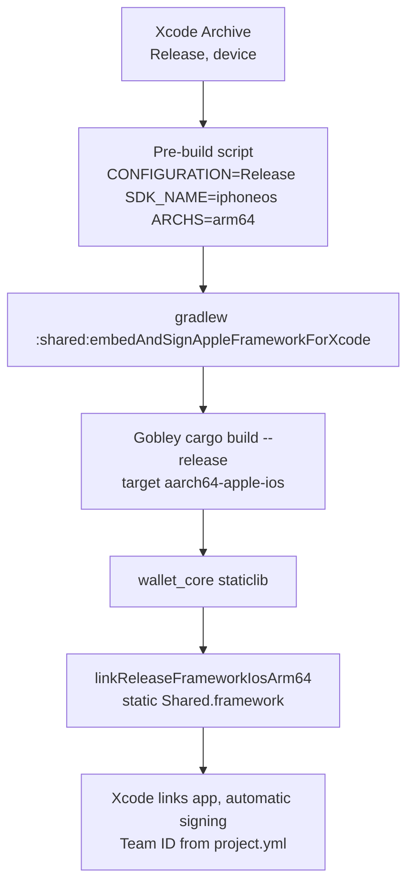

# TestFlight Distribution - Plan

## Goal Capsule

- **Objective:** Get zinqq iOS builds onto internal testers' devices via TestFlight — a signed Release device archive of the KMP+Rust build, uploaded manually from Xcode under an individual Apple developer account.
- **Authority:** This plan. The Product Contract defines product scope; the Planning Contract and Implementation Units define the repo changes.
- **Execution profile:** Repo-side work only (config, CI, runbook). The signed archive, App Store Connect record, and upload are user-operated steps documented in the runbook — they require Apple Developer enrollment the executor does not have. Do not attempt to sign, archive, or upload from an automated run.
- **Open blockers:** Individual Apple Developer Program enrollment must exist before the first App Store Connect step (user-owned; does not block the repo-side units).
- **Stop conditions:** Stop if the unsigned Release device build cannot be made to compile after genuine debugging — that invalidates U3/U4 sequencing and needs a human decision.

---

## Product Contract

### Summary

Establish the first TestFlight distribution path for the zinqq iOS app: make a signed Release device archive of the KMP+Rust build succeed, upload it manually from Xcode, and distribute to internal TestFlight testers under an individual Apple developer account. Add one CI job that keeps the device build compiling.

### Problem Frame

The app is feature-complete — full parity with the Zinqq PWA, a mainnet Lightning wallet with VSS-encrypted backup — but it has never left the simulator. CI builds a debug simulator framework with code signing disabled, and no signing identity, Team ID, provisioning, or distribution tooling exists anywhere in the repo. There is currently no way to put the app in a tester's hands.

Apple constrains the options: crypto wallet apps must be offered by developers enrolled as an organization to pass any App Review, including the Beta App Review that gates external TestFlight testing. Internal TestFlight testing is the one distribution channel that skips review entirely, which makes it reachable from an individual account.

### Key Decisions

- **Individual Apple developer account** over new or employer organization enrollment. Fastest start ($99/yr, enrolls in about a day). Accepts the cap: Apple guideline 3.1.5 means external beta and App Store release stay closed until an organization account exists.
- **Internal TestFlight tier only.** Up to 100 App Store Connect team members, builds available immediately, no Beta App Review. Consistent with the individual account; defers all review exposure.
- **Manual uploads from Xcode** over fastlane-in-CI or Xcode Cloud. No certificate or secret infrastructure until uploads become routine enough to hurt.
- **Automatic signing with the Team ID committed in `iosApp/project.yml`.** The Xcode project is XcodeGen-generated and not checked in, so signing settings clicked into Xcode are wiped on regeneration; they must live in `project.yml`.
- **Rename the bundle ID to `zinqq.ios` before the first upload.** The App Store Connect app record ties permanently to the bundle ID; renaming after upload means a new app record and lost tester history. `zinqq.spike.ios` is a one-line change today.
- **One CI guard job for the Release device build** (compile only — unsigned, no upload). The device toolchain has never been exercised; without a guard it can silently rot between manual uploads.

### Requirements

**Build and signing**

- R1. A Release device (arm64) archive of the iOS app — including the Kotlin/Native `Shared` framework and the embedded Rust wallet-core — builds and signs successfully on a developer machine.
- R2. Signing configuration survives Xcode project regeneration: automatic signing with the Team ID set in `iosApp/project.yml`, requiring no manual Xcode signing steps after `xcodegen generate`.
- R3. The bundle identifier is renamed from `zinqq.spike.ios` to `zinqq.ios` before the App Store Connect app record is created.
- R4. Every upload carries a unique, incremented build number; the bump procedure is part of the upload steps.
- R5. The export-compliance question is answered once in app configuration (`ITSAppUsesNonExemptEncryption` declaration) rather than interactively per upload.

**Distribution**

- R6. Builds reach internal TestFlight testers (App Store Connect team members) without Beta App Review.
- R7. The upload path is manual from a developer machine (Xcode Organizer or equivalent); no CI credentials, API keys, or upload automation.

**CI guard**

- R8. CI includes a job that compiles the Release device build of the full chain (Rust device staticlib, Release KMP framework, unsigned app build) so archive-toolchain breakage is caught before the next manual upload attempt.

### Key Flows

- F1. First-time setup
  - **Trigger:** Individual Apple Developer enrollment is active.
  - **Steps:** Rename the bundle ID; commit signing config to `iosApp/project.yml`; make a local Release device archive succeed (first-ever build of the Rust device target and Release framework); create the App Store Connect app record; upload the first build; add internal testers.
  - **Outcome:** The first build installs on testers' devices via the TestFlight app.
  - **Covers:** R1, R2, R3, R6, R7.
- F2. Routine build distribution
  - **Trigger:** A change worth testing on real devices.
  - **Steps:** Bump the build number; archive in Xcode; upload; App Store Connect processes the build; internal testers are notified automatically.
  - **Outcome:** Testers run the latest build the same day, with no review step.
  - **Covers:** R4, R6, R7.

### Acceptance Examples

- AE1. **Covers R2.** Given a freshly regenerated Xcode project (`xcodegen generate`), when the developer archives, then signing succeeds without any manual change in Xcode's Signing & Capabilities pane.
- AE2. **Covers R6.** Given a build that finished processing in App Store Connect, when an internal tester is added, then the build is installable on their device without any review having run.
- AE3. **Covers R8.** Given a change that breaks the device Release link (for example, a missing Rust target or a linker regression), when CI runs, then the guard job fails — the breakage is visible before anyone attempts an archive.

### Success Criteria

- An upload performed weeks after the last one succeeds by following the recorded steps, without re-derivation of the archive or signing procedure.

### Scope Boundaries

Deferred for later:

- External TestFlight beta groups and Beta App Review — requires organization enrollment per Apple guideline 3.1.5 (wallet apps); the internal-only cap is a deliberate, recorded dead-end, not an oversight.
- App Store release.
- CI-automated uploads (fastlane, certificate management, App Store Connect API keys in CI).
- Android distribution (Play Store) — adjacent work, not part of this plan.
- A testnet/signet build flavor for testers — testers use the mainnet wallet as-is.

### Dependencies / Assumptions

- Apple Developer Program individual enrollment is a prerequisite and is assumed not yet done.
- Testers are the developer plus at most a small handful of internal collaborators, all of whom can be added as App Store Connect users.
- Current device testing is assumed ad-hoc (cable install or simulator only); over-the-air install is the value TestFlight adds.
- The app's cryptography (ChaCha20-Poly1305 for VSS blobs, LDK's protocol crypto) uses standard international algorithms; per Apple's export-compliance documentation this is the "standard algorithm not provided by the OS" category, with a French encryption declaration required only when distributing on the French App Store.
- Verified repo state this plan builds on: CI builds only a debug simulator framework with `CODE_SIGNING_ALLOWED=NO` (`.github/workflows/ci.yml`); no Team ID, provisioning, fastlane, or export options exist anywhere; the Rust device target (`aarch64-apple-ios`) has never been built.
- Testers handle real funds — the app is a mainnet Lightning wallet and nothing in scope changes that.

### Sources / Research

- Repo grounding (verified against source): `.github/workflows/ci.yml` (simulator-debug-only build, signing disabled), `iosApp/project.yml` (bundle ID, `GENERATE_INFOPLIST_FILE: YES` — the on-disk `iosApp/iosApp/Info.plist` is XcodeGen-generated and gitignored, so durable keys belong in `project.yml`), `shared/build.gradle.kts` (static `Shared` framework, `iosArm64`/`iosSimulatorArm64` targets), `rust/Cargo.toml` (staticlib crate type, `lightning`, `chacha20poly1305`).
- Apple App Review Guidelines, section 3.1.5 (cryptocurrency wallets must be offered by developers enrolled as an organization): https://developer.apple.com/app-store/review/guidelines/

---

## Planning Contract

Product Contract preservation: unchanged, except the Sources note now records that `Info.plist` is XcodeGen-generated (clarification, not a scope change), and the previously deferred Outstanding Questions are resolved by the KTDs below.

### Key Technical Decisions

- KTD1. **Rename all three identifier sites in `iosApp/project.yml` together**: `options.bundleIdPrefix` (`zinqq.spike` → `zinqq`), the app target's explicit `PRODUCT_BUNDLE_IDENTIFIER` (`zinqq.spike.ios` → `zinqq.ios`), and the test target's `zinqq.spike.ios.tests` → `zinqq.ios.tests`. The explicit IDs override the prefix, and a mismatched test-target ID breaks test-host linkage silently. Kotlin package names moved to `zinqq.main.*` in a follow-up on this branch (user-directed; originally kept as `zinqq.spike.*` under Android's `applicationId`-divergence precedent). (session-settled: user-directed — chosen over keeping `zinqq.spike.ios` or using `zinqq.main.ios`: the App Store Connect record ties permanently to the bundle ID; instantiates the Product Contract bundle-ID decision.)
- KTD2. **Signing committed as plain build settings under `settings.base`**: `CODE_SIGN_STYLE: Automatic` plus `DEVELOPMENT_TEAM`. XcodeGen has no dedicated signing schema; no `configs:` split is needed since Debug/Release share one identity strategy. The Team ID value only exists after enrollment, so the key lands with a documented placeholder and the runbook's first-time setup fills it. Verify the regenerated `.pbxproj` carries the settings — XcodeGen issue #637 reports signing attributes that silently fail to propagate. (session-settled: user-approved — chosen over manual profiles / fastlane match: the project is XcodeGen-generated, so Xcode-clicked signing is wiped on regeneration; instantiates the Product Contract signing decision.)
- KTD3. **Version source of truth moves to `project.yml`**: `MARKETING_VERSION` and `CURRENT_PROJECT_VERSION` under `settings.base`. The generated `Info.plist` currently falls back to Xcode template defaults (`1.0`/`1`) on every regeneration, so R4's bump procedure is: edit `CURRENT_PROJECT_VERSION`, regenerate, archive. This resolves the build-number-bump open question.
- KTD4. **Encryption declaration lives in `project.yml`'s `info.properties`** (the generated-Info.plist path), not in a checked-in plist, with the committed value `ITSAppUsesNonExemptEncryption: true` — the app's crypto (ChaCha20-Poly1305, LDK primitives) is standard algorithms not provided by the OS, Apple's non-exempt-but-standard category. What remains at first upload is App-Store-Connect-side only: complete the export-compliance questionnaire consistently with that declaration and decide the French App Store question (deferred, non-blocking — see Open Questions).
- KTD5. **CI guard uses `xcodebuild build`, not `archive`**, against `-destination 'generic/platform=iOS'` with `CODE_SIGNING_ALLOWED=NO CODE_SIGNING_REQUIRED=NO CODE_SIGN_IDENTITY=""`, as a sibling job mirroring the existing `ios` job's setup steps, with its own `rust-cache` key (`ios-release`) so it doesn't evict the simulator job's cache. `build` avoids archive-only behaviors (provisioning validation, dSYM export) that an unsigned guard can't satisfy. (session-settled: user-approved — chosen over leaving CI untouched: the never-exercised device toolchain would silently rot; instantiates the Product Contract CI-guard decision.)
- KTD6. **Manual uploads go through Xcode Organizer (or Transporter), never `altool`.** `altool` is deprecated and its upload path has active breakage on 2025-2026 toolchains (fastlane #29698, #29743). (session-settled: user-approved — chosen over fastlane-in-CI / Xcode Cloud: no cert/secret infrastructure until uploads are routine; instantiates the Product Contract manual-uploads decision.)
- KTD7. **The runbook lives in a new `docs/runbooks/` directory.** `docs/solutions/` holds past-tense problem write-ups; an operational how-to doesn't fit there, and no runbook precedent exists yet.

### Assumptions

- Gobley maps Kotlin/Native's RELEASE build type to `cargo --release` and selects the Rust triple from the Xcode environment; this repo has never exercised the RELEASE → `aarch64-apple-ios` path, so U3 verifies it empirically (isolate with `cargo build --release --target aarch64-apple-ios` if the Gradle path fails).
- Gobley auto-installs Rust targets before building (`installTargetBeforeBuild` defaults on), and CI already runs `rustup target add aarch64-apple-ios` (`.github/workflows/ci.yml:149`), so no toolchain-install work is expected — this resolves the Rust-target open question.
- `embedAndSignAppleFrameworkForXcode` is configuration/SDK-aware by construction, but it runs **only** inside Xcode's build-phase environment — verified empirically in this repo: it requires all five of `CONFIGURATION`, a versioned `SDK_NAME` (e.g. `iphoneos26.5`), `ARCHS`, `TARGET_BUILD_DIR`, and `FRAMEWORKS_FOLDER_PATH`, and Gobley rejects an unversioned `SDK_NAME`. Terminal-side pre-warm therefore uses `./gradlew :shared:linkReleaseFrameworkIosArm64` instead. The other known hazard is `java` being unresolvable inside Xcode's build-phase shell — the Gradle wrapper must find a `java` executable before any Gradle property is read, so the runbook's fix is making a JDK discoverable system-wide (e.g. Homebrew's JDK symlink into `/Library/Java/JavaVirtualMachines`), with `org.gradle.java.home` in `~/.gradle/gradle.properties` only selecting the daemon JVM. The failure signature is the archive's Gradle step dying immediately with a Java-location error.

### High-Level Technical Design

The archive-time build chain the plan must keep working, end to end:

The CI guard (U3) exercises A–F unsigned (`xcodebuild build` in place of Archive); only G requires the enrolled Apple account and stays manual.

### Open Questions

- Deferred to implementation (non-blocking): whether zinqq distributes on the French App Store, and completing App Store Connect's export-compliance questionnaire consistently with the committed `ITSAppUsesNonExemptEncryption: true` declaration — resolved at first upload (KTD4).

---

## Implementation Units

### U1. Rename the bundle identifier to zinqq.ios

- **Goal:** All bundle identifiers in the XcodeGen spec use the permanent `zinqq.ios` root.
- **Requirements:** R3 (KTD1).
- **Dependencies:** None.
- **Files:** `iosApp/project.yml`.
- **Approach:** Change `options.bundleIdPrefix` to `zinqq`, the app target's `PRODUCT_BUNDLE_IDENTIFIER` to `zinqq.ios`, and the test target's to `zinqq.ios.tests`. Android IDs stay untouched per KTD1; Kotlin packages were renamed to `zinqq.main.*` in a follow-up on this branch.
- **Test scenarios:** Test expectation: none — configuration rename; behavior is proven by regeneration and the existing simulator test job (the test bundle must still load against the renamed host app).
- **Verification:** `xcodegen generate` succeeds in `iosApp/`; `grep -r "zinqq.spike" iosApp/project.yml` returns nothing; the existing iOS simulator CI job still passes.

### U2. Commit signing, version, and encryption settings to the XcodeGen spec

- **Goal:** Signing style, version numbers, and the export-compliance key survive `xcodegen generate` with no manual Xcode steps.
- **Requirements:** R2, R4, R5 (KTD2, KTD3, KTD4); the regeneration check enforces AE1.
- **Dependencies:** U1.
- **Files:** `iosApp/project.yml`.
- **Approach:** Under the app target's `settings.base`, add `CODE_SIGN_STYLE: Automatic`, `DEVELOPMENT_TEAM` with a clearly-marked placeholder value and a comment pointing at the runbook's fill-in step, `MARKETING_VERSION: "1.0"`, and `CURRENT_PROJECT_VERSION: 1`. Under `info.properties`, add `ITSAppUsesNonExemptEncryption: true` (KTD4). A placeholder Team ID must not break unsigned builds — CI runs with `CODE_SIGNING_ALLOWED=NO`.
- **Test scenarios:** Test expectation: none — build configuration; proven by regeneration checks below.
- **Verification:** After `xcodegen generate`, the generated project carries the settings (inspect `iosApp/iosApp.xcodeproj/project.pbxproj` for `CODE_SIGN_STYLE`, `DEVELOPMENT_TEAM`, `MARKETING_VERSION`, `CURRENT_PROJECT_VERSION`) — the XcodeGen #637 propagation check from KTD2. Confirm the encryption and version keys in a **built product's** `Info.plist` (e.g. the simulator build's app bundle), not only the XcodeGen-written source plist — Xcode's generated-plist path derives versions from the build settings and ignores stale literals in the source file. Existing CI stays green.

### U3. CI guard job for the unsigned Release device build

- **Goal:** CI fails when the Release device chain (Rust device staticlib → Release KMP framework → app compile) breaks.
- **Requirements:** R8, AE3; partially proves R1's compile chain (KTD5).
- **Dependencies:** U1, U2.
- **Files:** `.github/workflows/ci.yml`.
- **Approach:** Add a sibling job named `ios-release-device` on `macos-15` mirroring the existing `ios` job's setup steps — JDK 21, `rustup target add aarch64-apple-ios`, `Swatinem/rust-cache@v2` with `key: ios-release`, `gradle/actions/setup-gradle@v4`, `brew install xcodegen` — then `./gradlew :shared:linkReleaseFrameworkIosArm64`, `xcodegen generate`, and the Verification Contract's unsigned device build command (identical form). The job adds no secrets and needs only a read-only token — keep its permissions consistent with the workflow's existing jobs. Workflow-level `on:`/`concurrency:` config applies automatically.
- **Execution note:** Verify the full command chain locally first (the same Gradle link task and `xcodebuild build` invocation) — this is the first-ever Release/device build and failures here are toolchain discoveries, not CI syntax. Prefer runtime/smoke proof over unit coverage.
- **Test scenarios:** Covers AE3. (1) The guard job passes on the current tree once the chain compiles. (2) Sanity-check the failure signal during local verification if cheap — e.g. confirm the `xcodebuild` invocation fails loudly when the framework search path is broken — rather than engineering a CI-level fault injection.
- **Verification:** The new job appears in the workflow run and passes; the existing `ios` simulator job's cache is not evicted (distinct `rust-cache` key); local `xcodebuild build` with the same flags succeeds.

### U4. Manual TestFlight upload runbook

- **Goal:** An upload performed weeks later succeeds by following recorded steps (Success Criteria).
- **Requirements:** R4, R6, R7; documents F1 and F2, including the AE2 tester-install outcome (KTD3, KTD6, KTD7).
- **Dependencies:** U1, U2, U3 (documents the settings and commands they landed).
- **Files:** `docs/runbooks/testflight-upload.md` (new directory).
- **Approach:** Two sections mirroring the Product Contract flows. *First-time setup (F1):* enroll (individual account), fill `DEVELOPMENT_TEAM` in `iosApp/project.yml`, regenerate, pre-warm the Release device chain with `./gradlew :shared:linkReleaseFrameworkIosArm64` (the `embedAndSignAppleFrameworkForXcode` task refuses to run outside Xcode's build-phase environment — verified; this link task exercises the same Rust-release + Kotlin/Native-release chain and catches config errors before the slow first archive), fix Java discoverability for Xcode's build-phase shell if the archive's Gradle step fails (per the runbook's Java note), archive in Xcode (automatic signing auto-registers the `zinqq.ios` App ID during the first signed build; if creating the App Store Connect record first instead, register the App ID manually under Certificates, Identifiers & Profiles), create the App Store Connect record for `zinqq.ios`, upload via Organizer, answer the export-compliance questionnaire consistently with the committed declaration (KTD4), add internal testers with the least-privileged App Store Connect role that grants TestFlight access — only the account owner holds upload capability. *Routine upload (F2):* bump `CURRENT_PROJECT_VERSION` in `project.yml`, regenerate, archive, upload via Organizer. Never `altool` (KTD6). *Operational constraints the runbook records:* a pre-upload sanity check (intended commit, Release configuration, bundle ID `zinqq.ios`, expected Team ID); TestFlight builds expire 90 days after upload and refuse to launch afterward — upload a replacement before expiry while testers hold funds; and before a tester funds a wallet on a TestFlight install, verify their recovery path (VSS restore or seed) once end-to-end and keep balances small.
- **Test scenarios:** Test expectation: none — documentation; correctness is the Success Criteria walkthrough, which requires the enrolled account (user-owned).
- **Verification:** Every command in the runbook that can run without an Apple account (regenerate, pre-warm, grep checks) is executed once and works; file paths and setting names in the runbook match the tree exactly.

---

## Verification Contract

| Gate | Command | Applies to |
|---|---|---|
| Xcode project regenerates | `cd iosApp && xcodegen generate` | U1, U2, U4 |
| No stale bundle ID | `grep -r "zinqq.spike" iosApp/project.yml` returns empty | U1 |
| Generated project carries settings | `grep -E "CODE_SIGN_STYLE|DEVELOPMENT_TEAM|MARKETING_VERSION|CURRENT_PROJECT_VERSION" iosApp/iosApp.xcodeproj/project.pbxproj` | U2 |
| Release framework links | `./gradlew :shared:linkReleaseFrameworkIosArm64` | U3 |
| Unsigned device build compiles | `xcodebuild build -project iosApp/iosApp.xcodeproj -scheme iosApp -configuration Release -destination 'generic/platform=iOS' CODE_SIGNING_ALLOWED=NO CODE_SIGNING_REQUIRED=NO CODE_SIGN_IDENTITY=""` (from the repo root; scheme name per the generated project — expected `iosApp`) | U3 |
| Existing suites stay green | Full CI: rust, android, and ios simulator jobs | all units |

Signed archive and upload gates are user-operated (require Apple enrollment) and live in the runbook, not in automated verification.

## Definition of Done

- U1–U4 complete; all Verification Contract gates pass locally and in CI, including the new `ios-release-device` job.
- No `zinqq.spike` identifier remains in `iosApp/project.yml` or in Kotlin sources (packages renamed to `zinqq.main.*`).
- The runbook exists, matches the tree, and its account-free commands have been executed once.
- The signed first archive and TestFlight upload are explicitly out of the executor's scope (Apple enrollment is user-owned); done means the repo is ready for the runbook's first-time setup to succeed with no repo changes beyond the runbook's one documented fill-in — the enrolled Team ID replacing the placeholder in `iosApp/project.yml`. The signed first archive is the user-owned final proof of R2/AE1.
- No dead-end or experimental configuration from abandoned attempts remains in the diff.
