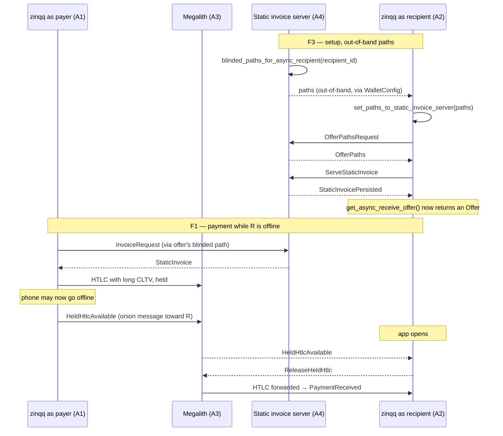
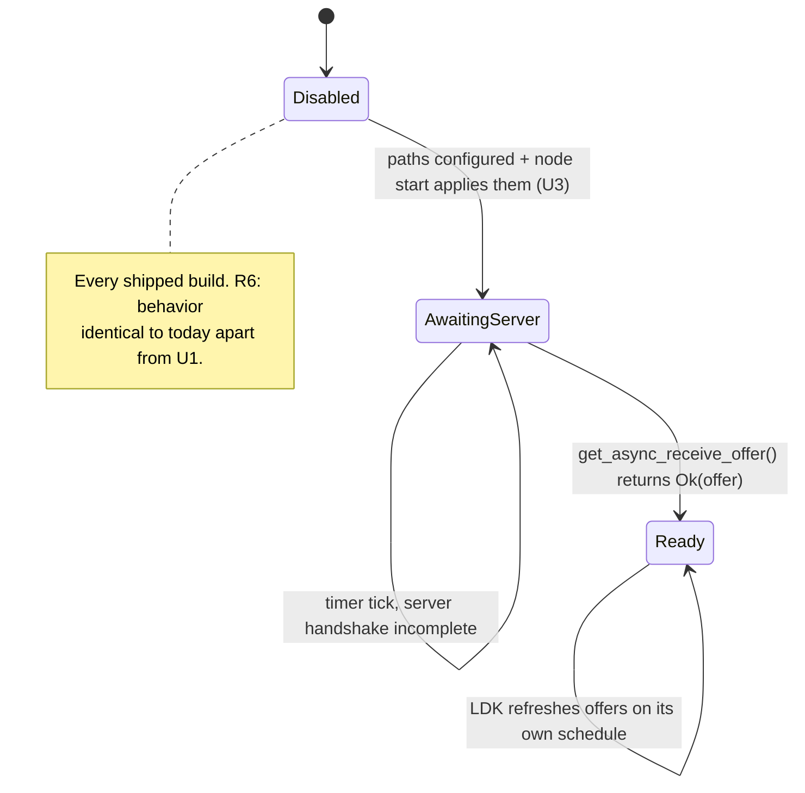

# Async Payments Protocol Support - Plan

## Goal Capsule

- **Objective:** Support the BOLT12 async payments protocol in the zinqq core and both shells — send-side held HTLCs enabled for real users now, receive-side (receiving while offline) fully wired but opt-in and inert by default until a static invoice server exists.
- **Authority:** This plan. The origin is the LDK blog post [Async Payments: Receiving While Offline](https://lightningdevkit.org/blog/async-payments-receiving-while-offline) plus the `lightning 0.2.4` API surface already vendored in this repo.
- **Execution profile:** Rust core (config, node, FFI) plus additive UI on the existing receive screen in both shells, plus one runbook. No LDK version bump. No changes to the existing BOLT11/JIT/BOLT12-offer paths.
- **Open blockers:** None that block this plan. The **product** blocker — no static invoice server is reachable for zinqq users — is why receive-side ships inert-by-default rather than on. See Assumptions.
- **Stop conditions:** Stop if enabling `hold_outbound_htlcs_at_next_hop` turns out to change behavior for non-static-invoice payments (it must not — U1's whole safety argument rests on the branch being reachable only from `initiate_async_payment`). Stop if `set_paths_to_static_invoice_server` cannot be called at start without blocking or destabilizing node startup.

---

## Product Contract

### Summary

Async payments let an often-offline recipient be paid without a custodian. A static invoice server hands the payer a reusable, payment-hash-less `StaticInvoice` on the recipient's behalf; the payer's own next-hop LSP **holds** the outbound HTLC until the recipient comes online and sends a release secret over an onion message. Neither side has to be online at the same instant.

zinqq is exactly the wallet this protocol was designed for: an often-offline mobile node that cannot wake up to claim an incoming HTLC on its own. This plan wires both halves of the protocol into the core:

- **As payer** — turn on held outbound HTLCs so a zinqq user can pay an offline recipient's static invoice, lock the HTLCs in with Megalith, and put the phone away.
- **As recipient** — carry static-invoice-server blinded paths through config, apply them at node start, and surface the resulting async receive offer as an additional page on the existing receive screen.

### Problem Frame

zinqq is a mainnet wallet handling real funds. Today its BOLT12 receive story is a normal reusable offer (`Node::get_or_create_offer`), which only pays out while the phone is online and reachable — the payer's HTLC arrives, and if the app is backgrounded or killed, it fails. Async payments close that gap.

Two facts constrain how far this can go in one change:

1. **LDK ships the recipient APIs but not a server for us to talk to.** `ChannelManager::set_paths_to_static_invoice_server` requires `Vec<BlindedMessagePath>` obtained *out-of-band* from a static invoice server. `lightning-liquidity 0.2.3` — the crate that gives us LSPS2 against Megalith — has no LSPS0/1/2/5 message for fetching them, and Megalith is not known to run a static invoice server. There is no in-band way for a zinqq user to get these paths today.
2. **LDK calls the flow not-yet-production-ready** and notes it currently works LDK-to-LDK only.

So the honest shape of this change is: ship the payer side for real (it works today, degrades gracefully, and needs no server), and ship the recipient side complete-but-dormant — every line of plumbing in place and tested, activated by configuration that defaults to empty.

### Actors

- **A1. zinqq user as payer** — pays a BOLT12 offer that resolves to a `StaticInvoice`. Wants to not have to stay online while the recipient wakes up.
- **A2. zinqq user as recipient** — wants to be paid while the app is closed. Blocked on A4 existing.
- **A3. Megalith (payer's LSP)** — must advertise `htlc_hold` for A1's benefit. If it does not, LDK falls back silently and A1 keeps the current behavior.
- **A4. Static invoice server** — an always-online LDK node serving `StaticInvoice`s for A2. Does not exist for zinqq users yet; operable in dev per U7's runbook.

### Key Flows

- **F1 (payer).** User pays an offer → LDK receives a `StaticInvoice` instead of a `Bolt12Invoice` → `initiate_async_payment` finds an `htlc_hold`-capable live channel → HTLCs lock in at Megalith → phone can go offline → recipient comes online and releases → payment settles as an ordinary `PaymentSuccessful`.
- **F2 (payer fallback).** Same, but no `htlc_hold` channel or the flag is off → LDK enqueues `HeldHtlcAvailable` and *we* wait online for `ReleaseHeldHtlc`. This is today's behavior, unchanged.
- **F3 (recipient setup).** Server operator calls `blinded_paths_for_async_recipient` → paths are handed to the app out-of-band → app passes them in `WalletConfig` → node start calls `set_paths_to_static_invoice_server` → LDK autonomously exchanges `OfferPathsRequest`/`OfferPaths`/`ServeStaticInvoice`/`StaticInvoicePersisted` on its timer ticks → `get_async_receive_offer()` starts returning an offer.
- **F4 (recipient receive).** Payer pays the async offer while the app is closed → app opens → `ChannelManager` (already the `OnionMessenger`'s async-payments handler) answers `HeldHtlcAvailable` with `ReleaseHeldHtlc` → HTLC is forwarded → existing `PaymentReceived` event fires. No new receive-side event handling needed.

### Requirements

- **R1.** As payer, zinqq holds outbound HTLCs at its next hop when paying a `StaticInvoice`, and falls back to today's behavior when the next hop does not support it.
- **R2.** Static-invoice-server blinded paths are configurable through the existing `WalletConfig` FFI record, default empty, and invalid input is rejected with a clear `InvalidConfig` error rather than a panic or a silent drop.
- **R3.** When paths are configured, the node applies them once per start without blocking or failing startup.
- **R4.** The core exposes the async receive offer and a three-state readiness signal over UniFFI.
- **R5.** Both shells show the async receive offer as an **additional** page on the receive screen when it is ready, labelled experimental. The existing standard offer page is untouched.
- **R6.** With no paths configured (the default for every shipped build), behavior is identical to today apart from R1.
- **R7.** A runbook documents how to stand up a static invoice server and produce the paths, so the dormant path is testable end-to-end.

### Acceptance Examples

- **AE1.** `default_user_config()` has `hold_outbound_htlcs_at_next_hop == true` and `enable_htlc_hold == false`.
- **AE2.** `apply_config_overrides` with a well-formed hex-encoded `BlindedMessagePath` yields a `Config` whose `static_invoice_server_paths` has one entry; with `"zz"` it yields `WalletError::InvalidConfig`.
- **AE3.** A node started with no configured paths reports `AsyncReceiveStatus::Disabled` and `async_receive_offer() == None`.
- **AE4.** A node started with configured paths reports `AsyncReceiveStatus::AwaitingServer` while no offer has been built, and starts successfully.
- **AE5.** With status `Ready` and an offer string, the Android and iOS receive controllers expose exactly one extra offer page; with any other status the page count is unchanged from today.

### Scope Boundaries

**In scope**

- Payer-side `UserConfig` change and its test.
- `Config`/`WalletConfig` path plumbing with hex encode/decode and validation.
- Node-start application of the paths.
- `Node`/`Wallet` async-receive offer + status APIs.
- Additive receive-screen page in both shells with an experimental label.
- Runbook and README note.

**Deferred to Follow-Up Work**

- **A payer-side "awaiting recipient" affordance in history.** LDK surfaces no payer-visible event when a payment resolves to a `StaticInvoice`, so a held payment is indistinguishable from any other pending outbound payment at the `Event` layer. It may sit pending for a long time (LDK deliberately declines to force-close over an unresolved async payment for four weeks). Today's pending-payment UX applies. Distinguishing it needs either an LDK upstream signal or `manually_handle_bolt12_invoices`-style interception — both larger than this change. Tracked as Risk RK1.
- **In-band path acquisition.** Whenever a spec (an LSPS extension or equivalent) lands for fetching static-invoice-server paths, replace the config field with a real fetch and give A2 a working default.
- **Running a static invoice server for zinqq users.** Infrastructure, not client code.

**Outside this product's identity**

- Setting `enable_htlc_hold = true`. That flag makes *us* hold HTLCs for other people's often-offline peers. It is explicitly for reliably-online nodes; a mobile wallet is the opposite of that.

---

## Planning Contract

### Key Technical Decisions

- **KTD-1. Ship payer-side on, recipient-side inert-by-default.** Chosen over shipping the receive flow enabled. Enabling it would require a server that does not exist for our users, on a protocol LDK itself labels not-production-ready, in a mainnet wallet holding real funds. An empty default makes R6 a compile-time-obvious property rather than a runtime hope.
- **KTD-2. Blinded paths travel as hex of LDK's own `Writeable` encoding.** Chosen over inventing a JSON/bech32 envelope. `BlindedMessagePath` already implements `Writeable`/`Readable`; round-tripping through LDK's encoding means the server operator's output and our input cannot drift. `bitcoin::hex` is already in the dependency graph via `bitcoin 0.32`, so this adds no dependency.
- **KTD-3. Apply the paths at node start on every start, not once.** `OffersMessageFlow::set_paths_to_static_invoice_server` overwrites the stored path list and preserves the existing offer slots, and only errors on an empty input vector — so re-calling is cheap and safe. It also kicks a refresh attempt whose failure is explicitly ignored inside LDK when no peers are connected yet, and `check_refresh_async_receive_offer_cache` retries on background-processor timer ticks. That makes "call it at start, ignore the error, let the timer converge" the correct shape, and removes any need for us to sequence it after peer connection.
- **KTD-4. The async offer is an *additional* receive page, never a replacement.** Chosen over swapping the standard BOLT12 offer for the async one when ready. The standard offer is a shipped, working mainnet surface; an experimental offer must not be able to displace it. Additive means the worst case for a bug in this feature is a page that should not have rendered, not a broken receive.
- **KTD-5. A three-state `AsyncReceiveStatus` (`Disabled`/`AwaitingServer`/`Ready`) rather than `Option<String>` alone.** Chosen over deriving UI state from a nullable offer. `None` conflates "you never configured this" with "configured, server handshake still in flight" — the first is normal for every shipped build, the second is a state a dev testing U7's runbook needs to see.
- **KTD-6. No changes to `OnionMessenger` wiring.** `rust/src/builder.rs` already passes the `ChannelManager` as the seventh argument to `OnionMessenger::new`, which is the `async_payments_handler` slot. The `HeldHtlcAvailable` → `ReleaseHeldHtlc` half of F4 is therefore already live; verifying this was a planning finding, and the plan must not "fix" it.

### Assumptions

- Megalith may or may not advertise `htlc_hold`. U1 is correct either way: `hold_htlc_channels()` filters for `init_features.supports_htlc_hold()` and returns `Err(())` when the set is empty, at which point LDK takes the F2 fallback branch. No probe of Megalith's features is needed to land U1.
- No shipped build sets `static_invoice_server_paths`. The field exists for the U7 runbook, dev builds, and integration testing. Wiring a user-facing settings surface for it is deliberately not in scope — it would advertise a capability no user can currently use.
- The `AsyncReceiveOfferCache` is serialized inside `ChannelManager` (TLV 21), so it rides the existing VSS channel-manager backup with no new persistence work.

---

## High-Level Technical Design

### The protocol, with zinqq on both sides

### Async receive readiness (KTD-5)

---

## Implementation Units

### U1. Enable held outbound HTLCs as payer

**Goal:** A zinqq user paying an offer that resolves to a `StaticInvoice` locks HTLCs in at Megalith and can go offline (R1, F1).

**Requirements:** R1. Covers AE1, F1, F2.

**Dependencies:** none.

**Files:**
- `rust/src/config.rs` (modify `default_user_config`; extend the existing `#[cfg(test)] mod tests`)

**Approach:** Set `hold_outbound_htlcs_at_next_hop = true` in `default_user_config()`, alongside the existing KTD-10 parity cluster, with a comment recording the two facts that make it safe: the flag is read only from `ChannelManager::hold_htlc_channels()`, which is called only from `initiate_async_payment` (the `StaticInvoice` branch), so no BOLT11, JIT, or ordinary BOLT12 payment path is affected; and when no live counterparty advertises `htlc_hold`, `hold_htlc_channels()` returns `Err(())` and LDK takes the pre-existing `enqueue_held_htlc_available` branch. Leave `enable_htlc_hold` at its `false` default and say why in the comment (see Scope Boundaries — outside this product's identity).

**Patterns to follow:** the existing `default_user_config()` body — every non-default field carries a comment naming the reason and, where applicable, the PWA parity source.

**Test scenarios:**
- Covers AE1. `default_user_config()` returns a config with `hold_outbound_htlcs_at_next_hop == true`.
- `default_user_config()` returns a config with `enable_htlc_hold == false` — asserted explicitly so a future "turn on async payments" edit cannot flip it by association.
- The existing `defaults_point_at_mainnet_and_public_services` and the 0-conf gate tests still pass unchanged, proving no collateral config drift.

**Verification:** `cargo test` green; `cargo clippy --all-targets -- -D warnings` clean.

---

### U2. Static-invoice-server paths through `Config` and `WalletConfig`

**Goal:** Blinded paths for a static invoice server can be supplied at wallet construction, validated, and carried into the core config (R2).

**Requirements:** R2. Covers AE2.

**Dependencies:** none (independent of U1).

**Files:**
- `rust/src/config.rs` (add field to `Config`, default it in `Config::new`)
- `rust/src/api.rs` (add field to `WalletConfig`, parse in `apply_config_overrides`; extend the existing config-override tests)

**Approach:** Add `Config.static_invoice_server_paths: Vec<BlindedMessagePath>`, defaulted to `Vec::new()` in `Config::new`. Add `WalletConfig.static_invoice_server_paths: Vec<String>` carrying `#[uniffi(default = [])]` so every existing shell call site keeps compiling — the same convention the LSP-override and trusted-LSP fields already use. In `apply_config_overrides`, decode each string as hex and read it as a `BlindedMessagePath` via LDK's `Readable`, mapping both failure modes onto `WalletError::InvalidConfig` with a detail naming which entry failed. Use `bitcoin::hex` for decoding (KTD-2) rather than adding a dependency.

Keep the parse in `apply_config_overrides` — it is already the repo's designated pure, unit-testable override/validation seam, and putting the parse anywhere else splits validation across two layers.

**Patterns to follow:** the `trusted_lsp_node_ids` loop and the `lsp_node_id`/`lsp_host`/`lsp_port` triple in `apply_config_overrides` — parse, map the error to `InvalidConfig` with a message that names the offending value, push onto the core config.

**Test scenarios:**
- Covers AE2. A `WalletConfig` with one valid hex-encoded `BlindedMessagePath` produces a `Config` whose `static_invoice_server_paths` has length 1 and round-trips back to the same bytes. Build the fixture in-test via the public `BlindedMessagePath::one_hop` constructor and serialize it, rather than pasting a hex literal, so the fixture cannot rot against an LDK encoding change.
- A `WalletConfig` with `"zz"` (invalid hex) yields `WalletError::InvalidConfig` whose detail names the entry.
- A `WalletConfig` with valid hex that is not a readable `BlindedMessagePath` (e.g. `"00"`) yields `WalletError::InvalidConfig`, not a panic.
- Two valid entries produce two paths, in input order.
- The default `WalletConfig` (field omitted) produces an empty `static_invoice_server_paths` — the R6 guarantee.

**Verification:** `cargo test` green; the generated UniFFI bindings still compile against unchanged shell call sites (`./gradlew :shared:jvmTest`).

---

### U3. Apply the paths at node start

**Goal:** A node configured with paths tells LDK about them once per start, without blocking or endangering startup (R3).

**Requirements:** R3. Covers AE4, F3.

**Dependencies:** U2.

**Files:**
- `rust/src/node.rs` (in `start`, after `spawn_peer_reconnect_task`; extend the existing `#[cfg(test)] mod tests`)

**Approach:** When `self.config.static_invoice_server_paths` is non-empty, call `channel_manager.set_paths_to_static_invoice_server(paths.clone())` and log an error on `Err(())` without propagating — per KTD-3, the only error case is an empty vector (already excluded by the guard) and LDK's own refresh loop converges on timer ticks regardless of whether peers were connected at call time. Skip the call entirely when the vector is empty so a default build does no extra work and takes no new lock.

Place it in `start` alongside the other post-component wiring rather than in `builder.rs`: the builder constructs components, `start` is where runtime behavior is kicked off, and this is the latter.

**Execution note:** This unit is the one place where a mistake could destabilize node startup for every user, including the ~100% of users with no paths configured. Prove the empty-path case first — a start that takes the guard's early exit — before adding the configured-path case.

**Test scenarios:**
- Covers AE3/R6. A node started with no configured paths starts successfully and reports `AsyncReceiveStatus::Disabled` (this scenario lands with U4; U3 asserts the start succeeds and nothing was called).
- Covers AE4. A node started with one configured path starts successfully — no error, no panic, no hang — even with no peers connected (the offline-start case the existing node tests already exercise).
- Stop-then-start with configured paths succeeds a second time, proving the re-application in KTD-3 is genuinely safe.

**Verification:** `cargo test` green; existing node lifecycle tests (`rust/tests/lifecycle_events.rs`, `rust/tests/restart.rs`) unchanged and passing.

---

### U4. Async receive offer and status over UniFFI

**Goal:** The shells can read the async receive offer and its readiness (R4).

**Requirements:** R4. Covers AE3, AE4.

**Dependencies:** U3.

**Files:**
- `rust/src/node.rs` (`Node::async_receive_offer`, `Node::async_receive_status`; tests)
- `rust/src/api.rs` (`AsyncReceiveStatus` uniffi enum; `Wallet::async_receive_offer`, `Wallet::async_receive_status`; tests)

**Approach:** `Node::async_receive_offer() -> Option<String>` locks state, returns `None` when stopped, otherwise maps `channel_manager.get_async_receive_offer()` to `Ok(offer) => Some(offer.to_string())`, `Err(()) => None`. `Node::async_receive_status() -> AsyncReceiveStatus` returns `Disabled` when the configured path list is empty or the node is stopped, `Ready` when an offer is available, else `AwaitingServer` (KTD-5).

Note the deliberate difference from `get_or_create_offer`: no retry schedule and no local persistence key. LDK owns both — the offer cache is refreshed on its own timer and is serialized inside the `ChannelManager` at TLV 21, so it already rides the VSS backup. Re-implementing either would fight LDK.

Mirror `Node`'s methods on `Wallet` in `api.rs` exactly as `get_or_create_offer`/`offer_available` are mirrored, and add the `#[derive(uniffi::Enum)] pub enum AsyncReceiveStatus { Disabled, AwaitingServer, Ready }`. These calls are non-blocking, unlike `get_or_create_offer`, so the doc comment should say so — the shells' `Dispatchers.IO` hop is then a convention choice, not a requirement.

**Patterns to follow:** `Node::get_or_create_offer` / `Node::offer_available` for the state-lock-and-early-return shape; `CloseTxRoleView` in `api.rs` for the uniffi enum shape and doc-comment style.

**Test scenarios:**
- Covers AE3. A stopped node returns `None` and `Disabled` from both methods.
- Covers AE3. A started node with no configured paths returns `None` and `Disabled`.
- Covers AE4. A started node with configured paths returns `None` and `AwaitingServer` (no server is reachable in test, so the handshake never completes — this is the honest steady state for the test environment).
- `apply_config_overrides` + `Wallet` construction with configured paths does not error, proving the FFI surface is reachable end-to-end.

**Verification:** `cargo test` green; `./gradlew :shared:jvmTest` green, proving the new enum and methods survive Gobley binding generation.

---

### U5. Android receive screen: experimental async offer page

**Goal:** The Android receive screen shows the async offer as an extra page when ready, labelled experimental (R5).

**Requirements:** R5. Covers AE5.

**Dependencies:** U4.

**Files:**
- `androidApp/src/main/kotlin/zinqq/app/WalletHolder.kt` (implement the two new port methods)
- `androidApp/src/main/kotlin/zinqq/app/screens/receive/ReceiveController.kt` (port methods, state fields, load path)
- `androidApp/src/main/kotlin/zinqq/app/screens/receive/ReceiveScreen.kt` (the extra page)
- `androidApp/src/test/kotlin/zinqq/app/screens/receive/ReceiveFixtures.kt` (fake port support)
- `androidApp/src/test/kotlin/zinqq/app/screens/receive/ReceiveControllerTest.kt` (tests)

**Approach:** Extend `ReceivePort` with `asyncReceiveOffer(): String?` and `asyncReceiveStatus(): AsyncReceiveStatus`, implemented in `WalletHolder` over the U4 calls. Add `asyncOffer: String?` and `asyncOfferQrValue: String?` to the receive state, populated on the same fire-and-forget coroutine pattern the existing `mintOffer()` uses — never on the entry path, so a slow or absent async offer cannot delay the receive screen. Reuse `bolt12Uri(...)` for the QR value exactly as the standard offer does.

Per KTD-4 the async page is strictly additive: render it only when status is `Ready` **and** `asyncOffer != null`, and never gate or replace the existing standard offer page on it. Label the page clearly as experimental with a one-line explanation that payments to it can arrive while the app is closed.

**Patterns to follow:** `mintOffer()` and its `_state.update { it.copy(offer = ..., offerQrValue = ...) }` shape; the existing offer-page composable in `ReceiveScreen.kt` for layout and QR rendering.

**Test scenarios:**
- Covers AE5. With a fake port returning `Ready` and an offer, the controller state exposes a non-null `asyncOffer` and `asyncOfferQrValue`, and the page count is exactly one more than the same fixture with `Disabled`.
- With status `Disabled`, `asyncOffer` stays null and the page set matches today's fixtures byte-for-byte.
- With status `AwaitingServer`, `asyncOffer` stays null and no extra page renders — the "configured but not ready" case must not render an empty page.
- With status `Ready` but `asyncReceiveOffer()` returning null (a race between the two calls), no extra page renders and no crash occurs.
- A port whose `asyncReceiveOffer()` throws does not prevent the standard receive bundle, URI, or standard offer from loading — the R6/KTD-4 isolation guarantee.

**Verification:** `./gradlew :androidApp:testDebugUnitTest` green; `./gradlew :androidApp:assembleDebug` green.

---

### U6. iOS receive screen: experimental async offer page

**Goal:** Parity with U5 on the SwiftUI shell (R5).

**Requirements:** R5. Covers AE5.

**Dependencies:** U4. Independent of U5 — the two shells can be built in either order.

**Files:**
- `iosApp/iosApp/WalletModel.swift` (port method implementations)
- `iosApp/iosApp/Screens/Receive/ReceiveController.swift` (port protocol, state, load path)
- `iosApp/iosApp/Screens/Receive/ReceiveScreen.swift` (the extra page)
- `iosApp/iosAppTests/ReceiveFixtures.swift` (fake port support)
- `iosApp/iosAppTests/ReceiveControllerTests.swift` (tests)

**Approach:** Mirror U5 one-for-one — same port additions, same state fields, same additive page rule, same experimental labelling. The two shells' receive controllers are already close mirrors of each other; keep them so. Watch the known KMP/Swift export edge the repo has already been bitten by (`Option<u64>` exporting as a nullable `KotlinULong?`): `asyncReceiveOffer` is `String?`, which is well-behaved, but confirm the `AsyncReceiveStatus` enum's generated Swift case names before writing the switch rather than assuming Rust-side spelling survives.

**Patterns to follow:** the existing offer handling in `ReceiveController.swift`/`ReceiveScreen.swift`; `ReceiveFixtures.swift` for the fake-port shape.

**Test scenarios:**
- Covers AE5. `Ready` + offer → one extra page and a populated async offer/QR value.
- `Disabled` → no extra page, state matches today's fixtures.
- `AwaitingServer` → no extra page.
- `Ready` with a nil offer → no extra page, no crash.
- A throwing/failing async-offer port call leaves the standard receive path fully functional.

**Verification:** `./gradlew :shared:linkDebugFrameworkIosSimulatorArm64` green; the iOS `xcodebuild ... test` simulator job green.

---

### U7. Runbook and README

**Goal:** The dormant receive path is reproducible by a developer, and the README states what is and is not on (R7).

**Requirements:** R7.

**Dependencies:** U2, U4 (the runbook documents their surfaces).

**Files:**
- `docs/runbooks/async-payments-static-invoice-server.md` (new)
- `README.md` (modify the BOLT12/receive bullet)

**Approach:** The runbook covers: what async payments are and the roles involved; that LDK labels the flow not-production-ready and LDK-to-LDK-only, and that zinqq therefore ships it off; how to stand up an always-online LDK node as a static invoice server; calling `blinded_paths_for_async_recipient(recipient_id, relative_expiry)` and handling the server-side `Event::PersistStaticInvoice` and `Event::StaticInvoiceRequested`; hex-encoding the returned paths for `WalletConfig.static_invoice_server_paths` (KTD-2); what each `AsyncReceiveStatus` means while waiting for the handshake; the payer-side note that `hold_outbound_htlcs_at_next_hop` only engages against an `htlc_hold`-capable counterparty; and RK5's warning that these paths are a trust boundary, so any future in-band acquisition must authenticate the server.

Follow `docs/runbooks/testflight-upload.md` for tone and structure — operator-facing, ordered steps, explicit about which steps a human must perform.

In the README, extend the unified-receive bullet to note the async receive offer exists but is inert without configured paths, and add the payer-side capability to the unified-send bullet.

**Test expectation: none — documentation only.**

**Verification:** Runbook steps are internally consistent with the U2/U4 API names as actually implemented; README claims match shipped defaults (specifically: it must not claim users can receive while offline).

---

## Verification Contract

Gates, in order:

1. `cd rust && cargo fmt --check`
2. `cd rust && cargo clippy --all-targets -- -D warnings`
3. `cd rust && cargo test` (excludes the `#[ignore]`d live-network tests, as CI does)
4. `./gradlew :shared:jvmTest` — proves the new UniFFI record field, enum, and methods survive Gobley binding generation and boot a real node
5. `./gradlew :androidApp:testDebugUnitTest` and `./gradlew :androidApp:assembleDebug`
6. `./gradlew :shared:linkDebugFrameworkIosSimulatorArm64`, then the iOS simulator `xcodebuild ... test`

Gates 4-6 are not optional even though the change is mostly Rust: `docs/solutions/best-practices/kmp-rust-ffi-build-early-on-every-target.md` records that half the spike's real defects were only reachable by building for an actual target, and this change adds a new uniffi enum and a `Vec<String>` record field — exactly the shape that has bitten the binding layer before.

**Regression floor:** the existing BOLT11, JIT/LSPS2, standard BOLT12 offer, on-chain, and restore suites must pass unchanged. No test in those areas should need editing; if one does, that is a signal U1 or U3 reached further than intended (see Stop conditions).

---

## Risks & Dependencies

- **RK1 — a held payment looks like a stuck payment.** As payer, an async payment may stay pending for a long time, and LDK deliberately will not force-close over it for four weeks. There is no payer-visible LDK event distinguishing it. *Mitigation:* documented in the runbook; the affordance is explicitly deferred (see Scope Boundaries). *Residual risk accepted:* this is the protocol's inherent shape, and the alternative — not enabling held HTLCs — costs A1 the entire capability.
- **RK2 — `hold_outbound_htlcs_at_next_hop` reaching further than the static-invoice branch.** *Mitigation:* U1's tests plus the untouched regression floor; the call-graph reading (one reader, `hold_htlc_channels`, called from one place, `initiate_async_payment`) is a Stop condition if it turns out to be wrong.
- **RK3 — startup regression from U3 for the ~100% of users with no paths.** *Mitigation:* the empty-vector guard means default builds execute one `is_empty()` check; U3's execution note sequences the empty case first; the existing lifecycle and restart integration suites are the backstop.
- **RK4 — protocol churn.** Async payments are pre-production and the wire format may change across LDK releases. *Mitigation:* KTD-2 pins us to LDK's own encoding rather than a hand-rolled one, so an encoding change surfaces as a decode error against a regenerated fixture rather than as silent misbehavior. No shipped build is exposed either way (KTD-1).
- **RK5 — the path input is a trust boundary.** A `BlindedMessagePath` names who serves static invoices on the user's behalf and receives their `ServeStaticInvoice` messages. Supplying a hostile path would let an attacker learn the user is soliciting offers and refuse to serve them (a denial and a privacy leak; it does not expose funds, since the static invoice is signed by us and the payment still terminates at our node). *Mitigation:* the field is settable only at wallet construction from the app's own build config — there is deliberately no user-facing or remotely-fetched surface for it (see Assumptions). Any future in-band acquisition must authenticate the server before this stays safe; the runbook says so explicitly.
- **Dependency:** none new. `lightning 0.2.4`, `bitcoin 0.32` (for `bitcoin::hex` — `FromHex`/`DisplayHex` are already used in `rust/src/chain.rs` and `rust/src/liquidity/mod.rs`), and the existing `OnionMessenger` wiring cover everything.

---

## Definition of Done

- [ ] `default_user_config()` enables `hold_outbound_htlcs_at_next_hop` and leaves `enable_htlc_hold` off, with tests asserting both (AE1).
- [ ] `WalletConfig.static_invoice_server_paths` exists with a uniffi default, decodes to `Config.static_invoice_server_paths`, and rejects malformed input as `InvalidConfig` (AE2).
- [ ] Node start applies configured paths without blocking, and skips the work entirely when none are configured (AE4).
- [ ] `Wallet::async_receive_offer()` and `Wallet::async_receive_status()` are exposed over UniFFI and behave per AE3/AE4.
- [ ] Both shells render exactly one additional, experimentally-labelled receive page when and only when status is `Ready` with a non-null offer (AE5).
- [ ] The runbook exists and the README does not overclaim.
- [ ] All six verification gates pass, and no pre-existing test needed editing.

---

## Sources & Research

- [Async Payments: Receiving While Offline](https://lightningdevkit.org/blog/async-payments-receiving-while-offline) — LDK blog. Origin of this request; source for the roles, the payment-hash-less static invoice rationale, the held-HTLC design, and the "not yet recommended for production use / LDK-to-LDK only" status.
- `lightning 0.2.4` vendored source (`~/.cargo/registry/.../lightning-0.2.4`), read directly rather than from docs, for: `ChannelManager::{get_async_receive_offer, set_paths_to_static_invoice_server, blinded_paths_for_async_recipient}`; `UserConfig::{enable_htlc_hold, hold_outbound_htlcs_at_next_hop}` doc comments; the `initiate_async_payment` / `hold_htlc_channels` fallback branch (the basis for F2 and RK2); `OffersMessageFlow::set_paths_to_static_invoice_server` and `AsyncReceiveOfferCache::set_paths_to_static_invoice_server` re-call semantics (KTD-3); `OnionMessenger::new`'s ninth-argument signature (KTD-6); and `AsyncReceiveOfferCache` serialization at `ChannelManager` TLV 21.
- `lightning-liquidity 0.2.3` module listing — confirms LSPS0/1/2/5 only, no static-invoice-server or path-fetch message. Basis for the Problem Frame's constraint 1 and for KTD-1.
- Repo research: `rust/src/builder.rs` (`OnionMessenger` wiring), `rust/src/config.rs` (`default_user_config`, `Config`), `rust/src/api.rs` (`WalletConfig`, `apply_config_overrides`), `rust/src/node.rs` (`start`, `get_or_create_offer`, `offer_available`), both shells' receive controllers, and `.github/workflows/ci.yml` (the verification gates).
- `docs/solutions/best-practices/kmp-rust-ffi-build-early-on-every-target.md` — the reason the Verification Contract keeps the Android and iOS gates for a mostly-Rust change.
