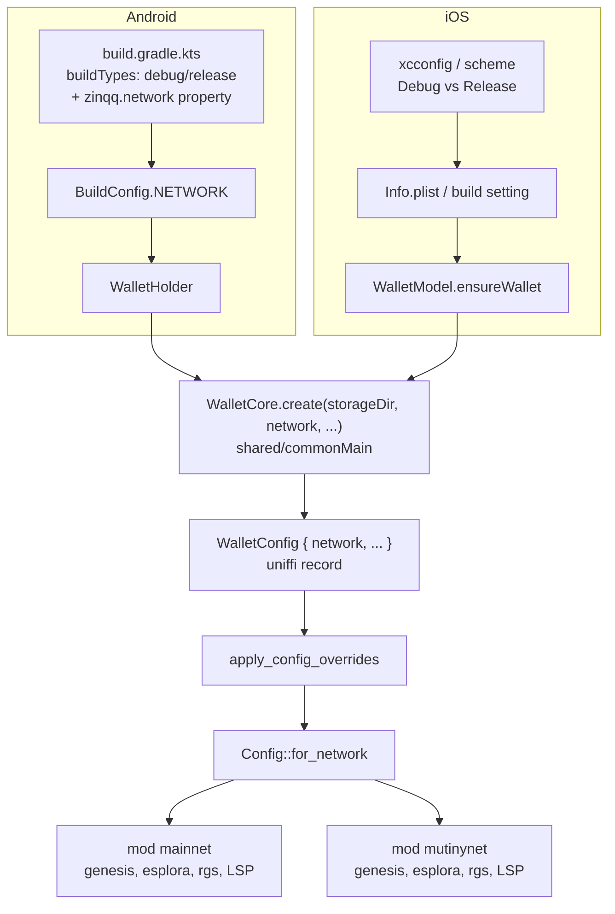
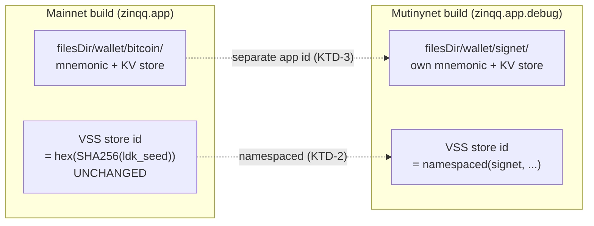

# Mutinynet Network Support - Plan

## Goal Capsule

- **Objective:** Make zinqq runnable against Mutinynet for local development, with the mainnet build unchanged and Release/TestFlight structurally guaranteed to be mainnet.
- **Authority:** This plan. Network selection is build-time (KTD-1); mainnet key derivation does not change (KTD-6).
- **Execution profile:** Rust core config/keys/builder, the shared KMP factory, and both shells' build configuration. No change to how the app behaves once running on mainnet.
- **Open blockers:** None. Whether Megalith's Mutinynet node serves LSPS2 is unresolved (OQ-1) but does not block — manual channel open already exists in the app.
- **Stop conditions:** Stop if any change would alter mainnet's derived keys, VSS store id, or storage location. Those are the invariants the whole plan is built to protect; a change that needs them is a different plan.

---

## Product Contract

### Summary

zinqq is pinned to mainnet: `Config::new` hardcodes `mainnet::NETWORK`, and `WalletConfig` — the entire FFI surface — has no network parameter. Every service default (Esplora, RGS, VSS, the Megalith LSP) and the startup genesis probe assume Bitcoin mainnet.

That makes the wallet untestable anywhere except against real money. The immediate cost is that the async payments receive path merged in PR #13 cannot be exercised end-to-end: proving it needs a static invoice server plus a payer node, and standing that up on mainnet means risking real sats on a protocol LDK itself labels pre-production.

This plan adds Mutinynet — a custom signet with 30-second blocks and a working Esplora, RGS, faucet, and LSP — as a second network selected at build time. Debug builds default to Mutinynet; Release and TestFlight are hard-wired to mainnet.

The hard part is not the network constant. It is **isolation**: two independent mechanisms in this wallet are network-blind today and would let signet state reach mainnet state.

### Problem Frame

Two hazards, both found by reading the code rather than inferred:

**H1 — the VSS store id does not vary by network.** `rust/src/keys.rs` derives `vss_store_id = hex(SHA-256(ldk_seed))` where `ldk_seed = m/535'/0'`. BIP32 master-key *bytes* are network-independent: `Xpriv::new_master(network, …)` takes a network argument, but it only sets the serialization prefix (`xprv` vs `tprv`) — the key material comes from HMAC-SHA512 over the seed and is identical. So the same mnemonic yields the same store id on every network, and a Mutinynet build with VSS enabled would write signet channel monitors into the **same cloud store** as mainnet.

**H2 — debug and release share an app id and therefore a storage directory.** `androidApp/build.gradle.kts` sets `applicationId = "zinqq.app"` with no `buildTypes` block, so a debug build installs over the mainnet app and reads the same `storage_dir` — the same mnemonic file and the same KV store. The startup genesis probe (`rust/src/builder.rs`, `check_genesis_hash`) does catch the wrong chain and fails the start, so this is a hard failure rather than silent corruption. But the storage is still shared, and relying on one probe as the only line of defence is thin for a wallet holding real funds.

### Actors

- **A1. Developer running locally** — wants a wallet on Mutinynet with faucet sats, ideally alongside their real mainnet wallet on the same device.
- **A2. TestFlight tester** — must always be on mainnet, with no way to end up on signet.
- **A3. Mainnet user** — must be entirely unaffected: same keys, same VSS store, same storage, same behavior.

### Key Flows

- **F1 (local dev).** Developer builds debug → app resolves Mutinynet → Mutinynet Esplora/RGS/LSP, signet-namespaced VSS store, `.debug` app id, per-network storage dir → faucet sats → channel → testing.
- **F2 (mainnet debug override).** Developer needs to reproduce a production bug → sets the override property → debug build runs mainnet with a debugger attached.
- **F3 (Release/TestFlight).** Release build ignores every override and resolves mainnet unconditionally.
- **F4 (isolation).** A Mutinynet build can never read or write the mainnet storage dir or the mainnet VSS store, and vice versa.

### Requirements

- **R1.** The core accepts a network and resolves all network-dependent constants and service endpoints from it.
- **R2.** Debug builds default to Mutinynet; an explicit build-level override can force mainnet. Release/TestFlight resolve mainnet with no override honored.
- **R3.** The startup genesis probe validates against the configured network's genesis, not mainnet's.
- **R4.** Storage is isolated per network, and on Android the Mutinynet build installs as a separate app so both can coexist.
- **R5.** The VSS store id is namespaced for non-mainnet. Mainnet's store id is byte-identical to today's.
- **R6.** Mainnet key derivation is unchanged — same `ldk_seed`, same VSS keys, same BIP84 descriptors.
- **R7.** A runbook documents the Mutinynet loop: faucet, channel, and testing async payments against a self-hosted static invoice server.
- **R8.** User-facing copy that names the network reflects the configured one rather than a hardcoded "bitcoin".

### Acceptance Examples

- **AE1.** `Config::for_network(Mainnet)` equals today's `Config::new` output field-for-field.
- **AE2.** `Config::for_network(Mutinynet)` carries `Network::Signet`, the Mutinynet genesis hash, `https://mutinynet.com/api`, `https://rgs.mutinynet.com/snapshot`, and the Mutinynet Megalith node.
- **AE3.** `derive_wallet_keys(m, Network::Bitcoin)` produces the exact `vss_store_id`, `ldk_seed`, and descriptors it produces today — asserted against pinned vectors.
- **AE4.** The same mnemonic yields a different `vss_store_id` on Mutinynet than on mainnet.
- **AE5.** A node configured for Mutinynet but pointed at a mainnet Esplora fails the start with the genesis-mismatch error, and vice versa.
- **AE6.** A Release Android build resolves mainnet even with the override property set to mutinynet.

### Scope Boundaries

**In scope**

- A `mutinynet` sibling constants module and network-keyed resolution in `rust/src/config.rs`.
- `network` on `WalletConfig` and on the shared `WalletCore.create` seam.
- Genesis probe keyed to the configured network.
- Per-network storage subdirectory and non-mainnet VSS store-id namespacing.
- Android and iOS build wiring, including the Android `.debug` application id suffix.
- A local-testing runbook.

**Deferred to Follow-Up Work**

- **Other networks** (testnet, regtest, mainnet-signet). The sibling-module shape makes each cheap, but nothing needs them yet.
- **A dev VSS endpoint.** Non-mainnet uses the production proxy with a namespaced store id. A separate endpoint is strictly safer but needs infrastructure that does not exist.
- **BIP84 coin-type correctness.** BIP84 specifies coin type 1 for test networks; this plan keeps `84'/0'/0'` everywhere (KTD-6). Revisit only if signet address parity with another wallet ever matters.

**Outside this product's identity**

- A runtime network switcher in settings. Settled (KTD-1): a wallet holding real mainnet funds must not let a user flip networks with live channels.

---

## Planning Contract

### Key Technical Decisions

- **KTD-1. Network is selected at build time, not runtime.** *(session-settled: user-directed — chosen over a runtime switcher in settings: a toggle on a production wallet holding real funds risks a user switching networks with live channels; build-time selection makes "TestFlight is mainnet" structurally true rather than a setting someone can flip.)*
- **KTD-2. VSS store id is namespaced for non-mainnet only; mainnet stays byte-identical.** *(session-settled: user-approved — chosen over disabling VSS off-mainnet: VSS is this wallet's most complex subsystem (dual-write, fencing, restore) and disabling it on signet would leave the riskiest code path exercisable only with real funds.)* Namespacing happens at the store-id layer, never in key derivation, so mainnet's derived material cannot shift.
- **KTD-3. Android debug builds get `applicationIdSuffix = ".debug"`.** *(session-settled: user-approved — chosen over storage-dir namespacing alone: OS-level separation means both wallets coexist on one device, and a namespacing bug has a second line of defence rather than being the only one.)*
- **KTD-4. Debug defaults to Mutinynet with an explicit override to mainnet; Release honors no override.** *(session-settled: user-approved — chosen over strictly build-type-keyed selection: without an escape hatch, reproducing a production bug in a debug build with a debugger attached becomes impossible.)*
- **KTD-5. A `mutinynet` sibling constants module, not scattered conditionals.** `config.rs`'s own doc comment already prescribes this: "adding a second network means adding a sibling module, not hunting hardcoded values across call sites." Following the file's stated extension point keeps the next network cheap.
- **KTD-6. BIP84 derivation stays at `84'/0'/0'` on every network.** Chosen over switching to coin type 1 on signet. Mainnet derivation must not change (R6), and a network-conditional path would create two derivation regimes to keep straight for no benefit — signet addresses still render with the signet HRP because bdk encodes from the configured network.
- **KTD-7. The network enters through `WalletCore.create`.** Both shells already construct the wallet through that single factory in `shared/src/commonMain`, so it is the natural seam. Note that Kotlin default arguments do not export to Swift — iOS must pass the value explicitly, as it already does for the URL overrides.
- **KTD-8. `WalletNetwork` is a uniffi enum, not a string.** Chosen over a free-text network name: an enum makes an unsupported network a compile error in the shells rather than a runtime `InvalidConfig`, and the set is deliberately closed.

### Assumptions

- Mutinynet's RGS snapshot is format-compatible with `lightning-rapid-gossip-sync` (the endpoint responds 200; the format is assumed until a run proves it). If it is not, RGS degrades exactly as it already does on a fetch failure — logged, non-fatal — so this cannot break the start.
- Using the production VSS proxy with a namespaced store id is acceptable for dev volume.
- Both shells generate their own mnemonic on first start, so with `.debug` isolation a Mutinynet build never shares a seed with the mainnet app in practice. The storage-dir namespacing is defence-in-depth, not the primary mechanism.

---

## High-Level Technical Design

### How the network reaches the core

Release/TestFlight never reads the override: the gate lives in the build config, so no runtime path can reach Mutinynet in a Release binary.

### The two isolation boundaries

Three independent mechanisms have to all fail before signet state could touch mainnet state: the OS-level app id, the per-network storage subdirectory, and the namespaced VSS store id. The genesis probe is a fourth, already present.

---

## Implementation Units

### U1. Mutinynet constants module and network-keyed config

**Goal:** `Config` can be built for either network, resolving every network-dependent constant from one place (R1).

**Requirements:** R1. Covers AE1, AE2.

**Dependencies:** none.

**Files:**
- `rust/src/config.rs` (add `pub mod mutinynet`; add `Config::for_network`; keep `Config::new` as the mainnet entry; extend the tests module)

**Approach:** Add a `mutinynet` module mirroring `mainnet`'s shape exactly — `NETWORK` (`Network::Signet`), `GENESIS_BLOCK_HASH` (`00000008819873e925422c1ff0f99f7cc9bbb232af63a077a480a3633bee1ef6`), `genesis_block_hash()`, plus the network's Esplora, RGS, and LSP constants. Introduce `Config::for_network(network, storage_dir)` that selects the constants; make `Config::new` delegate to it with mainnet so every existing call site keeps working and mainnet output is provably unchanged.

Keep service defaults inside the network modules rather than as free constants, so a future network cannot forget one. The existing top-level `DEFAULT_ESPLORA_URL` and friends stay as mainnet's values to avoid churning unrelated call sites and tests.

**Patterns to follow:** the existing `pub mod mainnet` — same constant names, same `genesis_block_hash()` parse-and-expect shape, same doc-comment density.

**Test scenarios:**
- Covers AE1. `Config::for_network(Bitcoin, dir)` equals `Config::new(dir)` field-for-field, including `trusted_lsps` and the LSP node id/address.
- Covers AE2. `Config::for_network(Signet, dir)` carries `Network::Signet`, the Mutinynet genesis hash, `https://mutinynet.com/api`, `https://rgs.mutinynet.com/snapshot`, and node `03e30f…7579` at `64.23.192.68:9736`.
- The Mutinynet genesis constant parses as a `BlockHash` (the mainnet module's own test asserts the same for its constant).
- `defaults_point_at_mainnet_and_public_services` still passes untouched — the mainnet regression floor.
- Each network's `trusted_lsps` seed contains that network's LSP and not the other's.

**Verification:** `cargo test` green; the existing mainnet config tests unmodified.

---

### U2. Network on the FFI surface

**Goal:** Shells can state which network to build for (R1, R2).

**Requirements:** R1, R2, R8. Covers AE2.

**Dependencies:** U1.

**Files:**
- `rust/src/config.rs` or `rust/src/api.rs` (the `WalletNetwork` uniffi enum — place it beside the other exported enums)
- `rust/src/api.rs` (`WalletConfig.network`; map it in `apply_config_overrides`; fix the hardcoded network name in `WalletError::WrongNetwork`; extend the config-override tests)
- `rust/src/payment.rs` (fix the hardcoded network name in `SendError::OfferWrongNetwork`)

**Approach:** Add `#[derive(uniffi::Enum)] pub enum WalletNetwork { Mainnet, Mutinynet }` (KTD-8) and a `network` field on `WalletConfig` defaulting to mainnet, so existing shell call sites keep compiling and the default is the safe one.

The repo's existing uniffi defaults are all literals (`None`, `false`, `[]`) — an enum-variant default is unproven here. If `#[uniffi(default = …)]` cannot express one, use `Option<WalletNetwork>` with `None` meaning mainnet: same guarantee, same call-site compatibility, and it matches the `Option` defaults already used for the URL overrides. In `apply_config_overrides`, build the core config via `Config::for_network` from that value **before** applying any URL overrides, so an explicit override still wins over the network default.

Mainnet must remain the default at every layer — the field default, the enum's first variant, and the behavior when a shell passes nothing.

Two error strings hardcode the network name and would read backwards on Mutinynet: `WalletError::WrongNetwork` in `api.rs` says "this wallet only pays bitcoin (mainnet) invoices", and `SendError::OfferWrongNetwork` in `payment.rs` says "this wallet only pays bitcoin offers". `SendError::WrongNetwork` already parameterizes it as `{expected}` — make both match that shape so a Mutinynet build tells the truth about what it accepts.

**Patterns to follow:** `CloseTxRoleView` in `api.rs` for the uniffi enum shape; the existing override-then-validate ordering in `apply_config_overrides`; `SendError::WrongNetwork`'s already-parameterized copy for the two error-string fixes.

**Test scenarios:**
- A default `WalletConfig` (network omitted) yields a mainnet core config — the safe-default guarantee.
- `WalletNetwork::Mutinynet` yields the Mutinynet endpoints and LSP.
- An explicit `esplora_url` override still wins over the Mutinynet default, proving override ordering.
- Covers AE2. The Mutinynet path carries `Network::Signet` through to `Config.network`.
- The wrong-network invoice and offer messages name the *configured* network, not a hardcoded "bitcoin" — asserted on a Mutinynet config so a mainnet-only string fails.
- The mainnet wording of those two messages is unchanged, so existing copy expectations still hold.

**Verification:** `cargo test`; `./gradlew :shared:jvmTest` proves the new enum and field survive binding generation.

---

### U3. Genesis probe follows the configured network

**Goal:** The startup chain check validates against the right genesis (R3).

**Requirements:** R3. Covers AE5.

**Dependencies:** U1, U2.

**Files:**
- `rust/src/builder.rs` (the `check_genesis_hash` call site, currently hardcoding `crate::config::mainnet::genesis_block_hash()`)

**Approach:** Resolve the expected genesis from the configured network instead of the `mainnet` module. A small accessor on the network selection (e.g. `Config::genesis_block_hash()`) keeps the call site a one-liner and keeps the mapping in `config.rs` where the constants live.

This unit is the cross-network safety net: it is what turns "pointed at the wrong chain" into a hard, typed start failure rather than silent divergence, so it must be keyed correctly before any Mutinynet build is run.

**Execution note:** Prove the mismatch direction first — a Mutinynet-configured node against a mainnet Esplora must fail. A probe that passes in both directions is worse than no probe.

**Test scenarios:**
- Covers AE5. A Mutinynet-configured node pointed at a mainnet Esplora fails the start with the existing genesis-mismatch error.
- Covers AE5. A mainnet-configured node pointed at the Mutinynet Esplora fails the same way.
- A network whose Esplora matches starts (offline-degraded is fine — the existing offline tests already tolerate an unreachable backend, so assert the probe's own outcome rather than a full start).

**Verification:** `cargo test`; existing `rust/tests/restart.rs` and `rust/tests/lifecycle_events.rs` pass unchanged.

---

### U4. Storage and VSS isolation

**Goal:** Signet state cannot reach mainnet state (R4, R5, R6) — this is the unit the two hazards exist for.

**Requirements:** R4, R5, R6. Covers AE3, AE4.

**Dependencies:** U1, U2.

**Files:**
- `rust/src/keys.rs` (network-namespaced `vss_store_id`; tests)
- `rust/src/builder.rs` (per-network storage subdirectory)
- `rust/src/config.rs` (whatever accessor the namespacing needs)

**Approach:** Two independent changes.

*Storage:* derive the effective data directory as a per-network subdirectory of the configured `storage_dir` (mainnet keeps a stable segment; Mutinynet gets its own). Everything below it — mnemonic, KV store, lock file, fence flag — moves with it, so no individual call site needs to know about networks.

*VSS:* namespace the store id **for non-mainnet only**, leaving mainnet's value byte-identical. Do this at the store-id layer, never inside `derive_wallet_keys`'s BIP32 path derivation (KTD-2, KTD-6): the private-key material must not shift, or every existing mainnet wallet's identity changes.

Mainnet's storage segment choice is load-bearing — an existing install must keep finding its data. Confirm at implementation whether mainnet must keep using the bare `storage_dir` (no segment) to preserve existing installs, or whether a migration is acceptable. Preserving the bare path is the conservative default and is what the tests below assume.

**Execution note:** This is the unit where a mistake costs real funds. Pin mainnet's derived values against literal vectors captured *before* the change, so any drift fails loudly rather than being read back from the new code.

**Test scenarios:**
- Covers AE3. `derive_wallet_keys(m, Bitcoin)` produces the exact `ldk_seed`, `vss_encryption_key`, `vss_signing_key`, `vss_store_id`, and both descriptors it produces today — asserted against literals captured pre-change, not recomputed.
- Covers AE4. The same mnemonic yields a different `vss_store_id` on Mutinynet than on mainnet.
- The Mutinynet store id is stable across calls (deterministic, not random).
- A mainnet node's effective storage path is unchanged from today's, so an existing install still finds its mnemonic and KV store.
- A Mutinynet node's effective storage path differs from the mainnet one for the same `storage_dir`.
- Two nodes on the same `storage_dir` with different networks each read their own mnemonic and do not observe the other's.

**Verification:** `cargo test`; the pre-change mainnet vectors are the gate — if they fail, stop rather than updating them.

---

### U5. Network parameter on the shared factory

**Goal:** Both shells state the network through one seam (R1, KTD-7).

**Requirements:** R1.

**Dependencies:** U2.

**Files:**
- `shared/src/commonMain/kotlin/zinqq/main/WalletCore.kt`
- `shared/src/jvmTest/kotlin/zinqq/main/BindingsSmokeTest.kt`

**Approach:** Add a `network` parameter to `WalletCore.create`, defaulting to mainnet, and pass it into `WalletConfig`. Update the doc comment, which currently says "Mainnet only".

Kotlin default arguments do not export to Swift (the existing comment in `WalletModel.ensureWallet` records this), so iOS must pass the value explicitly in U7 — the default only helps Kotlin callers.

**Test scenarios:**
- The bindings smoke test boots a real node through the generated bindings with an explicit network, proving the new enum crosses the FFI.
- The default (network omitted) still constructs a mainnet wallet.

**Verification:** `./gradlew :shared:jvmTest`.

---

### U6. Android build wiring

**Goal:** Debug builds resolve Mutinynet by default, coexist with the mainnet app, and can be overridden to mainnet (R2, R4).

**Requirements:** R2, R4. Covers AE6.

**Dependencies:** U5.

**Files:**
- `androidApp/build.gradle.kts` (`buildTypes`, `applicationIdSuffix`, `buildConfigField`, the override property)
- `androidApp/src/main/kotlin/zinqq/app/WalletHolder.kt` (pass the network into `WalletCore.create`)
- `androidApp/src/test/kotlin/...` (a test over whatever pure mapping is introduced)

**Approach:** Add a `buildTypes` block: `debug` gets `applicationIdSuffix = ".debug"` (KTD-3) and a `BuildConfig` network field defaulting to Mutinynet; `release` gets mainnet with no override path. Read an optional Gradle property (e.g. `-Pzinqq.network=mainnet`) in the debug branch only, so Release cannot be flipped (KTD-4, AE6).

`WalletHolder` maps `BuildConfig` to the `WalletNetwork` enum. Keep that mapping a small pure function so it is unit-testable without a device — the repo has no instrumentation-test infrastructure.

Note the app id change means the debug build installs alongside rather than over the mainnet app; the first debug launch generates its own mnemonic. Check whether `data_extraction_rules.xml` or any other manifest resource keys on the application id and needs the suffix accounted for.

**Test scenarios:**
- Covers AE6. The build-type→network mapping resolves mainnet for release regardless of the override value.
- The mapping resolves Mutinynet for debug with no property set.
- The mapping resolves mainnet for debug when the override says mainnet.
- An unrecognized override value falls back to the build type's default rather than failing the build.

**Verification:** `./gradlew :androidApp:testDebugUnitTest`; `assembleDebug` and `assembleRelease` both build; the debug APK's application id ends in `.debug`.

---

### U7. iOS build wiring

**Goal:** Parity with U6 on the SwiftUI shell (R2, R4).

**Requirements:** R2, R4.

**Dependencies:** U5. Independent of U6.

**Files:**
- `iosApp/project.yml` (per-configuration build setting and bundle id suffix for Debug)
- `iosApp/iosApp/WalletModel.swift` (`ensureWallet` passes the network explicitly)
- `iosApp/iosAppTests/...` (a test over the mapping)

**Approach:** Mirror U6 through XcodeGen: a per-configuration build setting exposing the network, a Debug-only bundle id suffix so both apps coexist, and Release hard-wired to mainnet. Pass the value explicitly in `ensureWallet` — Kotlin defaults do not reach Swift (KTD-7).

Confirm at implementation how the setting surfaces to Swift (Info.plist entry vs a generated constant); `project.yml` is regenerated by `xcodegen`, so the change belongs there rather than in the `.xcodeproj`.

**Test scenarios:**
- The configuration→network mapping resolves mainnet for Release and Mutinynet for Debug.
- An absent or unrecognized setting falls back to mainnet — the safe default, and stricter than Android's build-type fallback because iOS has no Gradle-property equivalent to misread.

**Verification:** `./gradlew :shared:linkDebugFrameworkIosSimulatorArm64`; the iOS simulator XCTest suite; a Release device build still compiles (the existing unsigned-guard CI job covers this).

---

### U8. Local testing runbook

**Goal:** The Mutinynet loop is reproducible, including the async payments case that motivated this (R7).

**Requirements:** R7.

**Dependencies:** U6, U7.

**Files:**
- `docs/runbooks/mutinynet-local-testing.md` (new)
- `README.md` (note that debug builds target Mutinynet)
- `docs/runbooks/async-payments-static-invoice-server.md` (point its "cannot be tested on mainnet" caveat at the new runbook)

**Approach:** Cover building for Mutinynet, the mainnet override, the `.debug` coexistence behavior, getting sats from `https://faucet.mutinynet.com/`, obtaining inbound liquidity, and running an ldk-node static invoice server against the wallet to exercise async receive. Record OQ-1's outcome once known.

Follow `docs/runbooks/testflight-upload.md` for tone and structure — operator-facing, ordered, explicit about which steps a human performs.

**Test expectation: none — documentation only.**

**Verification:** Steps match the flags and settings as actually implemented; the README does not claim more than ships.

---

## Verification Contract

1. `cd rust && cargo fmt --check`
2. `cd rust && cargo clippy --all-targets -- -D warnings`
3. `cd rust && cargo test`
4. `./gradlew :shared:jvmTest`
5. `./gradlew :androidApp:testDebugUnitTest`, `:androidApp:assembleDebug`, `:androidApp:assembleRelease`
6. `./gradlew :shared:linkDebugFrameworkIosSimulatorArm64`, then the iOS simulator XCTest suite

**Regression floor — the point of this plan.** Every existing test passes unmodified, especially `defaults_point_at_mainnet_and_public_services` and the key-derivation vectors. If a mainnet test needs editing, that is a stop condition, not a task: it means mainnet behavior moved.

`assembleRelease` is not optional. It is the only gate proving the Release path resolves mainnet and ignores the override (AE6), which is the guarantee TestFlight rests on.

---

## Risks & Dependencies

- **RK1 — a mainnet regression.** The entire change is adjacent to keys, storage, and startup for a wallet holding real funds. *Mitigation:* mainnet is the default at every layer; `Config::new` delegates rather than being rewritten; U4 pins pre-change derivation vectors as literals; the regression floor forbids editing existing mainnet tests.
- **RK2 — an existing mainnet install cannot find its data.** If the per-network storage segment is applied to mainnet without care, an upgrade would look like a wiped wallet. *Mitigation:* U4 preserves mainnet's existing path and tests it explicitly; the alternative (a migration) is called out as a decision to confirm at implementation rather than assumed.
- **RK3 — LSPS2 may not be available on Mutinynet.** zinqq's receive path is LSPS2 JIT; Megalith documents LSPS1 for Mutinynet and the LSPS2 page 404s. *Mitigation:* not a blocker — the app already has manual channel open/connect in settings, so inbound liquidity is reachable without JIT. Tracked as OQ-1 and recorded in the runbook.
- **RK4 — Mutinynet RGS format mismatch.** *Mitigation:* an RGS failure is already logged and non-fatal, so the worst case is degraded pathfinding on a test network.
- **Dependency:** none new. Every Mutinynet service is external and already verified reachable.

---

## Open Questions

- **OQ-1.** Does Megalith's Mutinynet node serve LSPS2, or only LSPS1? Resolve by connecting during U6/U7 bring-up. Outcome changes only what the runbook says about JIT receive, not the plan's shape.
- **OQ-2.** Does mainnet keep the bare `storage_dir` (no network segment) to preserve existing installs, or is a one-time migration acceptable? U4 assumes the former. Confirm before implementing that unit.
- **OQ-3.** How does the iOS build setting surface to Swift — an Info.plist entry or a generated constant? Decide during U7; it does not affect any other unit.

---

## Definition of Done

- [ ] `Config::for_network` resolves both networks, and mainnet output is field-for-field identical to today (AE1, AE2).
- [ ] `WalletConfig.network` exists as a uniffi enum defaulting to mainnet, and crosses the FFI to both shells.
- [ ] The genesis probe fails a cross-network mismatch in both directions (AE5).
- [ ] Mainnet key derivation is byte-identical against pre-change vectors; Mutinynet's VSS store id differs (AE3, AE4).
- [ ] Debug builds resolve Mutinynet, install alongside the mainnet app, and honor a mainnet override; Release resolves mainnet regardless (AE6).
- [ ] Wrong-network invoice and offer copy names the configured network, with mainnet wording unchanged (R8).
- [ ] The runbook exists and the README does not overclaim.
- [ ] All six verification gates pass with no pre-existing test edited.

---

## Sources & Research

- Live probes of Mutinynet infrastructure (2026-07-31): genesis `00000008819873e925422c1ff0f99f7cc9bbb232af63a077a480a3633bee1ef6` from `https://mutinynet.com/api/block-height/0`; RGS `https://rgs.mutinynet.com/snapshot` returning 200 at `/snapshot/0`.
- [Megalith LSPS1 docs](https://docs.megalithic.me/lightning-services/lsp1-get-inbound-liquidity-for-mobile-clients/) — Mutinynet node `03e30fda71887a916ef5548a4d02b06fe04aaa1a8de9e24134ce7f139cf79d7579` at `64.23.192.68:9736`. The LSPS2 page 404s, which is the basis for OQ-1 and RK3.
- [Mutinynet overview](https://www.nobsbitcoin.com/mutinynet/) — 30-second blocks, Esplora, RGS, faucet.
- Repo research: `rust/src/config.rs` (the `mainnet` module and its stated extension point), `rust/src/keys.rs` (`derive_wallet_keys`, `vss_store_id`), `rust/src/builder.rs` (genesis probe, storage setup), `shared/src/commonMain/kotlin/zinqq/main/WalletCore.kt` (the shared factory), `androidApp/build.gradle.kts` (single `applicationId`, no `buildTypes`), `iosApp/iosApp/WalletModel.swift` (`ensureWallet`, and the note that Kotlin default args do not export to Swift).
- `bitcoin` crate BIP32 semantics: `Xpriv::new_master`'s `network` argument sets the serialization prefix only — the basis for hazard H1.
- `docs/plans/2026-07-30-001-feat-async-payments-plan.md` and PR #13 — the motivating use case for testing off mainnet.
