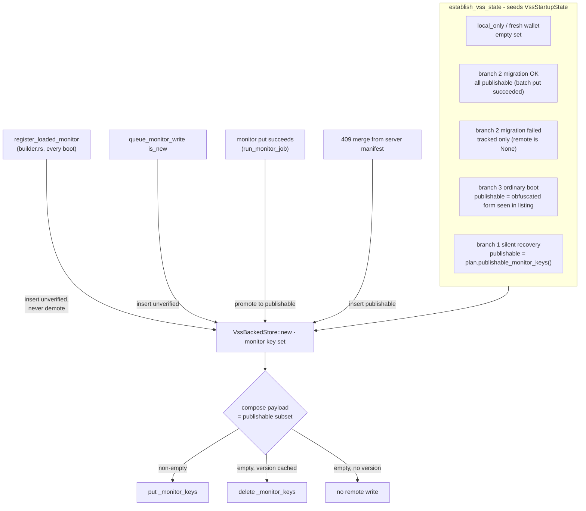
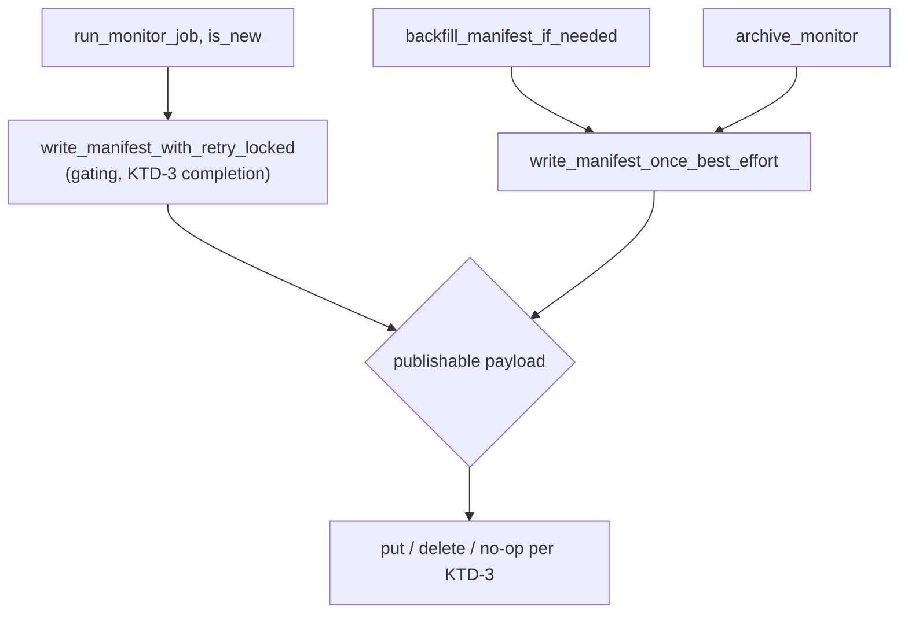

# VSS Monitor-Key Publication Safety and node.rs Split - Plan

## Goal Capsule

- **Objective:** Close GitHub issue #6 (`VssBackedStore` can re-publish an unverified monitor key, re-arming a permanent `BackupInconsistent` boot failure) and issue #4 (split the 3,524-line `rust/src/node.rs` into sibling `impl Node` modules).
- **Authority hierarchy:** This plan > the issue bodies > repo convention. Where the issue text and the code disagree, the code wins — record the divergence in the commit message.
- **Execution profile:** Nine units in two separately-committed groups. U1–U4 (the fund-safety fix) land first and must be reviewable without the refactor churn; U5–U9 (the mechanical split) land second.
- **Stop conditions:** Stop and report if a publishability seeding site cannot be resolved without a network call the startup path does not already make, or if the `impl Node` split requires widening a public signature.
- **Tail ownership:** The calling pipeline owns commit/push/PR. Units are committed individually.

---

## Product Contract

### Summary

`VssBackedStore` publishes the `_monitor_keys` manifest from a set of plaintext monitor keys it re-derives from local monitors on every boot, with no record of whether any given key actually names a blob that exists remotely. Commit `4842d6b` taught the two `restore::backfill_manifest` call sites to filter on `ValidatedMonitor::key_verified`, but the store re-derives and can re-publish the same unverified key from either of its own publication routes on any later start. This plan gives the store's key set a per-key publishability bit, seeds it correctly from every startup branch, and stops the store from ever publishing a manifest payload a later restore would reject.

Separately, `rust/src/node.rs` is 3,524 lines with a single ~1,811-line `impl Node` block. The split moves background tasks, payments, on-chain, channel API, and event handling into sibling modules, leaving lifecycle and queries in `node.rs`.

### Problem Frame

A monitor whose plaintext VSS key re-derived from its funding outpoint does not reproduce the key the blob is stored under — genuine key-derivation divergence between the PWA and native clients — becomes adoptable through orphan-monitor adoption (`ab060e2`, `ad2cbf3`). Adoption learns the plaintext key by re-deriving it, and obfuscation is a one-way HMAC, so the key the blob really lives under is unrecoverable.

`download_and_validate` treats a manifest entry with no blob behind it as a hard `RestoreError::BackupInconsistent`; on the silent-recovery door that surfaces as `BuildError::VssRecoveryFailed` — a node that refuses to boot, permanently. Publishing the unverifiable key therefore converts a backup that recovered successfully into one that can never be restored again.

`VssBackedStore::register_loaded_monitor` (`rust/src/vss/store.rs:950`, called from `rust/src/builder.rs:539-541`) inserts `monitor_vss_key(monitor.get_funding_txo())` for every monitor read off local disk at boot. From there the key reaches a published manifest through either `backfill_manifest_if_needed` (`rust/src/vss/store.rs:1160`) or `write_manifest_with_retry_locked` (`rust/src/vss/store.rs:558`) on the next new-channel persist. The trigger is narrow, the outcome is a permanently bricked wallet.

The `impl Node` problem is a review-surface problem, not a correctness one: the fund-safety lifecycle invariants (start/stop/restore/fence ordering) sit in the same block as every payments, on-chain, and channel method, so every future feature lands in the same place and compounds merge conflicts and review blind spots.

### Requirements

**Manifest publication safety (issue #6)**

- R1. The store never publishes a monitor VSS key it has no positive evidence for — evidence being that the store itself wrote a blob under that key, that the key came from a server manifest, or that the key's obfuscated form appeared in a `listKeyVersions` listing.
- R2. Publishability survives a restart. A key recorded unverified at one boot is not promoted by re-derivation at the next.
- R3. Every monitor the store tracks locally stays tracked and stays covered by the new-channel completion gate, regardless of publishability. Only remote publication is filtered.
- R4. Keys merged in from a 409 server manifest are publishable, so a manifest write never drops a key another device tracks.
- R5. The store never puts a `_monitor_keys` payload that `parse_monitor_manifest` would reject — notably the empty array, which that parser treats as corrupt (`rust/src/vss/store.rs:277-279`).
- R6. Removing the last publishable key (the archive path) leaves the remote manifest in a state a later restore can read: neither an empty array nor a listing of a blob that was just deleted.
- R7. A restart after a divergent adoption, followed by a forced manifest write through either publication route, leaves the backup restorable through both the explicit-restore door and the silent-recovery door.

**node.rs structure (issue #4)**

- R8. `impl Node` is split across sibling modules under `rust/src/node/`, with `new`, `start`, `stop`, `restore`, and the read-only query methods remaining in `rust/src/node.rs`.
- R9. The split preserves behavior: no logic change, no public signature change, and no visibility widening beyond what child-module access requires.
- R10. Tests move with the code they cover.
- R11. `rust/src/node.rs` ends at roughly a third of its current size — under ~1,200 lines, down from 3,524.

### Scope Boundaries

- **In scope, as a direct consequence of the fix:** the empty-payload manifest hazard (R5, R6). Filtering publication to publishable keys makes an empty payload newly reachable, and the same hazard already exists today on the archive-last-channel path. Adding the filter without closing it would arm the same brick class the issue asks to close.

#### Deferred to Follow-Up Work

- Reconciling a divergently-stored monitor blob to its correctly-derived key (re-writing the blob under the derived key and deleting the old one). That would make the key publishable rather than merely unpublishable, but it is a new remote-write path with its own fence interactions.
- Splitting the other large modules (`restore.rs` at 2,891 lines, `close_records.rs` at 2,512, `send.rs` at 2,426, `sweep.rs` at 2,383). Issue #4 names `node.rs` only.

#### Outside this change

- Changing `parse_monitor_manifest`'s rejection of the empty array. It matches the PWA's `parseMonitorManifest` and cross-client parity is the point.
- Any change to fence semantics or the KTD-3 completion gate. Publication filtering is layered under the gate, not through it.

---

## Planning Contract

### Key Technical Decisions

- KTD-1. **Track publishability in the store (issue option 1), seeded per startup branch from evidence each branch already has.** Option 2 (gate publication on an observed `listKeyVersions` round-trip) couples publication to listing freshness and would need a listing call the store does not hold. Option 1 keeps the invariant local to the thing that publishes. The two compose rather than compete: the ordinary-boot branch already computes `transport.obfuscate(&key)` against the listing for version seeding (`rust/src/vss/startup.rs:327-335`), so option 2's evidence is available there for free — used as a *seed source*, not as a publication gate.

- KTD-2. **Publishability is one-way: promote, never demote.** `register_loaded_monitor` inserts as unverified without demoting a key already known publishable; a successful monitor put promotes. Otherwise the boot-time re-derivation at `rust/src/builder.rs:539-541` would undo evidence the store legitimately holds.

- KTD-3. **An empty publishable payload is never put.** Payload composition resolves to one of three outcomes: non-empty → put as today; empty with a cached `_monitor_keys` version → delete the remote manifest (a zero-channel backup, which `fetch_manifest` reads as `Ok(None)`); empty with no cached version → do nothing. This closes both empty-payload bricks — publishing `[]` (rejected by `parse_monitor_manifest`) and leaving a stale entry for a deleted blob (rejected by `download_and_validate`).

- KTD-4. **Split via `src/node.rs` plus a sibling `src/node/` directory (Rust 2018 style), not `src/node/mod.rs`.** Child modules inherit access to their ancestors' private items, so the private fields of `Node`, `RunningState`, `ChannelHandles`, and `OnchainHandles` need no visibility widening, and inherent `impl Node` blocks are legal in any module of the defining crate. `pub fn` methods stay externally reachable because inherent-method resolution does not depend on the impl's module path.

- KTD-5. **Move the event-handling free functions to `node/event_handler.rs` as well**, beyond the four files issue #4 names. `handle_ldk_event` plus the three `settle_*`/`record_*` helpers and `spawn_background_processor` are ~560 lines; leaving them would land `node.rs` near 1,400 lines and miss the issue's stated goal. Named `event_handler` rather than `events` to avoid reading as the crate-root `rust/src/events.rs`.

- KTD-6. **Land issue #6 (U1–U4) and issue #4 (U5–U9) as separate commits, fix first.** Issue #4's own body notes the restructure "would churn the entire reviewed diff post-review; best done as an isolated follow-up PR." Both ship in one PR here, so unit separation is the substitute for PR separation and keeps the fund-safety diff readable on its own.

### High-Level Technical Design

Directional guidance for review, not implementation specification.

The lifecycle of one monitor key's publishability, from startup seed through publication:



The two publication routes both read the same filtered payload, so the invariant holds regardless of which one fires:



### Assumptions

- Both issues ship in one PR, with commit-level separation standing in for PR-level separation (KTD-6).
- The ~900-line target for `node.rs` (R11) is a design guideline, not a CI gate. No line-count check is added.
- `run_silent_recovery`'s existing constraint holds: the divergent-adoption fixture's monitors belong to channels no offline channel manager knows about, so the U4 restart test simulates the restart at the `establish_vss_state` + `VssBackedStore` level rather than booting a real `Node`.

### Sequencing

U1 → U2 → U3 → U4 (issue #6, commit-separated), then U5 → U6 → U7 → U8 → U9 (issue #4). U5 must land before U6–U9: it creates the module directory, the `mod` declarations, and the `pub(super)` test-helper visibility every later unit's relocated tests need. With that in U5, U6 through U9 are mutually independent — but land them in order anyway, to keep each diff readable.

---

## Implementation Units

### U1. Publishability-tracking monitor key set in the store

**Goal:** Replace `Inner.monitor_keys: Mutex<BTreeSet<String>>` with a set that records, per key, whether the store has positive evidence the key names a blob that exists remotely — and compose both manifest payloads from the publishable subset only.

**Requirements:** R1, R2, R3, R4

**Dependencies:** none

**Files:**
- `rust/src/vss/store.rs` (modify — new key-set type, `Inner` field, `VssBackedStore::new` parameter, `register_loaded_monitor`, `queue_monitor_write`, `run_monitor_job`, `write_manifest_with_retry_locked`, `write_manifest_once_best_effort`, `backfill_manifest_if_needed`, `archive_monitor`, and the in-file `Harness`)

**Approach:**

Introduce a small type in `rust/src/vss/store.rs` — a tracked set keyed by plaintext VSS key with a two-state publishability value (a named enum, not a bare `bool`, since this is a fund-safety invariant). It replaces the `BTreeSet<String>` both in `Inner` and in the `VssBackedStore::new` parameter list, keeping the argument count flat.

Operations the call sites need: insert-unverified (non-demoting, per KTD-2), insert-publishable, promote, remove, `is_empty` over the tracked set, and a publishable-payload accessor. Wire them:

- `register_loaded_monitor` → insert-unverified. This is the boot-time re-derivation; it must never assert publishability.
- `queue_monitor_write` with `is_new` → insert-unverified (the blob is not durable yet).
- `run_monitor_job` → promote after `put_fund_critical_with_retry` returns `Ok`, before the gating manifest write. This is the "we wrote a blob under this key" evidence, and it guarantees the gating path's payload is non-empty by construction. Promote on **every** successful monitor put, new and update alike — not only when `is_new`. `run_monitor_job` handles both, and an update put writes a real blob under the derived key, so a divergently-adopted monitor self-heals into publishability the first time the store updates it. Scoping promotion to `is_new` would leave such a monitor permanently unpublishable even after its key became real.
- Both 409 merge sites (`rust/src/vss/store.rs:583` and `:642`) → insert-publishable for every server key, preserving R4.
- Both payload compositions → the publishable subset.
- `backfill_manifest_if_needed`'s non-empty check → keep it on the tracked set (its purpose is "monitors exist but no manifest version was seeded"); U3 handles the empty-publishable outcome.
- `archive_monitor`'s removal → remove from the tracked set as today.

Leave the empty-payload handling to U3; here the payload accessor may still return an empty vector.

**Patterns to follow:** the existing `Mutex<BTreeSet<String>>` locking discipline in `Inner` — short critical sections, clone out before awaiting. Mirror the doc-comment density of `ValidatedMonitor::key_verified` (`rust/src/restore.rs:265-278`): this invariant is only safe if the next reader understands why.

**Test scenarios:**
- A key inserted by `register_loaded_monitor` and never put is absent from every published manifest payload, while the tracked set still contains it.
- A new-channel monitor write promotes its key: after `queue_monitor_write(.., true)` completes, the published payload contains that key.
- Non-demotion: promote a key via a successful put, then call `register_loaded_monitor` for the same funding outpoint; the key stays publishable and still appears in the next published payload.
- A 409 on the manifest merges the server's keys and republishes them (extend the existing `manifest_conflict_merges_server_keys_and_retries`, asserting merged server keys survive the publishable filter).
- Mixed set: one promoted key plus one unverified key publishes exactly the promoted key.
- Existing store tests that assert on published manifest contents still pass unchanged.

**Verification:** `cargo test` in `rust/` passes; `cargo clippy --all-targets -- -D warnings` clean. The store's own tests prove an unverified key never reaches `transport.put_payloads_for(MONITOR_MANIFEST_KEY)`.

---

### U2. Seed publishability from every startup branch

**Goal:** Give `VssStartupState` a publishability-aware monitor key seed and populate it correctly at all five construction sites, so R2 holds across restarts.

**Requirements:** R1, R2, R3

**Dependencies:** U1

**Files:**
- `rust/src/vss/startup.rs` (modify — `VssStartupState::monitor_keys` field type, `local_only`, the fresh-wallet return, the branch-2 migration success and failure returns, the branch-3 return, `silent_recovery`)
- `rust/src/builder.rs` (modify — pass the seed through to `VssBackedStore::new` at `rust/src/builder.rs:482-493`)
- `rust/src/restore.rs` (modify if `RestorePlan` needs an accessor that yields tracked-plus-publishable in one call)
- `rust/src/vss/store.rs` (modify — `VssBackedStore::new` signature already changed in U1; adjust if the seed type moves)

**Approach:**

Change `VssStartupState::monitor_keys` from `BTreeSet<String>` to U1's key-set type. The type change is deliberate leverage: every construction site becomes a compile error until it states its publishability evidence explicitly, which is the mitigation for the "a missed seeding site silently under-publishes" risk.

Per site:
- `local_only()` and the fresh-wallet return (`rust/src/vss/startup.rs:202-208`) — empty.
- Branch 2 migration success (`:290-298`) — all keys publishable. The transactional batch just wrote every monitor blob under exactly those keys.
- Branch 2 migration failure (`:311-317`) — tracked only. Nothing reached the remote, and `remote` is `None` for the session anyway; unverified is the fund-safe default.
- Branch 3 ordinary boot (`:341-347`) — publishable exactly when `by_obfuscated.get(&transport.obfuscate(&key))` hits, which the version-seeding loop at `:327-335` already computes. Fold the publishability decision into that loop rather than adding a second pass. Comment the load-bearing assumption at that site: listing-absence is safe as negative evidence only because `list_key_versions` (`rust/src/vss/client.rs:258-288`) pages to exhaustion and errors rather than truncating.
- Silent recovery (`:478-484`) — tracked from `plan.monitor_keys()`, publishable from `plan.publishable_monitor_keys()`.

The explicit-restore door needs no separate site: `run_restore` writes locally and the next boot resolves through branch 3.

**Patterns to follow:** the existing `FIXED_REMOTE_KEYS` / obfuscation-lookup loop at `rust/src/vss/startup.rs:327-335`; the `RestorePlan::monitor_keys` vs `publishable_monitor_keys` split at `rust/src/restore.rs:313-356`, whose doc comments already state this exact invariant and should be cross-referenced from the new code.

**Test scenarios:**
- Branch 3 over a store holding a divergently-stored monitor: the derived key is tracked but not publishable, and the listed key is both.
- Branch 3 where every local monitor's obfuscated key appears in the listing: all keys publishable.
- Branch 2 migration success: all migrated monitor keys publishable.
- Silent recovery after a divergent adoption: the returned seed's publishable subset excludes the adopted divergent key and includes the manifest-listed one. Extend the existing assertion at `rust/src/restore.rs:2560-2564`, which currently checks only the total set.
- `local_only()` and the fresh-wallet branch yield an empty seed.

**Verification:** `cargo test` passes; the compiler confirms no `VssStartupState` construction site was missed.

---

### U3. Never publish a manifest payload a restore would reject

**Goal:** Resolve an empty publishable payload to a delete or a no-op instead of putting `[]`, closing R5 and R6 on both publication routes.

**Requirements:** R5, R6

**Dependencies:** U1

**Files:**
- `rust/src/vss/store.rs` (modify — `write_manifest_with_retry_locked`, `write_manifest_once_best_effort`, `archive_monitor`)

**Approach:**

Apply KTD-3's three-way rule at payload composition. Non-empty publishable payload → put, exactly as today. Empty with a cached `_monitor_keys` version → delete the remote manifest at that version, so the backup reads as a zero-channel backup (`fetch_manifest` returns `Ok(None)`) rather than as a corrupt or dangling one. Empty with no cached version → no remote write.

Two route-specific notes. In `write_manifest_with_retry_locked` (the KTD-3 gating path) an empty payload is unreachable by construction, because U1 promotes the new channel's key after its successful put and before this call: handle it by logging at error level and returning `Ok(())`, never by looping or wedging — the monitor blob is already durable both remotely and locally, so stalling the completion signal would halt channel operations over a state that cannot occur. In `write_manifest_once_best_effort` the empty case is reachable and is the real fix: it covers archiving the last channel (a manifest version exists → delete) and backfilling a wallet whose only tracked keys are unverified (no version → no-op).

This also fixes a hazard that predates the publishability filter: `archive_moves_local_file_prunes_manifest_and_deletes_remote` (`rust/src/vss/store.rs:2055`) archives a single-channel wallet and today leaves `[]` in the remote manifest. Its assertion reads the payload with raw `serde_json::from_slice` rather than `parse_monitor_manifest`, which is why the suite never caught it.

A delete that conflicts on version is logged and abandoned, not retried: a 409 means another client has written a newer `_monitor_keys` that is now authoritative, and overwriting it from our stale view is the wrong move. Note that this leaves the pre-existing archive-path exposure unchanged — `archive_monitor` rewrites the manifest before deleting the blob, so a manifest write that gives up still ends with a deleted blob the old manifest names. That ordering is out of scope here; do not reorder it as a drive-by.

**Patterns to follow:** the fire-and-forget remote delete already in `archive_monitor` (`rust/src/vss/store.rs:1251-1260`) — same version-cache handling, same no-retry posture.

**Test scenarios:**
- Archive the only channel: the remote `_monitor_keys` key is deleted, and no put of `[]` was ever attempted (assert over `transport.put_payloads_for(MONITOR_MANIFEST_KEY)`, every entry of which must parse under `parse_monitor_manifest`).
- Archive one of two channels: the manifest is put with the remaining key, unchanged from today's behavior.
- After archiving the only channel, a fresh restore over the resulting remote state succeeds and finds zero monitors, rather than failing `ValidationFailed`.
- `backfill_manifest_if_needed` with a non-empty tracked set whose publishable subset is empty and no cached manifest version: no put and no delete reaches the transport.
- Existing archive and backfill tests still pass.

**Verification:** `cargo test` passes. Every payload in `put_payloads_for(MONITOR_MANIFEST_KEY)` parses under `parse_monitor_manifest` across the whole store test module.

---

### U4. End-to-end regression: a restart after a divergent adoption stays restorable

**Goal:** Prove the class is closed, not just the deterministic path — the store re-derives the divergent key at the next boot and still never publishes it, through either publication route.

**Requirements:** R7, R2

**Dependencies:** U1, U2, U3

**Files:**
- `rust/src/restore.rs` (modify — extend the test module around `a_divergent_adoption_leaves_the_backup_restorable_on_both_doors` at `rust/src/restore.rs:2517`)

**Approach:**

Extend the existing scenario past the adoption boot. After the first restore adopts the divergently-stored monitor, simulate a restart: re-run `establish_vss_state` over the same directory and transport (which now takes branch 3, since local monitors exist and the listing is non-empty), construct a `VssBackedStore` from the returned seed, and call `register_loaded_monitor` over the monitors read back off local disk — reproducing `rust/src/builder.rs:539-541` exactly.

Then force a manifest write through each publication route separately: `backfill_manifest_if_needed` with no seeded `_monitor_keys` version, and a new-channel persist via `queue_monitor_write(.., true)`. Assert after each that no published payload names the divergent key, and that a subsequent `run_restore` and `run_silent_recovery` over the resulting remote state both still succeed.

Do not boot a real `Node`. The `run_silent_recovery` helper's own comment (`rust/src/restore.rs:1625-1628`) explains why: the fixture monitors belong to channels no offline channel manager knows about. Add a restart helper alongside it rather than reaching for a node boot.

`published_manifest_sets` (`rust/src/restore.rs:1611`) already `expect`s every published payload to parse, so it doubles as the R5 assertion — a regression that publishes `[]` panics the test rather than passing silently.

**Execution note:** Write this test's assertions before starting U1 and confirm they fail against the pre-fix tree — the point of the unit is to prove the brick is real. Commit the test with U4 once green, so no intermediate commit is knowingly red.

**Patterns to follow:** `seed_backup_with_a_divergently_stored_monitor` (`rust/src/restore.rs:1583`), `published_manifest_sets` (`:1611`), `run_silent_recovery` (`:1629`), `local_monitor_blobs` (`:1654`).

**Test scenarios:**
- Restart after divergent adoption, then `backfill_manifest_if_needed`: no payload names the divergent key.
- Restart after divergent adoption, then a new-channel persist: the payload names the new channel's key and the originally-listed key, never the divergent one.
- After both forced writes, an explicit `run_restore` over the resulting remote state succeeds and recovers the same monitor set.
- After both forced writes, `run_silent_recovery` over the resulting remote state returns a state rather than `BuildError::VssRecoveryFailed`.
- The divergent key remains in the restart's tracked seed, so the completion gate still covers the adopted monitor (R3).

**Verification:** `cargo test` passes. Reverting U1–U3 makes this test fail — confirm once locally before committing.

---

### U5. Create the node module directory and move the background tasks

**Goal:** Establish `rust/src/node/` and move the six `spawn_*_task` methods plus `reconnect_targets` out of the monolithic `impl Node` block.

**Requirements:** R8, R9, R10

**Dependencies:** U4 (commit ordering only — no code dependency)

**Files:**
- `rust/src/node.rs` (modify — add `mod tasks;`, remove the moved methods)
- `rust/src/node/tasks.rs` (create)

**Approach:**

Keep `rust/src/node.rs` as the parent module file and add a sibling `rust/src/node/` directory (KTD-4). Declare `mod tasks;` near the top of `node.rs`. `rust/src/node/tasks.rs` holds one `impl Node` block containing `spawn_broadcast_task` (`rust/src/node.rs:1767`), `spawn_sync_task` (`:1789`), `reconnect_targets` (`:1934`), `spawn_peer_reconnect_task` (`:1938`), `spawn_recovery_task` (`:2003`), `spawn_sweep_task` (`:2039`), and `spawn_liquidity_event_task` (`:2073`).

Move the method bodies verbatim. Resolve imports by pulling what the moved code needs into `tasks.rs` and removing anything `node.rs` no longer uses — `cargo clippy -- -D warnings` will name every unused import. Reference parent-module items via `super::` (`super::RunningState`, `super::CoreEvent`, and so on); no `pub(crate)` widening is required, since a child module can already see its ancestors' private items.

Also make the shared test helpers in `node.rs`'s `#[cfg(test)] mod tests` — `store_in`, `offline_config`, `payment_hash`, `offline_config_for`, `static_invoice_server_path` — `pub(super)`, so the child modules' test submodules can import them via `crate::node::tests::*`. U5 relocates no tests itself, but doing this here rather than in U6 is what makes U6, U7, U8, and U9 independent of each other instead of serially dependent on whichever moved tests first. This is the one visibility change the split requires, and it is test-only.

**Patterns to follow:** the existing multi-file module layout at `rust/src/liquidity/` (`mod.rs` + `claim.rs` + `selection.rs`) for import and doc-comment conventions, adapted to the `node.rs` + `node/` shape.

**Test scenarios:** `Test expectation: none -- behavior-preserving move; the existing suite is the characterization coverage.`

**Verification:** `cargo build`, `cargo test`, `cargo clippy --all-targets -- -D warnings`, and `cargo fmt --check` all pass with no test-file changes beyond relocation. `git diff --stat` shows the moved lines as deletions in `node.rs` and additions in `node/tasks.rs`, with no other file touched.

---

### U6. Move the payments and receive surface

**Goal:** Move the JIT/offer/receive and send methods into `rust/src/node/payments.rs`.

**Requirements:** R8, R9, R10

**Dependencies:** U5

**Files:**
- `rust/src/node.rs` (modify — add `mod payments;`, remove the moved methods and their tests)
- `rust/src/node/payments.rs` (create)

**Approach:**

Move `receive_jit` (`rust/src/node.rs:628`), `liquidity_handles` (`:659`), `jit_quote` (`:679`), `jit_accept` (`:694`), `min_receive_sats` (`:736`), `standard_invoice` (`:768`), `receive_bundle` (`:796`), `get_or_create_offer` (`:877`), `offer_available` (`:936`), `async_receive` (`:978`), `send_payment` (`:1009`), `pay_offer` (`:1061`), `record_pending_outbound` (`:1127`), `settle_attempt_failure` (`:1146`), and `lsps2_get_info_live` (`:1175`).

Leave `explorer_base_url` (`:956`) in `node.rs` — it is a config query that happens to sit inside the receive cluster, not part of the payments surface.

Relocate the covering tests into a `#[cfg(test)] mod tests` inside `payments.rs`: `async_receive_is_inert_without_a_configured_server` (`:2768`), `configured_static_invoice_server_paths_apply_at_every_start` (`:2790`), `applying_no_static_invoice_server_paths_is_a_no_op` (`:2835`), `payment_settles_persist_before_any_public_event_is_emitted` (`:2855`), `replayed_payment_sent_after_crash_before_ack_settles_exactly_once` (`:2919`), `replayed_payment_claimed_never_duplicates_the_inbound_row` (`:2981`), `receive_endpoints_follow_the_node_lifecycle` (`:3106`), `signed_mainnet_invoice` (`:3311`), and `send_payment_writes_and_settles_the_history_row` (`:3330`).

Shared test helpers stay in `node.rs`'s test module; U5 already made them `pub(super)`, so import them via `crate::node::tests::*`.

**Patterns to follow:** U5's module and import conventions.

**Test scenarios:** `Test expectation: none -- behavior-preserving move; the relocated tests are the coverage and must pass unchanged.`

**Verification:** `cargo test` passes with the same test count as before the move (compare `cargo test -- --list | wc -l` across the commit). `cargo clippy --all-targets -- -D warnings` and `cargo fmt --check` clean.

---

### U7. Move the on-chain surface

**Goal:** Move the on-chain send and estimate methods into `rust/src/node/onchain.rs`.

**Requirements:** R8, R9, R10

**Dependencies:** U5

**Files:**
- `rust/src/node.rs` (modify — add `mod onchain;`, remove the moved methods and their tests)
- `rust/src/node/onchain.rs` (create)

**Approach:**

Move `onchain_handles` (`rust/src/node.rs:1400`), `dispatch_onchain_tx` (`:1421`, an associated fn with no receiver), `estimate_onchain_fee` (`:1430`), `estimate_max_sendable` (`:1447`), `send_onchain` (`:1465`), `send_onchain_max` (`:1496`), and `next_receive_address` (`:1523`). Move the `OnchainHandles` struct (`:230`) with them — it exists only for these methods.

Leave the balance queries (`onchain_balance_sats` at `:1296`, `onchain_balances` at `:1307`) and the `OnchainBalances` type (`:148`) in `node.rs`; they are part of the read-only query core R8 keeps there.

Relocate `onchain_endpoints_follow_the_node_lifecycle` (`:3056`).

**Patterns to follow:** U5's module and import conventions, including its `pub(super)` test-helper access.

**Test scenarios:** `Test expectation: none -- behavior-preserving move.`

**Verification:** `cargo test` passes with an unchanged test count; clippy and fmt clean.

---

### U8. Move the channel API surface

**Goal:** Move the peer and channel management methods into `rust/src/node/channels_api.rs`.

**Requirements:** R8, R9, R10

**Dependencies:** U5

**Files:**
- `rust/src/node.rs` (modify — add `mod channels_api;`, remove the moved methods and their tests)
- `rust/src/node/channels_api.rs` (create)

**Approach:**

Move `channel_handles` (`rust/src/node.rs:1538`), `dial_and_persist` (`:1558`), `connect_peer` (`:1602`), `disconnect_peer` (`:1611`), `forget_peer` (`:1621`), `list_peers` (`:1641`), `list_channels` (`:1664`), `estimate_open_fee` (`:1676`), `open_channel` (`:1691`), `close_channel` (`:1727`), and `estimate_close` (`:1755`). Move the `ChannelHandles` struct (`:217`) with them.

The module is named `channels_api` rather than `channels` to avoid reading as the crate-root `rust/src/channels.rs` it delegates to.

Relocate `channel_endpoints_follow_the_node_lifecycle` (`:3221`).

**Patterns to follow:** U5's module and import conventions, including its `pub(super)` test-helper access.

**Test scenarios:** `Test expectation: none -- behavior-preserving move.`

**Verification:** `cargo test` passes with an unchanged test count; clippy and fmt clean.

---

### U9. Move the LDK event handler and the background processor

**Goal:** Move the event-handling free functions into `rust/src/node/event_handler.rs`, bringing `node.rs` under the R11 target.

**Requirements:** R8, R9, R10, R11

**Dependencies:** U5

**Files:**
- `rust/src/node.rs` (modify — add `mod event_handler;`, remove the moved functions, re-export where the crate needs them)
- `rust/src/node/event_handler.rs` (create)

**Approach:**

Move `settle_payment_sent` (`rust/src/node.rs:2100`), `settle_payment_failed` (`:2130`), `record_payment_claimed` (`:2157`), `handle_ldk_event` (`:2194`), and `spawn_background_processor` (`:2534`).

These are free functions, not `Node` methods (KTD-5). `settle_payment_sent`, `settle_payment_failed`, and `record_payment_claimed` are `pub(crate)`, but a grep for `crate::node::settle_payment_sent`, `crate::node::settle_payment_failed`, `crate::node::record_payment_claimed`, and `crate::node::handle_ldk_event` across `rust/src` and `rust/tests` returns nothing — every caller is inside `node.rs` itself. No re-export is expected. If the grep result has changed by implementation time, add `pub(crate) use event_handler::{...};` in `node.rs` rather than updating call sites, to keep the diff confined to the two files.

After this unit, record `wc -l rust/src/node.rs`. The arithmetic on the moved ranges lands it near 1,100. If it comes in above the R11 target of ~1,200, report the actual figure rather than moving more code to hit the number; R11 is a design guideline, not a gate (see Assumptions).

**Patterns to follow:** U5's module and import conventions.

**Test scenarios:** `Test expectation: none -- behavior-preserving move.`

**Verification:** `cargo test` passes with an unchanged test count; `cargo clippy --all-targets -- -D warnings` and `cargo fmt --check` clean. Report the final `rust/src/node.rs` line count.

---

## Output Structure

Expected layout after U5–U9. The per-unit `Files` lists remain authoritative; the implementer may adjust if a better grouping emerges.

```text
rust/src/
  node.rs                  # module decls, CoreEvent/EventSink, Node struct,
                           # RunningState, OnchainBalances, OnchainSyncPause,
                           # new/with_event_sink/start/stop/restore, queries,
                           # shared test helpers
  node/
    tasks.rs               # the six spawn_*_task methods + reconnect_targets
    payments.rs            # JIT, offers, receive, send
    onchain.rs             # on-chain send/estimate + OnchainHandles
    channels_api.rs        # peers, channels + ChannelHandles
    event_handler.rs       # handle_ldk_event, settle_*/record_* helpers,
                           # spawn_background_processor
```

---

## Verification Contract

All commands run from `rust/`. These are exactly the gates CI enforces in `.github/workflows/ci.yml`.

| Gate | Command | Applies to | Done signal |
|---|---|---|---|
| Format | `cargo fmt --check` | all units | exit 0 |
| Lint | `cargo clippy --all-targets -- -D warnings` | all units | exit 0, no warnings |
| Test | `cargo test` | all units | all tests pass; the live-network tests stay `#[ignore]`d |
| Manifest validity | every payload in `put_payloads_for(MONITOR_MANIFEST_KEY)` parses under `parse_monitor_manifest` | U1, U3, U4 | no `expect` panic in `published_manifest_sets` |
| Red proof | U4's assertions fail against the pre-fix tree | U4 | observed locally before U1 |
| Move fidelity | `cargo test -- --list \| wc -l` unchanged across each of U5–U9 | U5–U9 | identical count before and after |

The Android and iOS CI jobs build the crate for real targets. Neither issue changes the FFI surface — all `uniffi` attributes live in `rust/src/api.rs` and `rust/src/lib.rs`, none on `Node` — so no `.udl`/binding regeneration is expected. If either platform job fails, treat it as a signal that the split leaked into the exported surface.

---

## Definition of Done

**Global**

- R1–R11 are each satisfied or explicitly reported as not satisfied with the reason.
- Every gate in the Verification Contract passes.
- Issue #6's work is committed separately from issue #4's work, fix first (KTD-6).
- No abandoned-attempt code, commented-out blocks, or exploratory scaffolding remains in the diff.
- Commit messages name the issue they close.

**Per unit**

- U1 — an unverified key is tracked and gate-covered but never published; promotion is one-way; server-merged keys stay publishable.
- U2 — every `VssStartupState` construction site states its publishability evidence; branch 3 derives it from the listing lookup it already performs.
- U3 — no `_monitor_keys` put carries a payload `parse_monitor_manifest` would reject, and archiving the last channel leaves a restorable remote state.
- U4 — the restart regression passes, and failed against the pre-fix tree.
- U5–U9 — `cargo test` count unchanged, no public signature changed, no non-test visibility widened, and the final `rust/src/node.rs` line count is reported.

---

## Risks & Dependencies

- **A missed seeding site silently under-publishes.** If a `VssStartupState` construction site defaults to "tracked only," a monitor another device tracks quietly drops out of the manifest — the mirror of the bug being fixed, and much harder to notice. Mitigated by changing the field's *type* in U2 so every site is a compile error until it states its evidence, and by U2's per-branch tests.

- **The gating path could wedge on an empty payload.** `write_manifest_with_retry_locked` gates `persist_new_channel` completion; making it loop or return an error on an empty publishable set would halt channel operations. KTD-3 resolves this to log-and-return-`Ok`, and U1's promote-after-put makes the case unreachable by construction. Do not "harden" it into a retry.

- **`register_loaded_monitor` runs on every boot, including after the fix.** KTD-2's non-demotion rule is what keeps it from being an evidence-destroying call. A future edit that makes insert unconditional silently re-arms the bug; U1's non-demotion test is the guard.

- **The refactor churns the fix's review surface.** Both issues land in one PR (KTD-6 mitigates with commit separation), but a reviewer reading the squashed diff will still see thousands of moved lines. Flag the commit boundary in the PR description.

- **Test-helper visibility is the one intended widening.** U5 makes `node.rs`'s test helpers `pub(super)`. If the split ends up needing any *non-test* `pub(crate)` widening, that contradicts R9 — stop and report rather than widening.

- **Branch 3's publishability evidence depends on a non-local invariant.** Treating "absent from the `listKeyVersions` listing" as negative evidence is only sound because `VssClient::list_key_versions` (`rust/src/vss/client.rs:258-288`) pages to exhaustion and returns `VssError::TooManyListPages` rather than silently truncating. That holds today. If a future change adds a `key_prefix` filter, a page cap that truncates, or any partial-listing path, branch 3 would start marking real keys unverified and quietly dropping them from published manifests — the mirror image of the bug this plan fixes. Cite that guarantee where U2 uses the lookup, so the coupling is visible to whoever edits the client next.

---

## Sources & Research

- `rust/src/vss/store.rs:255-298` — `parse_monitor_manifest` rejects the empty array, which is what makes an empty published payload a brick rather than a benign no-op.
- `rust/src/vss/store.rs:558-661` — the two publication routes (`write_manifest_with_retry_locked`, `write_manifest_once_best_effort`) and their 409 merge behavior.
- `rust/src/vss/store.rs:950-961` — `register_loaded_monitor`, the boot-time re-derivation at the center of issue #6.
- `rust/src/vss/store.rs:1160-1178` — `backfill_manifest_if_needed`, one of the two routes from that re-derivation to a published manifest.
- `rust/src/vss/store.rs:2055-2120` — the existing archive test, whose raw-JSON assertion is why the pre-existing `[]` hazard went unnoticed.
- `rust/src/vss/startup.rs:143-348` — the KTD-3 startup branches and the five `VssStartupState` construction sites U2 must seed.
- `rust/src/vss/startup.rs:327-335` — the obfuscation lookup that already computes branch 3's publishability evidence for free.
- `rust/src/restore.rs:265-356` — `ValidatedMonitor::key_verified` and the `monitor_keys` / `publishable_monitor_keys` split from `4842d6b`, whose doc comments state the invariant this plan extends into the store.
- `rust/src/restore.rs:1583-1676` — the divergent-adoption fixture and test helpers U4 builds on.
- `rust/src/restore.rs:2517-2565` — `a_divergent_adoption_leaves_the_backup_restorable_on_both_doors`, the test U4 extends past the adoption boot.
- `rust/src/builder.rs:482-542` — where the store is constructed from the startup seed and where `register_loaded_monitor` is called for every locally-read monitor.
- `.github/workflows/ci.yml` — the exact gate commands in the Verification Contract.
- Commits `ad2cbf3`, `ab060e2` (orphan-monitor adoption, which made the divergent key reachable) and `4842d6b` (the first half of this fix).
</content>
</invoke>
